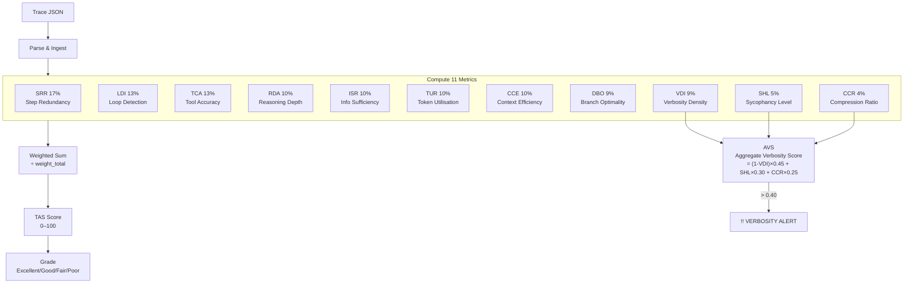
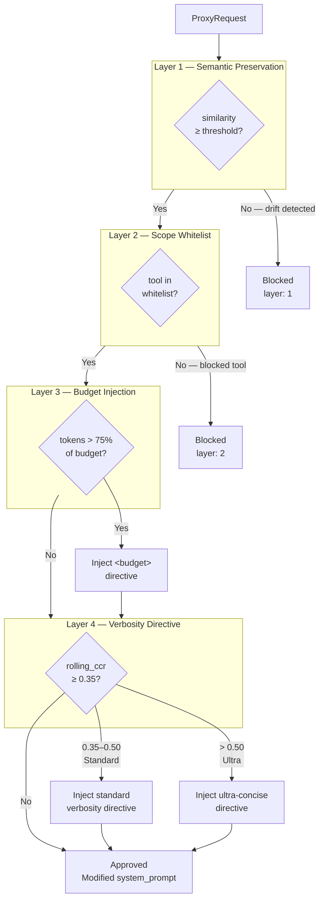

# TraceRazor

**Token efficiency auditing for AI agents.**

> Score your agent's reasoning trace like Lighthouse scores a webpage. Get a step-by-step plan to cut token waste — no agent code changes required.

[](https://github.com/ZulfaqarHafez/tracerazor/actions)
&nbsp;·&nbsp; Apache 2.0 &nbsp;·&nbsp; Rust &nbsp;·&nbsp; Author: Zulfaqar Hafez

---

## Why TraceRazor

ACL 2025, NeurIPS 2024, and KDD 2025 independently measured **40–70% of reasoning tokens as redundant** in typical chain-of-thought traces. A customer-support agent with 8 tool calls and 3 reasoning loops can consume 15,000–40,000 tokens per resolution. At 50,000 runs/month, a 30% efficiency improvement saves six figures annually.

LangSmith, Langfuse, and Arize tell you *what happened*. TraceRazor tells you *what was unnecessary* and *what the efficient version looks like*. It reads the completed trace, scores it against eleven metrics, and produces a concrete diff.

All eleven metrics run **offline**. No API keys required.

---

## What You Get

**TAS Score.** Composite 0–100 efficiency grade from eleven metrics. Gate CI/CD on it, track regressions, compare agent versions.

**Optimal path diff.** Per-step verdict: remove, trim, or keep — with token savings per action.

**Auto-generated fixes.** Patches for tool schemas, system prompt instructions, termination guards, context compression, verbosity reduction, and reformulation guards — each with an estimated token saving.

**Savings projection.** Tokens saved × cost/token × run volume → monthly and annual figures per provider.

**Simulation.** Project the TAS impact of removing or merging steps without re-running the agent.

**Verbosity intelligence.** VDI, SHL, and CCR measure filler density, sycophantic preamble, and local compressibility. When the Aggregate Verbosity Score (AVS) exceeds 0.40, a `VERBOSITY ALERT` appears in the report with the primary driver and estimated verbose token count.

**Reformulation detection.** Steps that open by paraphrasing their input context are flagged via bigram Jaccard overlap (≥ 0.70). A `ReformulationGuard` fix is generated automatically.

**Shannon entropy pre-filter.** Steps with character-level entropy < 3.8 bits/char (repetitive or low-variety content) are flagged inside the VDI result.

**Multi-agent scoring.** Traces with ≥ 2 agent IDs get a per-agent TAS breakdown weighted by token share.

**Executive summaries.** Every report includes a one-paragraph summary leading with the worst metric and a one-liner for CI logs or Slack.

**Anomaly detection.** Twelve independent rolling baselines (TAS + eleven normalised metric scores), each checked at 2σ. A verbosity spike in SHL surfaces even when overall TAS looks acceptable.

**Known-Good-Paths KB.** Traces scoring ≥ 85 are stored automatically. Future traces are matched against the closest prior run.

**Live guardrails.** Four-layer interceptor: blocks drifted prompts, enforces tool scope, injects budget directives, injects verbosity directives when rolling CCR is elevated.

---

## Quickstart

### Docker (recommended)

```bash
git clone https://github.com/ZulfaqarHafez/tracerazor
cd tracerazor
docker compose up --build
```

`http://localhost:8080` — no Node.js or Rust toolchain on the host.

### Build from source

```bash
cargo build --release
```

### Audit a trace

```bash
./target/release/tracerazor audit traces/support-agent-run-2847.json
```

```
TRACERAZOR REPORT
------------------------------------------------------
Trace:     support-agent-run-2847
Agent:     support-agent
Framework: langgraph
Steps:     9   Tokens: 18420
------------------------------------------------------
TRACERAZOR SCORE:  64 / 100  [FAIR]
VAE SCORE:         0.71
------------------------------------------------------
!! VERBOSITY ALERT  AVS: 0.52  Primary driver: SHL (sycophancy/hedging)
   Est. verbose tokens: 9578
------------------------------------------------------
METRIC BREAKDOWN
Code   Metric                         Score    Target   Status
SRR    Step Redundancy Rate           18.2%    <15%     FAIL
LDI    Loop Detection Index           0.182    <0.10    FAIL
TCA    Tool Call Accuracy             83.3%    >85%     FAIL
RDA    Reasoning Depth Approp.        0.820    >0.75    PASS [hist]
ISR    Info Sufficiency Rate          88.0%    >80%     PASS
TUR    Token Utilisation Ratio        0.714    >0.35    PASS
CCE    Context Carry-over Eff.        0.880    >0.60    PASS
DBO    Decision Branch Optimality     0.700    >0.70    PASS [cold]
-- Verbosity Metrics ----------------------------------
VDI    Verbosity Density Index        0.512    >0.60    FAIL
SHL    Sycophancy/Hedging Level       0.380    <0.20    FAIL
CCR    Caveman Compression Ratio      0.412    <0.30    FAIL
------------------------------------------------------
SAVINGS ESTIMATE
Tokens saved:      9,840  (53.4% reduction)
Cost saved:        $0.0295 per run
At 50K runs/month: $1,477.20/month saved
```

### CI/CD gate

```bash
tracerazor audit trace.json --threshold 75
```

---

## TAS Scoring Pipeline



---

## CLI Reference

```
tracerazor <COMMAND>

Commands:
  audit      Analyse a trace file and print the full report
  compare    Compare two trace files — per-metric delta table with regression detection
  simulate   Project the impact of removing or merging steps without re-running the agent
  cost       Estimate monthly cost savings across a set of trace files
  export     Send a stored trace to an OTEL collector or webhook

Options for audit:
  <FILE>                   Path to trace JSON
  --threshold <N>          Exit non-zero if TAS < N (default: 0, CI gate usage)
  --format <fmt>           Output format: markdown (default) | json
  --trace-format <fmt>     Input format: auto (default) | raw | langsmith | otel
  --enhanced               Use OpenAI embeddings for similarity (requires OPENAI_API_KEY)
```

### `compare`

```bash
tracerazor compare before.json after.json --regression-threshold 5.0
```

Per-metric delta table. Exits non-zero if TAS regresses by more than the threshold.

### `simulate`

```bash
tracerazor simulate trace.json --remove 3,8 --merge 6,7
```

Returns original vs. projected TAS, token delta, and per-metric deltas.

### `cost`

```bash
tracerazor cost trace1.json trace2.json trace3.json \
  --provider anthropic-claude-3-5-sonnet \
  --runs-per-month 50000
```

Providers: `openai-gpt-4o`, `openai-gpt-4o-mini`, `anthropic-claude-3-5-sonnet`, `anthropic-claude-3-haiku`, `google-gemini-1-5-flash`.

### `audit --enhanced`

Default similarity is bag-of-words (offline). `--enhanced` uses OpenAI `text-embedding-3-small` for SRR and ISR:

```bash
export OPENAI_API_KEY=sk-...
tracerazor audit trace.json --enhanced
```

All other metrics (RDA, DBO, TCA, LDI, TUR, CCE, VDI, SHL, CCR) remain offline.

### `export`

```bash
tracerazor export trace.json otel    --endpoint http://localhost:4318
tracerazor export trace.json webhook --url https://hooks.example.com/tracerazor
```

---

## Dashboard

Single HTML file embedded in the server binary — no Node.js in production.

| Tab | What it shows |
|-----|---------------|
| **Dashboard** | TAS trend chart, agent rankings worst-first, savings totals |
| **Traces** | Full trace history with drill-down to the report |
| **Audit** | Paste any trace JSON, get a full report in-browser |
| **Compare** | Side-by-side diff of two trace IDs |
| **KB** | Known-Good-Paths library |
| **Live** | Real-time WebSocket feed of every audit event |

---

## API Reference

Start the server: `./target/release/tracerazor-server`

| Method | Path | Description |
|--------|------|-------------|
| `POST` | `/api/audit` | Analyse a trace; auto-captures to KB if TAS ≥ 85 |
| `GET` | `/api/traces` | List all stored traces |
| `GET` | `/api/traces/:id` | Full trace and report |
| `DELETE` | `/api/traces/:id` | Remove a trace |
| `GET` | `/api/dashboard` | Aggregate stats |
| `GET` | `/api/agents` | Per-agent statistics, sorted worst-first |
| `GET` | `/api/agents/:name` | Single agent stats |
| `GET` | `/api/compare?a=:id&b=:id` | Score two traces against each other |
| `GET` | `/api/kb` | List Known-Good-Paths entries |
| `GET` | `/api/kb/:id` | Full optimal path for one KB entry |
| `DELETE` | `/api/kb/:id` | Remove a KB entry |
| `GET` | `/api/metrics` | Prometheus exposition format |
| `POST` | `/api/export/otel` | Send a stored trace to an OTEL collector |
| `POST` | `/api/export/webhook` | POST a trace summary to a webhook URL |
| `WS` | `/ws` | Live audit events |

### Audit response

```json
{
  "trace_id": "run-001",
  "tas_score": 91.2,
  "grade": "Excellent",
  "avs": 0.18,
  "tokens_saved": 3400,
  "captured_to_kb": true,
  "fixes": [
    { "fix_type": "hedge_reduction", "target": "system_prompt", "patch": "...", "estimated_token_savings": 740 }
  ],
  "summary_oneliner": "TAS 91.2/100 [EXCELLENT] — 3,400 tokens saved (38%). Loop rate 0.18 is the primary drag.",
  "anomalies": [],
  "per_agent": [
    { "agent_id": "TriageAgent",    "total_steps": 4, "total_tokens": 1200, "token_share_pct": 28.6, "tas_score": 82.5, "grade": "GOOD" },
    { "agent_id": "SupportAgent",   "total_steps": 7, "total_tokens": 2600, "token_share_pct": 61.9, "tas_score": 61.2, "grade": "FAIR" },
    { "agent_id": "EscalationAgent","total_steps": 2, "total_tokens": 400,  "token_share_pct": 9.5,  "tas_score": null, "grade": null }
  ],
  "kb_match": {
    "entry": { "source_trace_id": "run-098", "tas_score": 94.1, "optimal_tokens": 2800 },
    "similarity": 0.81
  },
  "report_markdown": "..."
}
```

`per_agent` requires ≥ 2 distinct `agent_id` values. Agents below the minimum step threshold receive `null` TAS.

### Export endpoints

```bash
curl -X POST http://localhost:8080/api/export/otel \
  -H 'Content-Type: application/json' \
  -d '{"trace_id": "run-001", "endpoint": "http://collector:4318"}'

curl -X POST http://localhost:8080/api/export/webhook \
  -H 'Content-Type: application/json' \
  -d '{"trace_id": "run-001", "webhook_url": "https://hooks.example.com/tr"}'
```

### Prometheus

```yaml
scrape_configs:
  - job_name: tracerazor
    static_configs:
      - targets: ['localhost:8080']
    metrics_path: /api/metrics
```

Exposes `tracerazor_traces_total`, `tracerazor_avg_tas_score`, `tracerazor_tokens_saved_total`, `tracerazor_cost_saved_usd_total`.

---

## Metrics

All eleven metrics run locally. No model weights, no inference hooks, no API keys.

### Structural & Semantic (v1)

| Code | Metric | Weight | What it measures | Target |
|------|--------|--------|------------------|--------|
| **SRR** | Step Redundancy Rate | 17% | Near-duplicate steps (bag-of-words Jaccard) | < 15% |
| **LDI** | Loop Detection Index | 13% | Longest repeated tool-call cycle ÷ total steps | < 0.10 |
| **TCA** | Tool Call Accuracy | 13% | First-attempt success rate for tool calls | > 85% |
| **RDA** | Reasoning Depth Appropriateness | 10% | Heuristic complexity classifier vs. actual step count; overridden by historical median when ≥ 3 prior traces exist | > 0.75 |
| **ISR** | Information Sufficiency Rate | 10% | Fraction of steps contributing novel information | > 80% |
| **TUR** | Token Utilisation Ratio | 10% | Fraction of tokens attributed to useful work | > 35% |
| **CCE** | Context Carry-over Efficiency | 10% | Novel tokens ÷ total input window per step | > 60% |
| **DBO** | Decision Branch Optimality | 9% | Jaccard similarity to historical optimal tool sequences; cold-starts to 0.7 below 10 similar traces | > 0.70 |

### Verbosity (v2)

| Code | Metric | Weight | What it measures | Target |
|------|--------|--------|------------------|--------|
| **VDI** | Verbosity Density Index | 9% | Substantive tokens ÷ total; preamble phrases weighted 3×, fillers and articles counted individually | > 0.60 |
| **SHL** | Sycophancy/Hedging Level | 5% | Sentences starting with a sycophantic opener or containing ≥ 2 hedge phrases | < 0.20 |
| **CCR** | Caveman Compression Ratio | 4% | Tokens removable by local Caveman stripping (preamble → articles → fillers) | < 0.30 |

### Verbosity Detection Pipeline

```
Step content
     │
     ├──► VDI ──► filler_count / total_words ──────────────────────┐
     │     └──► Shannon entropy < 3.8 bits/char → entropy_flagged  │
     │                                                              ▼
     ├──► SHL ──► sentence split → preamble OR ≥2 hedges → score  AVS
     │                                                              ▲
     └──► CCR ──► caveman_compress() → (1 - compressed/original) ──┘
                       │
                       ▼
              AVS = (1-VDI)×0.45 + SHL×0.30 + CCR×0.25
                       │
                       └── AVS > 0.40 ──► !! VERBOSITY ALERT
```

### Reformulation Detection

```
TraceStep
   ├── content: "The user wants a refund for ORD-9182."
   └── input_context: "User: I need a refund for order ORD-9182..."
              │
              ▼
   first_sentence(content)  ──► bigrams set A
   input_context             ──► bigrams set B
              │
              ▼
   Jaccard = |A ∩ B| / |A ∪ B|
              │
              └── ≥ 0.70 ──► StepFlag::Reformulation
                             flag_detail: "reformulates input context (74% bigram overlap)"
                             Fix: ReformulationGuard → system_prompt patch
```

### Grade bands

| Grade | Range | Meaning |
|-------|-------|---------|
| **Excellent** | 90–100 | Minor gains only |
| **Good** | 70–89 | Addressable inefficiency |
| **Fair** | 50–69 | Significant waste |
| **Poor** | 0–49 | Structural reasoning issues |

---

## Anomaly Detection

Twelve rolling baselines (TAS + eleven normalised metric scores). Each activates after 5 prior traces and fires at `|z| > 2.0`.

```json
"anomalies": [
  { "metric": "tas_score", "value": 58.1, "z_score": -2.4, "baseline_mean": 79.3, "baseline_std": 8.8 },
  { "metric": "shl",       "value": 0.45, "z_score": -2.3, "baseline_mean": 0.12, "baseline_std": 0.14 }
]
```

Negative z-score = regression. Each metric checked independently — a SHL spike surfaces even when overall TAS looks normal.

---

## Auto-Generated Fixes

```json
"fixes": [
  {
    "fix_type": "tool_schema",
    "target": "check_refund_eligibility",
    "patch": "Mark `order_id` as required in the tool schema...",
    "estimated_token_savings": 580
  },
  {
    "fix_type": "hedge_reduction",
    "target": "system_prompt",
    "patch": "Do not begin responses with preamble phrases (let me, I'd be happy to, certainly). Do not use more than one hedging phrase per sentence...",
    "estimated_token_savings": 740
  },
  {
    "fix_type": "caveman_prompt_insert",
    "target": "system_prompt",
    "patch": "Be maximally concise. Output only what's needed for the next step. Skip re-stating context and throat-clearing sentences...",
    "estimated_token_savings": 1200
  },
  {
    "fix_type": "reformulation_guard",
    "target": "system_prompt",
    "patch": "Do not re-state the user's request at the start of reasoning. Proceed directly to analysis. (Steps [2, 5] detected as reformulating input context.)",
    "estimated_token_savings": 360
  }
]
```

| Fix Type | Triggered by | Patch target |
|----------|-------------|--------------|
| `tool_schema` | TCA misfire | Failing tool's required parameters |
| `prompt_insert` | RDA over-depth | Step-count instruction |
| `termination_guard` | LDI loop | Loop-breaking condition |
| `context_compression` | CCE bloat | Context summarisation instruction |
| `verbosity_reduction` | VDI fail + AVS > 0.40 | Filler-word elimination |
| `hedge_reduction` | SHL fail + AVS > 0.40 | Sycophancy/hedging elimination |
| `caveman_prompt_insert` | CCR fail + AVS > 0.40 | Maximal conciseness directive |
| `reformulation_guard` | StepFlag::Reformulation | Skip re-stating input context |

---

## Guardrail Proxy

Four checks applied in order on every LLM request.



**Layer 1: Semantic Preservation.** BoW similarity between prompt and original task. Blocks below 0.55.

**Layer 2: Scope Whitelist.** Blocks any tool not in the configured allowlist.

```rust
let scope = ScopeConfig::whitelist(["get_order", "check_eligibility", "process_refund"]);
```

**Layer 3: Budget Injection.** Injects `<budget>` directive when token usage exceeds 75% of budget.

```
<budget remaining="2000" total="8000">
Be concise. Avoid repeating context already established in this conversation.
</budget>
```

**Layer 4: Verbosity Directive.** Appends a conciseness directive when `rolling_ccr ≥ 0.35`. Escalates to ultra-concise at CCR > 0.50.

```rust
use tracerazor_proxy::{ProxyConfig, ProxyRequest, ProxyResponse};

let proxy = ProxyConfig::default();
let req = ProxyRequest {
    task_description: "Process refund for ORD-9182".into(),
    system_prompt: "You are a support agent.".into(),
    user_message: "Check order status".into(),
    requested_tools: vec!["get_order".into()],
    tokens_used: 4200,
    rolling_ccr: Some(0.38),
};

match proxy.intercept(&req) {
    ProxyResponse::Approved { system_prompt, .. } => { /* call LLM */ }
    ProxyResponse::Blocked { reason, layer }      => { /* log and abort */ }
}
```

---

## Architecture


```
tracerazor/
├── crates/
│   ├── tracerazor-core/      # 11 metrics, AVS, reformulation, simulation, fixes, reports
│   ├── tracerazor-ingest/    # Format parsers: raw JSON, LangSmith, OpenTelemetry
│   ├── tracerazor-semantic/  # BoW similarity + optional OpenAI embeddings (--enhanced)
│   ├── tracerazor-store/     # SurrealDB: traces, KB, baselines, anomaly detection
│   ├── tracerazor-server/    # Axum REST + WebSocket + embedded dashboard
│   ├── tracerazor-proxy/     # Four-layer guardrail: semantic, scope, budget, verbosity
│   └── tracerazor-cli/       # CLI entry point (clap 4); persistent store at ~/.tracerazor/
├── integrations/
│   ├── tracerazor/           # Core Python SDK (pip install tracerazor)
│   ├── crewai/               # TraceRazorCallback for CrewAI
│   ├── openai-agents/        # TraceRazorHooks for OpenAI Agents SDK
│   └── langgraph/            # LangChain callback for LangGraph
├── .github/
│   ├── actions/tracerazor/   # Composite GitHub Action with Cargo caching
│   └── workflows/            # CI: check, test, clippy, TAS gate
├── dashboard/                # Alpine.js + Chart.js (embedded in server binary)
├── traces/                   # Sample traces
└── Dockerfile                # Multi-stage: rust -> debian-slim
```

Key design decisions:

- `tracerazor-core` has zero network dependencies. All eleven metrics run offline in under 5 ms.
- `tracerazor-semantic` is separate so the offline path never pulls in `reqwest`. `--enhanced` activates OpenAI embeddings at runtime without recompiling.
- CLI opens `~/.tracerazor/store` (SurrealKV) on every `audit` run. Baselines accumulate without a running server.
- VDI, SHL, and CCR share a private `verbosity_data` module (HEDGE_PHRASES, PREAMBLE_PATTERNS, FILLER_WORDS) for consistent detection.
- Reformulation threshold (0.70 Jaccard) flags near-verbatim restates without triggering on steps that merely reference the same entities.

---

## Deployment

```bash
docker compose up --build   # http://localhost:8080
PORT=9090 docker compose up
```

| Variable | Default | Description |
|----------|---------|-------------|
| `TRACERAZOR_DB_PATH` | `./tracerazor.db` | Persistent database path |
| `PORT` | `8080` | HTTP server port |
| `TRACERAZOR_CORS_ORIGINS` | *(permissive)* | Comma-separated allowed origins, e.g. `https://app.example.com,http://localhost:3000` |

---

## CI/CD

`.github/workflows/tracerazor.yml` on every push to `main`:

1. `cargo check`
2. `cargo test`
3. `cargo clippy -- -D warnings`
4. **TAS gate** — audits the sample trace, exits non-zero if TAS < 60

---

## Test Coverage

| Crate | Tests | What's covered |
|-------|-------|----------------|
| tracerazor-core | 61 | 11 metrics, AVS, reformulation, entropy, verbosity fixes, scoring, simulation, cost, multi-agent, NL summaries |
| tracerazor-ingest | 3 | raw JSON, LangSmith, OTEL parsers |
| tracerazor-semantic | 5 | BoW similarity edge cases |
| tracerazor-store | 9 | traces, KB, baselines, anomaly detection, dashboard, delete |
| tracerazor-server | 13 | full lifecycle, audit/retrieve/delete, compare, agents, KB, malformed input, metrics |
| tracerazor-proxy | 12 | scope whitelist, budget injection, Layer 4 (standard, ultra, boundary, no-op) |
| **Total** | **109, all pass** | |

---

## Trace Format

```json
{
  "trace_id": "run-001",
  "agent_name": "support-agent",
  "framework": "langgraph",
  "task_value_score": 1.0,
  "steps": [
    {
      "id": 1,
      "step_type": "reasoning",
      "content": "Parse the user request about order refund",
      "tokens": 820
    },
    {
      "id": 2,
      "step_type": "tool_call",
      "content": "Fetch order details",
      "tokens": 340,
      "tool_name": "get_order_details",
      "tool_params": { "order_id": "ORD-9182" },
      "tool_success": true,
      "input_context": "full prompt sent to LLM for this step"
    }
  ]
}
```

LangSmith and OpenTelemetry JSON are auto-detected. Use `--trace-format langsmith|otel|raw` to override.

| Field | Required | Notes |
|-------|----------|-------|
| `id` | yes | 1-based step index |
| `step_type` | yes | `reasoning`, `tool_call`, or `handoff` |
| `content` | yes | Primary text of the step |
| `tokens` | yes | Token count for this step |
| `tool_name` | no | Required for accurate TCA and DBO |
| `tool_success` | no | `false` triggers misfire detection |
| `input_context` | no | Full LLM input; used by CCE and reformulation detection |
| `agent_id` | no | ≥ 2 distinct values triggers per-agent TAS breakdown |
| `output` | no | Included in semantic content for ISR and SRR |

---

## Integrations

### Python SDK (framework-agnostic)

```bash
pip install tracerazor
```

```python
from tracerazor_sdk import TraceRazorClient

client = TraceRazorClient(base_url="http://localhost:8080")
report = client.audit(trace_dict)
print(report["tas_score"], report["grade"])
```

### LangGraph / LangChain

```bash
pip install tracerazor-langgraph
```

```python
from tracerazor_langgraph import TraceRazorCallback

callback = TraceRazorCallback(agent_name="support-graph", threshold=70)
graph = build_graph()  # your LangGraph StateGraph
result = graph.invoke({"messages": [...]}, config={"callbacks": [callback]})
callback.analyse().markdown()
```

See [`integrations/langgraph/`](integrations/langgraph/).

### CrewAI

```bash
pip install tracerazor-crewai
```

```python
from tracerazor_crewai import TraceRazorCallback

callback = TraceRazorCallback(agent_name="support-crew", threshold=70)
crew = Crew(agents=[...], tasks=[...], callbacks=[callback])
crew.kickoff()
callback.analyse().markdown()
callback.assert_passes()
```

Events captured: `on_task_start/end`, `on_agent_action`, `on_tool_use_start/end`, `on_tool_error`.
See [`integrations/crewai/`](integrations/crewai/).

### OpenAI Agents SDK

```bash
pip install tracerazor-openai-agents
```

```python
from tracerazor_openai_agents import TraceRazorHooks

hooks = TraceRazorHooks(agent_name="support-agent", threshold=70)
await Runner.run(agent, "I need a refund for order ORD-9182", hooks=hooks)
hooks.analyse().markdown()
hooks.assert_passes()
```

Events captured: `on_agent_start/end`, `on_tool_start/end`, `on_handoff`.
See [`integrations/openai-agents/`](integrations/openai-agents/).

### GitHub Action

```yaml
- uses: ./.github/actions/tracerazor
  with:
    trace-file: traces/latest.json
    threshold: '75'
    format: markdown
```

Outputs: `tas-score`, `grade`, `passes`, `report`. Exits 1 if TAS < threshold. Cold runner build ~35 s with Cargo caching.

See [`.github/actions/tracerazor/`](.github/actions/tracerazor/) and [`.github/workflows/agent-efficiency-gate.yml`](.github/workflows/agent-efficiency-gate.yml).

---

## Framework Support

| Framework | Status | Adapter |
|-----------|--------|---------|
| LangGraph / LangChain | Supported | Native callback + LangSmith JSON / OTEL ingest |
| OpenAI Agents SDK | Supported | Native `RunHooks` adapter |
| CrewAI | Supported | Native `CrewCallbackHandler` adapter |
| Any OTEL-instrumented agent | Supported | OTEL JSON ingest |
| Raw / custom | Supported | Python SDK or user-defined JSON |

---

## Research Foundation

| # | Paper | Metric |
|---|-------|--------|
| [1] | Han et al. (2024). **Token-Budget-Aware LLM Reasoning (TALE)**. ACL 2025. | TUR, CCE |
| [2] | Zhao et al. (2025). **SelfBudgeter: Adaptive Token Allocation**. | Proxy Layer 3 |
| [3] | Lee et al. (2025). **Evaluating Step-by-step Reasoning Traces: A Survey**. | Framework basis |
| [4] | Su et al. (2024). **Dualformer: Controllable Fast and Slow Thinking**. | RDA |
| [5] | Wu et al. (2025). **Step Pruner: Efficient Reasoning in LLMs**. | Optimal path diff |
| [6] | Feng et al. (2025). **Efficient Reasoning Models: A Survey**. | Metric validation |
| [7] | Pan et al. (2024). **ToolChain\*: A\* Search for Tool Sequences**. NeurIPS 2024. | DBO, KB design |
| [8] | Hassid et al. (2025). **Reasoning on a Budget**. | VAE score, proxy |
| [9] | (2025). **Balanced Thinking (SCALe-SFT)**. | Efficiency without accuracy loss |
| [10] | Mohammadi et al. (2025). **Evaluation and Benchmarking of LLM Agents**. KDD 2025. | Composite scoring |
| [11] | Shi et al. (2024). **Verbosity Bias in LLM Responses**. | VDI, SHL, CCR design |

---

## License

Apache 2.0. Copyright 2025 Zulfaqar Hafez. See [LICENSE](LICENSE).