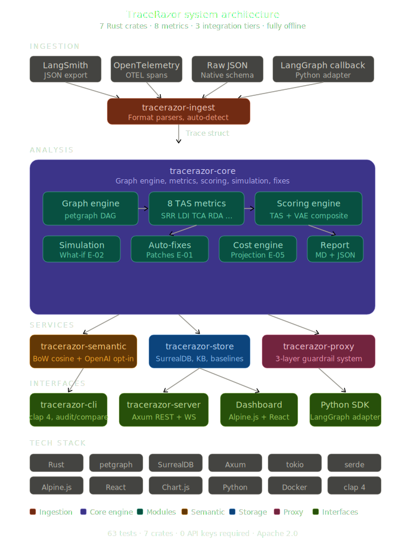

# TraceRazor

**Token efficiency auditing for AI agents.**

> Analyse your agent's reasoning traces, score them like Lighthouse scores a webpage, and get a step-by-step plan to cut token waste — no changes to your agent code required.

[](https://github.com/ZulfaqarHafez/tracerazor/actions)
&nbsp;·&nbsp; Apache 2.0 &nbsp;·&nbsp; Rust &nbsp;·&nbsp; Author: Zulfaqar Hafez

---

## Why TraceRazor

Production AI agents are expensive because they reason too much. Academic work from ACL 2025, NeurIPS 2024, and KDD 2025 independently measured **40–70% of reasoning tokens as redundant** in typical chain-of-thought traces. That redundancy is invisible until it shows up on the invoice.

A customer-support agent requiring 8 tool calls and 3 reasoning loops can consume 15,000–40,000 tokens per resolution. At 50,000 interactions/month, a 30% efficiency improvement saves six figures annually.

Existing observability tools (LangSmith, Langfuse, Arize) tell you *what happened*. They don't tell you *what was unnecessary* or *what the efficient version looks like*. TraceRazor is a post-hoc auditor: it reads the trace after execution, scores it against eight research-backed metrics, and produces a concrete diff.

All eight metrics run **entirely offline** using local heuristics. No API keys required.

---

## What You Get

**TAS Score.** A composite 0–100 efficiency grade derived from eight metrics, weighted and normalised consistently. One number your team can track, gate CI/CD on, and regression-test against.

**Optimal path diff.** A step-by-step breakdown of which reasoning steps to remove, which tool calls are redundant, and which context windows are being re-transmitted for no reason.

**Auto-generated fixes.** Actionable patches for tool schemas, system prompt instructions, termination guards, and context compression — each with an estimated token savings.

**Savings projection.** Tokens saved × cost per token × your run volume, extrapolated to monthly and annual figures per provider.

**Simulation.** Project the impact of removing or merging specific steps *before* re-running your agent. Pure arithmetic in Rust — no LLM calls.

**Multi-agent scoring.** Traces with multiple agent IDs automatically receive a per-agent TAS breakdown alongside the composite score. Each sub-agent's contribution is weighted by token share.

**Executive summaries.** Every report includes a natural-language paragraph leading with the worst-performing metric and its specific token numbers, plus a one-line summary suitable for CI logs and Slack notifications.

**Per-metric anomaly detection.** Nine independent rolling baselines — one for TAS and one for each of the eight normalised metric scores. Each is checked independently at 2σ, so a loop-detection regression doesn't hide behind a good TCA score.

**Known-Good-Paths KB.** Every trace scoring ≥ 85 is automatically stored as a reference. Future traces by the same agent are matched against it and the closest prior run is surfaced in the audit response.

**Live guardrails.** An interceptor layer that blocks semantically-drifted prompts, enforces tool scope whitelists, and injects token budget directives before an agent blows its budget.

---

## Quickstart

### Docker (recommended)

```bash
git clone https://github.com/ZulfaqarHafez/tracerazor
cd tracerazor
docker compose up --build
```

Open `http://localhost:8080`. No Node.js or Rust toolchain required on the host.

### Build from source

```bash
cargo build --release
```

### Audit a trace

```bash
./target/release/tracerazor audit traces/support-agent-run-2847.json
```

```
TRACERAZOR REPORT
------------------------------------------------------
Trace:     support-agent-run-2847
Agent:     support-agent
Framework: langgraph
Steps:     9   Tokens: 18420
------------------------------------------------------
TRACERAZOR SCORE:  71 / 100  [GOOD]
------------------------------------------------------
METRIC BREAKDOWN
SRR  Step Redundancy Rate     18.2%    <15%    FAIL
LDI  Loop Detection Index     0.182    <0.10   FAIL
TCA  Tool Call Accuracy       83.3%    >85%    FAIL
RDA  Reasoning Depth Approp.  0.820    >0.75   PASS
ISR  Info Sufficiency Rate    88.0%    >80%    PASS
TUR  Token Utilisation Ratio  0.714    >0.35   PASS
CCE  Context Carry-over Eff.  0.880    >0.60   PASS
DBO  Decision Branch Optimality 0.700  >0.70   PASS [cold]
------------------------------------------------------
SAVINGS ESTIMATE
Tokens saved:      7,006  (38.0% reduction)
Cost saved:        $0.0210 per run
At 50K runs/month: $1,050.90/month saved
```

### CI/CD gate

```bash
# Exits non-zero if TAS drops below 75, blocking the build
tracerazor audit trace.json --threshold 75
```

---

## CLI Reference

```
tracerazor <COMMAND>

Commands:
  audit      Analyse a trace file and print the full report
  compare    Compare two trace files — per-metric delta table with regression detection
  simulate   Project the impact of removing or merging steps without re-running the agent
  cost       Estimate monthly cost savings across a set of trace files
  export     Send a stored trace to an OTEL collector or webhook

Options for audit:
  <FILE>                   Path to trace JSON
  --threshold <N>          Exit non-zero if TAS < N (default: 0, CI gate usage)
  --format <fmt>           Output format: markdown (default) | json
  --trace-format <fmt>     Input format: auto (default) | raw | langsmith | otel
  --enhanced               Use OpenAI embeddings for similarity (requires OPENAI_API_KEY)
```

### `compare`

```bash
tracerazor compare before.json after.json --regression-threshold 5.0
```

Prints a per-metric delta table. Exits non-zero if TAS regresses by more than the threshold.

### `simulate`

```bash
# Remove steps 3 and 8, merge steps 6 and 7, project the new TAS
tracerazor simulate trace.json --remove 3,8 --merge 6,7
```

Returns original vs. projected TAS, token delta, and per-metric deltas. No agent re-run required.

### `cost`

```bash
tracerazor cost trace1.json trace2.json trace3.json \
  --provider anthropic-claude-3-5-sonnet \
  --runs-per-month 50000
```

Supported providers: `openai-gpt-4o`, `openai-gpt-4o-mini`, `anthropic-claude-3-5-sonnet`, `anthropic-claude-3-haiku`, `google-gemini-1-5-flash`.

### `audit --enhanced`

The default similarity engine is bag-of-words (offline, no API keys). Pass `--enhanced` to use OpenAI `text-embedding-3-small` embeddings for SRR and ISR — more accurate redundancy detection on traces where token overlap is low:

```bash
export OPENAI_API_KEY=sk-...
tracerazor audit trace.json --enhanced
```

Embeddings are batched into a single API call. The rest of the analysis (RDA, DBO, TCA, LDI, TUR, CCE) is unchanged and fully offline.

### `export`

```bash
# Send to an OTEL collector
tracerazor export trace.json otel --endpoint http://localhost:4318

# Post a summary JSON to a webhook
tracerazor export trace.json webhook --url https://hooks.example.com/tracerazor
```

---

## Dashboard

The web interface ships as a single HTML file embedded in the server binary. No separate frontend deployment, no Node.js in production.

| Tab | What it shows |
|-----|---------------|
| **Dashboard** | TAS trend chart, agent rankings worst-first, savings totals |
| **Traces** | Full trace history with drill-down to the report |
| **Audit** | Paste any trace JSON, get a full report in-browser |
| **Compare** | Side-by-side diff of two trace IDs |
| **KB** | Known-Good-Paths library — optimal paths from high-scoring traces |
| **Live** | Real-time WebSocket feed of every audit event |

---

## API Reference

Start the server: `./target/release/tracerazor-server`

| Method | Path | Description |
|--------|------|-------------|
| `POST` | `/api/audit` | Ingest and analyse a trace; auto-captures to KB if TAS ≥ 85 |
| `GET` | `/api/traces` | List all stored traces |
| `GET` | `/api/traces/:id` | Full trace and report |
| `DELETE` | `/api/traces/:id` | Remove a trace |
| `GET` | `/api/dashboard` | Aggregate stats |
| `GET` | `/api/agents` | Per-agent statistics, sorted worst-first |
| `GET` | `/api/agents/:name` | Single agent stats |
| `GET` | `/api/compare?a=:id&b=:id` | Score two traces against each other |
| `GET` | `/api/kb` | List Known-Good-Paths entries |
| `GET` | `/api/kb/:id` | Full optimal path for one KB entry |
| `DELETE` | `/api/kb/:id` | Remove a KB entry |
| `GET` | `/api/metrics` | Prometheus exposition format |
| `POST` | `/api/export/otel` | Send a stored trace to an OTEL collector |
| `POST` | `/api/export/webhook` | POST a trace summary to a webhook URL |
| `WS` | `/ws` | Live audit events |

### Audit response

```json
{
  "trace_id": "run-001",
  "tas_score": 91.2,
  "grade": "Excellent",
  "tokens_saved": 3400,
  "captured_to_kb": true,
  "summary_oneliner": "TAS 91.2/100 [EXCELLENT] — 3,400 tokens saved (38%). Loop rate 0.18 is the primary drag.",
  "anomalies": [],
  "per_agent": [
    { "agent_id": "TriageAgent",   "total_steps": 4, "total_tokens": 1200, "token_share_pct": 28.6, "tas_score": 82.5, "grade": "GOOD" },
    { "agent_id": "SupportAgent",  "total_steps": 7, "total_tokens": 2600, "token_share_pct": 61.9, "tas_score": 61.2, "grade": "FAIR" },
    { "agent_id": "EscalationAgent","total_steps": 2, "total_tokens": 400,  "token_share_pct": 9.5,  "tas_score": null, "grade": null }
  ],
  "kb_match": {
    "entry": { "source_trace_id": "run-098", "tas_score": 94.1, "optimal_tokens": 2800 },
    "similarity": 0.81
  },
  "report_markdown": "..."
}
```

`per_agent` is populated whenever the trace contains ≥ 2 distinct `agent_id` values. Agents with fewer than the minimum step threshold receive `null` TAS.

### Export endpoints

```bash
# OTEL export
curl -X POST http://localhost:8080/api/export/otel \
  -H 'Content-Type: application/json' \
  -d '{"trace_id": "run-001", "endpoint": "http://collector:4318"}'

# Webhook export
curl -X POST http://localhost:8080/api/export/webhook \
  -H 'Content-Type: application/json' \
  -d '{"trace_id": "run-001", "webhook_url": "https://hooks.example.com/tr"}'
```

### Prometheus

```yaml
# prometheus.yml
scrape_configs:
  - job_name: tracerazor
    static_configs:
      - targets: ['localhost:8080']
    metrics_path: /api/metrics
```

Exposes `tracerazor_traces_total`, `tracerazor_avg_tas_score`, `tracerazor_tokens_saved_total`, `tracerazor_cost_saved_usd_total`.

---

## Metrics

All eight TAS metrics are computed locally from trace data. No model weights, no inference hooks, no API keys.

| Code | Metric | Weight | What it measures | Target |
|------|--------|--------|------------------|--------|
| **SRR** | Step Redundancy Rate | 20% | Fraction of reasoning steps that are near-duplicates of prior steps (bag-of-words Jaccard) | < 15% |
| **LDI** | Loop Detection Index | 15% | Longest repeated tool-call cycle as a fraction of total steps | < 0.10 |
| **TCA** | Tool Call Accuracy | 15% | Rate of tool calls that succeed on the first attempt | > 85% |
| **RDA** | Reasoning Depth Appropriateness | 10% | Heuristic complexity classifier (tool surface area + keywords) vs. actual step count; overridden by historical median when ≥ 3 prior traces exist | > 0.75 |
| **ISR** | Information Sufficiency Rate | 10% | Fraction of steps that contribute novel information (bag-of-words novelty) | > 80% |
| **TUR** | Token Utilisation Ratio | 10% | Fraction of tokens attributed to useful work | > 35% |
| **CCE** | Context Carry-over Efficiency | 10% | How much of each input window is novel vs. re-transmitted context | > 60% |
| **DBO** | Decision Branch Optimality | 10% | Jaccard similarity to historical optimal tool sequences; cold-starts to 0.7 when fewer than 10 similar traces exist | > 0.70 |

### TAS Score grades

| Grade | Range | Meaning |
|-------|-------|---------|
| **Excellent** | 90–100 | Highly optimised, minor gains only |
| **Good** | 70–89 | Some inefficiency, addressable |
| **Fair** | 50–69 | Significant waste, restructuring recommended |
| **Poor** | 0–49 | Fundamental reasoning pattern issues |

---

## Anomaly Detection

After each audit, TraceRazor checks nine independent rolling baselines — the composite TAS score plus each of the eight normalised metric values. Every baseline requires a minimum of 5 prior traces before activating; each is tested at `|z| > 2.0`.

```json
"anomalies": [
  {
    "metric": "tas_score",
    "value": 58.1,
    "z_score": -2.4,
    "baseline_mean": 79.3,
    "baseline_std": 8.8
  },
  {
    "metric": "ldi",
    "value": 0.42,
    "z_score": -2.1,
    "baseline_mean": 0.12,
    "baseline_std": 0.14
  }
]
```

Negative z-score = regression. Positive = improvement. Checking each metric independently means a loop-detection spike (LDI) is surfaced even when TCA and overall TAS look normal.

**Persistent baselines.** The CLI accumulates historical data in `~/.tracerazor/store` across runs. No server required — the store is a local file opened automatically on every `audit` call.

---

## Auto-Generated Fixes

Each audit returns a `fixes` array with actionable patches derived from flagged issues.

```json
"fixes": [
  {
    "fix_type": "tool_schema",
    "target": "check_refund_eligibility",
    "patch": "Mark `order_id` as required in the tool schema...",
    "estimated_token_savings": 580
  },
  {
    "fix_type": "termination_guard",
    "target": "system_prompt",
    "patch": "Once the action at steps [3, 4] succeeds, do not repeat it...",
    "estimated_token_savings": 1200
  }
]
```

Fix types: `tool_schema`, `prompt_insert`, `termination_guard`, `context_compression`.

---

## Known-Good-Paths KB

The KB stores the optimal execution paths of high-scoring traces so future runs can be compared against a validated reference.

**Capture.** Any trace scoring ≥ 85 TAS has its KEEP/TRIM steps extracted and written to the `kb_entries` table, along with task hint, token counts, and grade.

**Match.** When a new trace is submitted, bag-of-words similarity is computed between the incoming trace's first reasoning step and every KB entry for the same agent. Matches above 0.45 are returned in the audit response.

**Over time.** The KB accumulates proven-efficient patterns. Unlike passive trace logging, it only stores *optimal* paths — not what the agent actually did.

---

## Guardrail Proxy

`tracerazor-proxy` sits between your agent orchestrator and the model and applies three checks in order.

**Layer 1: Semantic Preservation.** Bag-of-words similarity between the incoming prompt and the original task. If drift exceeds the 0.55 threshold, the request is blocked. Catches runaway reasoning loops before they consume tokens.

**Layer 2: Scope Whitelist.** Validates every requested tool name against a configured allowlist. Tools not on the list never reach the model.

```rust
let scope = ScopeConfig::whitelist(["get_order", "check_eligibility", "process_refund"]);
```

**Layer 3: Budget Injection.** When cumulative token usage crosses 75% of the configured budget, a `<budget>` directive is prepended to the system prompt.

```
<budget remaining="2000" total="8000">
Be concise. Avoid repeating context already established in this conversation.
</budget>
```

```rust
use tracerazor_proxy::{ProxyConfig, ProxyRequest, ProxyResponse};

let proxy = ProxyConfig::default();
match proxy.intercept(&req) {
    ProxyResponse::Approved { system_prompt, .. } => { /* call LLM */ }
    ProxyResponse::Blocked { reason, layer }      => { /* log and abort */ }
}
```

---

## Architecture



Six Rust crates, one embedded Alpine.js dashboard, and three Python integration adapters.

```
tracerazor/
├── crates/
│   ├── tracerazor-core/      # Metrics, scoring, simulation, fixes, report generation
│   ├── tracerazor-ingest/    # Format parsers: raw JSON, LangSmith, OpenTelemetry
│   ├── tracerazor-semantic/  # BoW similarity + optional OpenAI embeddings (--enhanced)
│   ├── tracerazor-store/     # SurrealDB persistence: traces, KB, baselines, anomaly detection
│   ├── tracerazor-server/    # Axum REST + WebSocket + embedded dashboard
│   ├── tracerazor-proxy/     # Three-layer LLM guardrail interceptor
│   └── tracerazor-cli/       # CLI entry point (clap 4); persistent store at ~/.tracerazor/
├── integrations/
│   ├── crewai/               # Python adapter: TraceRazorCallback for CrewAI
│   └── openai-agents/        # Python adapter: TraceRazorHooks for OpenAI Agents SDK
├── .github/
│   ├── actions/tracerazor/   # Composite GitHub Action with Cargo caching
│   └── workflows/            # CI: check, test, clippy, TAS gate, example efficiency gate
├── dashboard/                # Alpine.js + Chart.js (embedded in server binary)
├── traces/                   # Sample traces
└── Dockerfile                # Multi-stage: rust -> debian-slim
```

Design decisions:

- `tracerazor-core` has zero network dependencies. All eight metrics run offline in under 5 ms. No API keys, no async runtime.
- `tracerazor-semantic` is a separate crate so the offline analysis path never pulls in `reqwest`. The `--enhanced` flag activates the OpenAI embeddings path at runtime without recompiling.
- The dashboard is compiled into the server binary via `include_str!`. No Node.js in production.
- The CLI opens a persistent file store at `~/.tracerazor/store` (SurrealKV) on every `audit` run. Historical baselines, DBO sequences, and anomaly baselines accumulate automatically — no server needed.
- The server uses `kv-surrealkv` with a configurable path (`TRACERAZOR_DB_PATH`). The store API is identical in both modes.
- RDA and DBO use local heuristics (keyword analysis, Jaccard similarity over historical sequences). Historical baselines override heuristics when enough data exists (≥ 3 traces for RDA median, ≥ 10 for DBO cold-start threshold).
- Multi-agent scoring uses type erasure (`&dyn Fn`) to break the generic monomorphization recursion that would occur if `analyse<F>` called itself for sub-traces. `analyse<F>` coerces immediately to `analyse_dyn(&dyn Fn)`, which is a single concrete function used for both the top-level trace and all sub-agent traces.
- Python adapters are duck-typed against the respective SDK hook protocols, avoiding hard install dependencies. The CrewAI adapter works without `crewai` installed; the OpenAI Agents adapter inherits from `RunHooks` only when `openai-agents` is present.

---

## Deployment

### Docker Compose

```bash
docker compose up --build
# Server at http://localhost:8080, data persisted to a named volume
```

Override port:

```bash
PORT=9090 docker compose up
```

### Environment variables

| Variable | Default | Description |
|----------|---------|-------------|
| `TRACERAZOR_DB_PATH` | `./tracerazor.db` | Persistent database path |
| `PORT` | `8080` | HTTP server port |

---

## CI/CD

`.github/workflows/tracerazor.yml` runs on every push to `main`:

1. `cargo check` — workspace compiles
2. `cargo test` — all tests pass
3. `cargo clippy -- -D warnings` — zero warnings
4. **TAS gate** — audits the included sample trace, exits non-zero if TAS < 60

Replace the sample trace with your agent's most recent production trace to turn the gate into an efficiency regression test.

---

## Test Coverage

| Crate | Tests |
|-------|-------|
| tracerazor-core | 39: all eight metrics, scoring, simulation, fixes, cost projection, multi-agent breakdown, NL summaries |
| tracerazor-ingest | 3: raw JSON, LangSmith, OTEL parsers |
| tracerazor-semantic | 5: BoW similarity edge cases |
| tracerazor-store | 9: traces, KB, baselines, per-metric anomaly detection, dashboard, delete |
| tracerazor-server | 6: audit, list, dashboard, 404, metrics, compare |
| tracerazor-proxy | 5: scope whitelist, budget injection |
| **Total** | **73, all pass** |

---

## Trace Format

```json
{
  "trace_id": "run-001",
  "agent_name": "support-agent",
  "framework": "langgraph",
  "task_value_score": 1.0,
  "steps": [
    {
      "id": 1,
      "step_type": "reasoning",
      "content": "Parse the user request about order refund",
      "tokens": 820
    },
    {
      "id": 2,
      "step_type": "tool_call",
      "content": "Fetch order details",
      "tokens": 340,
      "tool_name": "get_order_details",
      "tool_params": { "order_id": "ORD-9182" },
      "tool_success": true,
      "input_context": "full prompt sent to LLM"
    }
  ]
}
```

LangSmith exports and OpenTelemetry JSON spans are auto-detected. Pass `--trace-format langsmith|otel|raw` to override.

| Field | Required | Notes |
|-------|----------|-------|
| `id` | yes | 1-based step index |
| `step_type` | yes | `reasoning`, `tool_call`, or `handoff` |
| `content` | yes | Primary text of the step |
| `tokens` | yes | Token count for this step |
| `tool_name` | no | Required for accurate TCA and DBO |
| `tool_success` | no | `false` triggers misfire detection |
| `input_context` | no | Full LLM input, used by CCE |
| `agent_id` | no | Agent identifier; when ≥ 2 distinct values appear, a per-agent TAS breakdown is computed automatically |

---

## Integrations

Native adapters instrument your agent automatically — no manual trace building required.

### CrewAI

```bash
pip install tracerazor-crewai
```

```python
from tracerazor_crewai import TraceRazorCallback
from crewai import Crew, Agent, Task

callback = TraceRazorCallback(agent_name="support-crew", threshold=70)

crew = Crew(
    agents=[support_agent],
    tasks=[support_task],
    callbacks=[callback],
)

result = crew.kickoff()
report = callback.analyse()
print(report.markdown())
callback.assert_passes()  # raises AssertionError if TAS < threshold
```

Captured events: `on_task_start/end`, `on_agent_action`, `on_tool_use_start/end`, `on_tool_error`.
See [`integrations/crewai/`](integrations/crewai/) for full docs and example.

### OpenAI Agents SDK

```bash
pip install tracerazor-openai-agents
```

```python
from tracerazor_openai_agents import TraceRazorHooks
from agents import Agent, Runner

hooks = TraceRazorHooks(agent_name="support-agent", threshold=70)
result = await Runner.run(agent, "I need a refund for order ORD-9182", hooks=hooks)

report = hooks.analyse()
print(report.markdown())
hooks.assert_passes()
```

Captured events: `on_agent_start/end`, `on_tool_start/end`, `on_handoff`. Multi-agent handoffs produce an automatic per-agent breakdown.
See [`integrations/openai-agents/`](integrations/openai-agents/) for full docs and example.

### GitHub Action

Add a TAS efficiency gate to any workflow in one step:

```yaml
- uses: ./.github/actions/tracerazor
  with:
    trace-file: traces/latest.json
    threshold: '75'
    format: markdown
```

Outputs: `tas-score`, `grade`, `passes`, `report`. Exits 1 if TAS < threshold — blocking the build automatically. Builds the binary from source with Cargo caching (~35 s on a cold runner).

See [`.github/actions/tracerazor/`](.github/actions/tracerazor/) and the example workflow at [`.github/workflows/agent-efficiency-gate.yml`](.github/workflows/agent-efficiency-gate.yml).

---

## Framework Support

| Framework | Status | Adapter |
|-----------|--------|---------|
| LangGraph / LangChain | Supported | LangSmith JSON / OTEL ingest |
| OpenAI Agents SDK | Supported | Native `RunHooks` adapter |
| CrewAI | Supported | Native `CrewCallbackHandler` adapter |
| Any OTEL-instrumented agent | Supported | OTEL JSON ingest |
| Raw / custom | Supported | User-defined JSON |

---

## Research Foundation

The eight TAS metrics map directly to failure modes identified in peer-reviewed work from 2024–2025.

| # | Paper | Metric |
|---|-------|--------|
| [1] | Han et al. (2024). **Token-Budget-Aware LLM Reasoning (TALE)**. ACL 2025. | TUR, CCE |
| [2] | Zhao et al. (2025). **SelfBudgeter: Adaptive Token Allocation**. | Proxy Layer 3 |
| [3] | Lee et al. (2025). **Evaluating Step-by-step Reasoning Traces: A Survey**. | Framework basis |
| [4] | Su et al. (2024). **Dualformer: Controllable Fast and Slow Thinking**. | RDA |
| [5] | Wu et al. (2025). **Step Pruner: Efficient Reasoning in LLMs**. | Optimal path diff |
| [6] | Feng et al. (2025). **Efficient Reasoning Models: A Survey**. | Metric validation |
| [7] | Pan et al. (2024). **ToolChain\*: A\* Search for Tool Sequences**. NeurIPS 2024. | DBO, KB design |
| [8] | Hassid et al. (2025). **Reasoning on a Budget**. | VAE score, proxy |
| [9] | (2025). **Balanced Thinking (SCALe-SFT)**. | Efficiency without accuracy loss |
| [10] | Mohammadi et al. (2025). **Evaluation and Benchmarking of LLM Agents**. KDD 2025. | Composite scoring |

---

## License

Apache 2.0.

```
Copyright 2025 Zulfaqar Hafez

Licensed under the Apache License, Version 2.0 (the "License");
you may not use this file except in compliance with the License.
You may obtain a copy of the License at

    http://www.apache.org/licenses/LICENSE-2.0

Unless required by applicable law or agreed to in writing, software
distributed under the License is distributed on an "AS IS" BASIS,
WITHOUT WARRANTIES OR CONDITIONS OF ANY KIND, either express or implied.
See the License for the specific language governing permissions and
limitations under the License.
```

The CLI, server, dashboard, and guardrail proxy are all open-source under this licence.
