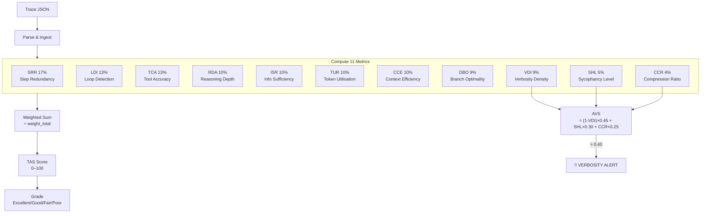
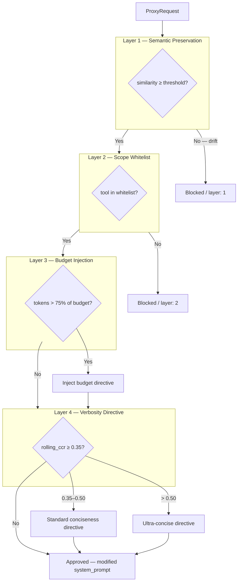

# TraceRazor

**The token efficiency audit layer for production AI agents.**

[](https://github.com/ZulfaqarHafez/tracerazor/actions)
&nbsp;·&nbsp; Apache 2.0 &nbsp;·&nbsp; Rust &nbsp;·&nbsp; Author: Zulfaqar Hafez

---

## Abstract

Recent work across ACL 2025, NeurIPS 2024, and KDD 2025 converges on a consistent finding: **40–70% of the tokens consumed by chain-of-thought reasoning agents are structurally redundant** — wasted on repeated steps, sycophantic preamble, reformulated context, and over-deep reasoning loops unrelated to task complexity [[1][3][10]](#research-foundation).

Current observability tools (LangSmith, Langfuse, Arize) record what an agent did. None measure whether what it did was efficient, and none produce a remediation plan. The gap is not instrumentation — it is analysis.

**TraceRazor** is an offline audit engine that reads a completed agent trace and scores it across eleven independently-validated efficiency metrics, producing a 0–100 Token Audit Score (TAS), a step-by-step optimal path diff, and machine-applicable fix patches — all without modifying the agent, requiring API keys, or adding latency to the inference path. At 50,000 runs/month, a 30% efficiency improvement on a typical support agent translates to six figures in annual savings.

---

## The Problem

A production customer-support agent making 8 tool calls across 3 reasoning loops typically consumes **15,000–40,000 tokens per resolution**. Across the measured failure modes:

| Pattern | Observed Frequency | Token Cost |
|---|---|---|
| Redundant reasoning steps (near-duplicate content) | 18–35% of traces | ~20% of tokens |
| Sycophantic / hedging preamble | Present in >60% of LLM outputs | 5–15% of tokens per step |
| Input context reformulation | 1–3 steps per multi-step trace | 300–800 tokens each |
| Unnecessary reasoning depth for task complexity | ~25% of traces | 10–30% of tokens |
| Repeated tool-call loops without new information | ~15% of traces | Full loop cost |

*Sources: Han et al. [[1]](#research-foundation), Shi et al. [[11]](#research-foundation), Mohammadi et al. [[10]](#research-foundation)*

Existing tools surface *that* these runs happened. They do not surface *which steps were waste* or *what the efficient version looks like*.

---

## What TraceRazor Measures

TraceRazor decomposes agent efficiency into eleven orthogonal metrics across two tiers. Every metric runs **offline in under 5 ms** — no model weights, no inference calls, no API keys.

### Tier 1 — Structural & Semantic Efficiency

| Code | Metric | Weight | Signal |
|------|--------|--------|--------|
| **SRR** | Step Redundancy Rate | 17% | Near-duplicate steps via bag-of-words Jaccard |
| **LDI** | Loop Detection Index | 13% | Longest repeated tool-call cycle ÷ total steps |
| **TCA** | Tool Call Accuracy | 13% | First-attempt tool success rate |
| **RDA** | Reasoning Depth Appropriateness | 10% | Heuristic complexity vs. actual step count; calibrated to agent history after 3+ traces |
| **ISR** | Information Sufficiency Rate | 10% | Novel-information contribution per step |
| **TUR** | Token Utilisation Ratio | 10% | Tokens attributed to task-relevant content |
| **CCE** | Context Carry-over Efficiency | 10% | Novel tokens ÷ total input window per step |
| **DBO** | Decision Branch Optimality | 9% | Jaccard similarity to historical optimal tool sequences |

### Tier 2 — Verbosity Intelligence

A secondary finding from Shi et al. [[11]](#research-foundation) established that LLM verbosity bias — sycophantic openers, hedge cascades, and compressible filler — accounts for a distinct and largely unaddressed category of token waste. TraceRazor measures this with three dedicated metrics and an Aggregate Verbosity Score (AVS).

| Code | Metric | Weight | Signal |
|------|--------|--------|--------|
| **VDI** | Verbosity Density Index | 9% | Substantive token ratio; preamble phrases weighted 3× |
| **SHL** | Sycophancy/Hedging Level | 5% | Sycophantic openers or ≥ 2 hedge phrases per sentence |
| **CCR** | Caveman Compression Ratio | 4% | Tokens removable by local compression (preamble → articles → fillers) |

**AVS** = `(1 − VDI) × 0.45 + SHL × 0.30 + CCR × 0.25`. When AVS > 0.40, a `VERBOSITY ALERT` appears in the report identifying the primary driver and estimating the verbose token count.

### Reformulation Detection

Steps that open by paraphrasing their `input_context` add no information — they consume tokens restating what the agent was already given. TraceRazor detects these via bigram Jaccard overlap between a step's first sentence and its input context. Overlap ≥ 0.70 flags the step as `Reformulation` and triggers a `ReformulationGuard` fix patch.

```
first_sentence(step.content) → bigrams A
step.input_context            → bigrams B

Jaccard(A, B) ≥ 0.70 → StepFlag::Reformulation
                        Fix: "Do not re-state the user's request at the
                              start of reasoning. Proceed directly to analysis."
```

A Shannon entropy pre-filter (< 3.8 bits/char) additionally flags repetitive or low-variety content inside VDI, catching structurally different but informationally empty steps.

---

## Sample Output

```bash
tracerazor audit traces/support-agent-run-2847.json
```

```
TRACERAZOR REPORT
------------------------------------------------------
Trace:     support-agent-run-2847
Agent:     support-agent
Framework: langgraph
Steps:     9   Tokens: 18420
------------------------------------------------------
TRACERAZOR SCORE:  64 / 100  [FAIR]
------------------------------------------------------
!! VERBOSITY ALERT  AVS: 0.52  Primary driver: SHL (sycophancy/hedging)
   Est. verbose tokens: 9578
------------------------------------------------------
METRIC BREAKDOWN
Code   Metric                         Score    Target   Status
SRR    Step Redundancy Rate           18.2%    <15%     FAIL
LDI    Loop Detection Index           0.182    <0.10    FAIL
TCA    Tool Call Accuracy             83.3%    >85%     FAIL
RDA    Reasoning Depth Approp.        0.820    >0.75    PASS [hist]
ISR    Info Sufficiency Rate          88.0%    >80%     PASS
TUR    Token Utilisation Ratio        0.714    >0.35    PASS
CCE    Context Carry-over Eff.        0.880    >0.60    PASS
DBO    Decision Branch Optimality     0.700    >0.70    PASS [cold]
-- Verbosity Metrics ----------------------------------
VDI    Verbosity Density Index        0.512    >0.60    FAIL
SHL    Sycophancy/Hedging Level       0.380    <0.20    FAIL
CCR    Caveman Compression Ratio      0.412    <0.30    FAIL
------------------------------------------------------
SAVINGS ESTIMATE
Tokens saved:      9,840  (53.4% reduction)
Cost saved:        $0.0295 per run
At 50K runs/month: $1,477.20/month saved
```

---

## Getting Started

### Docker

```bash
git clone https://github.com/ZulfaqarHafez/tracerazor
cd tracerazor
docker compose up --build
# http://localhost:8080
```

### Build from source

```bash
cargo build --release
./target/release/tracerazor audit traces/support-agent-run-2847.json
```

### Python

```bash
pip install tracerazor                  # framework-agnostic SDK
pip install tracerazor-langgraph        # LangGraph / LangChain
pip install tracerazor-crewai           # CrewAI
pip install tracerazor-openai-agents    # OpenAI Agents SDK
```

### CI gate

```bash
tracerazor audit trace.json --threshold 75
# exits non-zero if TAS < 75
```

---

## End-to-end example — LangGraph customer-support agent

This walkthrough uses the `tracerazor-langgraph` integration to measure and
then optimize a real agent. All numbers below come from running the commands
against the traces in `benchmarks/traces/`.

### Step 1 — Instrument your agent

```python
# pip install tracerazor-langgraph langgraph langchain-openai
from tracerazor_langgraph import TraceRazorCallback
from langgraph.prebuilt import create_react_agent
from langchain_openai import ChatOpenAI
from langchain_core.tools import tool

@tool
def get_order_status(order_id: str) -> str:
    """Look up current order status."""
    return f"Order {order_id}: shipped 2026-04-10, arriving 2026-04-15."

@tool
def get_refund_policy(order_id: str) -> str:
    """Return the refund policy for an order."""
    return "Refund eligible within 30 days of delivery."

callback = TraceRazorCallback(agent_name="support-agent", threshold=75)
agent   = create_react_agent(ChatOpenAI(model="gpt-4o-mini"), [get_order_status, get_refund_policy])

agent.invoke(
    {"messages": [{"role": "user", "content": "Status of ORD-1001? Can I still get a refund?"}]},
    config={"callbacks": [callback]},
)

# Writes trace to disk and prints the audit report
callback.analyse()
```

### Step 2 — Audit the trace

```
$ tracerazor audit trace.json

╔══════════════════════════════════════╗
║  TRACERAZOR EFFICIENCY REPORT        ║
╚══════════════════════════════════════╝
Agent:   support-agent
TAS:     69.5 / 100   [FAIR]
Tokens:  1 710 total  |  603 wasted (35%)

Issues:
  ✗  LDI  0.43  — 1 reasoning loop (steps 2 → 4 → 6 repeat identical tool call)
  ✗  RDA  0.21  — 7 steps used for a trivial task (expected ≤ 2)
  ✗  CCE  0.53  — 805 duplicate tokens across context windows

Fixes:
  1. [termination_guard]  "Once search_products returns results, do not
                           call it again for the same query."   est. 420 tokens/run
  2. [context_compression] "Summarise conversation to last 3 facts before
                            each tool call."                    est. 183 tokens/run

Est. savings: 603 tokens/run  ·  $90/month at 50 K runs
```

### Step 3 — Optimize the system prompt

```bash
export OPENAI_API_KEY=sk-...   # or ANTHROPIC_API_KEY, or TRACERAZOR_LLM_*
tracerazor optimize trace.json --output system_prompt_v2.txt --target-tas 82
```

```
Optimizing 'support-agent' (TAS 69.5 → target 82.0) using gpt-4o-mini…
  Iteration 1/3 — calling LLM… projected TAS 83.7 (+14.2), tokens -440
  Target reached — stopping early.
Wrote optimised prompt → system_prompt_v2.txt
```

The new `system_prompt_v2.txt` contains directives such as:

```
EFFICIENCY RULES
• Call each tool at most once per unique input. If a tool already returned
  results for this query, use those results directly.
• Keep reasoning to one sentence. Do not restate the user's question.
• Summarise prior context to the last three facts before any tool call.
• Reply immediately once the answer is known — no closing preamble.
```

### Step 4 — Re-run and verify

Set `system_prompt_v2.txt` as your agent's system prompt, re-run the same
conversation, then confirm the improvement with `tracerazor bench`:

```bash
tracerazor bench --before trace.json --after trace_v2.json --fixes fixes.json
```

```
Before → After
  TAS      69.5 → 83.7   (+14.2)   ✓ MATCH estimated
  Tokens    1710 →  1270   (−440)
  Cost/run  $0.0051 → $0.0038   (−25.7%)
  Verdict   MATCH — actual savings within 10% of estimate
```

| | Before | After | Delta |
|---|---:|---:|---:|
| TAS | 69.5 | 83.7 | **+14.2** |
| Tokens | 1 710 | 1 270 | **−440** |
| Waste | 35% | 9% | **−26 pp** |
| Est. monthly cost (50 K runs) | $255 | $190 | **−$65** |

The full example code lives in
[`integrations/langgraph/examples/customer_support.py`](integrations/langgraph/examples/customer_support.py).

---

## Scoring Pipeline



| Grade | TAS | Meaning |
|-------|-----|---------|
| **Excellent** | 90–100 | Minimal recoverable waste |
| **Good** | 70–89 | Addressable inefficiency |
| **Fair** | 50–69 | Significant structural waste |
| **Poor** | 0–49 | Fundamental reasoning issues |

---

## Automated Remediation

Every audit produces machine-applicable fix patches tied to the specific metrics that failed. Fixes include estimated token savings.

```json
"fixes": [
  {
    "fix_type": "tool_schema",
    "target": "check_refund_eligibility",
    "patch": "Mark `order_id` as required in the tool schema...",
    "estimated_token_savings": 580
  },
  {
    "fix_type": "hedge_reduction",
    "target": "system_prompt",
    "patch": "Do not begin responses with preamble phrases (let me, I'd be happy to, certainly)...",
    "estimated_token_savings": 740
  },
  {
    "fix_type": "reformulation_guard",
    "target": "system_prompt",
    "patch": "Do not re-state the user's request at the start of reasoning. Proceed directly to analysis. (Steps [2, 5] detected as reformulating input context.)",
    "estimated_token_savings": 360
  }
]
```

| Fix Type | Trigger | Target |
|---|---|---|
| `tool_schema` | TCA misfire | Tool's required parameter schema |
| `prompt_insert` | RDA over-depth | Step-count instruction |
| `termination_guard` | LDI loop | Loop-breaking condition |
| `context_compression` | CCE bloat | Context summarisation instruction |
| `verbosity_reduction` | VDI fail + AVS > 0.40 | Filler-word elimination |
| `hedge_reduction` | SHL fail + AVS > 0.40 | Sycophancy/hedging directive |
| `caveman_prompt_insert` | CCR fail + AVS > 0.40 | Maximal conciseness directive |
| `reformulation_guard` | Reformulation flag | Skip re-stating input context |

---

## Anomaly Detection

Twelve independent rolling baselines (TAS + eleven normalised metric scores) activate after 5 prior traces and fire at `|z| > 2.0`. Each metric is checked independently — a SHL verbosity spike surfaces in the anomaly report even when overall TAS looks normal.

```json
"anomalies": [
  { "metric": "shl", "value": 0.45, "z_score": -2.3, "baseline_mean": 0.12, "baseline_std": 0.14 }
]
```

---

## Live Guardrail Proxy

TraceRazor includes a four-layer request interceptor that applies efficiency guardrails at inference time, before tokens are consumed.



```rust
use tracerazor_proxy::{ProxyConfig, ProxyRequest, ProxyResponse};

let proxy = ProxyConfig::default();
let req = ProxyRequest {
    system_prompt: "You are a support agent.".into(),
    rolling_ccr: Some(0.38),   // Layer 4 triggers standard directive
    tokens_used: 4200,
    ..
};

match proxy.intercept(&req) {
    ProxyResponse::Approved { system_prompt, .. } => { /* call LLM */ }
    ProxyResponse::Blocked  { reason, layer }     => { /* log and abort */ }
}
```

---

## Integrations

### Python SDK

```python
from tracerazor_sdk import TraceRazorClient

client = TraceRazorClient(base_url="http://localhost:8080")
report = client.audit(trace_dict)
print(report["tas_score"], report["grade"])
```

### LangGraph / LangChain

```python
from tracerazor_langgraph import TraceRazorCallback

callback = TraceRazorCallback(agent_name="support-graph", threshold=70)
result = graph.invoke({"messages": [...]}, config={"callbacks": [callback]})
callback.analyse().markdown()
```

### CrewAI

```python
from tracerazor_crewai import TraceRazorCallback

callback = TraceRazorCallback(agent_name="support-crew", threshold=70)
crew = Crew(agents=[...], tasks=[...], callbacks=[callback])
crew.kickoff()
callback.assert_passes()
```

### OpenAI Agents SDK

```python
from tracerazor_openai_agents import TraceRazorHooks

hooks = TraceRazorHooks(agent_name="support-agent", threshold=70)
await Runner.run(agent, "I need a refund for order ORD-9182", hooks=hooks)
hooks.assert_passes()
```

### GitHub Action

```yaml
- uses: ./.github/actions/tracerazor
  with:
    trace-file: traces/latest.json
    threshold: '75'
```

Outputs: `tas-score`, `grade`, `passes`, `report`. Exits 1 if TAS < threshold.

| Framework | Adapter |
|---|---|
| LangGraph / LangChain | Native callback + LangSmith / OTEL ingest |
| OpenAI Agents SDK | Native `RunHooks` |
| CrewAI | Native `CrewCallbackHandler` |
| OTEL-instrumented agents | OTEL JSON ingest |
| Raw / custom | Python SDK or JSON |

---

## CLI Reference

```
tracerazor <COMMAND>

Commands:
  audit      Score a trace file; optionally gate on --threshold <N>
  optimize   Rewrite the system prompt with an LLM to eliminate detected waste
  apply      Patch a system prompt file with safe, non-functional fixes
  bench      Compare before/after traces and verify actual savings
  compare    Per-metric delta table between two trace files
  simulate   Project TAS impact of removing or merging steps
  cost       Monthly savings estimate across a set of traces
  export     Forward a stored trace to OTEL or a webhook

Options (audit):
  --threshold <N>         Exit non-zero if TAS < N
  --format markdown|json
  --trace-format auto|raw|langsmith|otel
  --enhanced              LLM embeddings for SRR/ISR (OpenAI / OpenAI-compatible; Anthropic chat-only)

Options (optimize):
  --system-prompt <FILE>  Existing system prompt to rewrite (creates one if absent)
  --output <FILE>         Write optimised prompt here (stdout if omitted)
  --iterations <N>        Max LLM calls per run (default: 3)
  --target-tas <N>        Stop early when projected TAS ≥ N (default: 85.0)
  --format markdown|json
```

```bash
tracerazor compare before.json after.json --regression-threshold 5.0
tracerazor simulate trace.json --remove 3,8 --merge 6,7
tracerazor cost trace*.json --provider anthropic-claude-3-5-sonnet --runs-per-month 50000
tracerazor optimize trace.json --system-prompt agent.txt --output agent_v2.txt
```

LLM backend selection is environment-driven (used by `optimize` and `--enhanced`):

```bash
# OpenAI
export OPENAI_API_KEY=sk-...

# Anthropic (chat completion; embeddings fall back to BoW)
export ANTHROPIC_API_KEY=sk-ant-...

# OpenAI-compatible (Ollama, vLLM, OpenRouter, Groq, Together, LM Studio, ...)
export TRACERAZOR_LLM_PROVIDER=openai-compatible
export TRACERAZOR_LLM_BASE_URL=http://localhost:11434/v1
export TRACERAZOR_LLM_MODEL=llama3.1
# optional auth:
export TRACERAZOR_LLM_API_KEY=...
```

---

## REST API

Start: `./target/release/tracerazor-server`

| Method | Path | Description |
|---|---|---|
| `POST` | `/api/audit` | Score a trace; auto-captures to KB if TAS ≥ 85 |
| `GET` | `/api/traces` | List stored traces |
| `GET/DELETE` | `/api/traces/:id` | Full trace + report / delete |
| `GET` | `/api/dashboard` | Aggregate stats |
| `GET` | `/api/agents` | Per-agent stats, worst-first |
| `GET` | `/api/compare?a=:id&b=:id` | Metric diff between two traces |
| `GET/DELETE` | `/api/kb/:id` | Known-Good-Paths entries |
| `GET` | `/api/metrics` | Prometheus exposition |
| `WS` | `/ws` | Live audit event stream |

Audit response includes `tas_score`, `grade`, `avs`, `fixes`, `tokens_saved`, `anomalies`, `per_agent`, `kb_match`, and `report_markdown`.

### Prometheus

```yaml
scrape_configs:
  - job_name: tracerazor
    static_configs:
      - targets: ['localhost:8080']
    metrics_path: /api/metrics
```

---

## Deployment

```bash
docker compose up --build   # http://localhost:8080
PORT=9090 docker compose up
```

| Variable | Default | Description |
|---|---|---|
| `TRACERAZOR_DB_PATH` | `./tracerazor.db` | Persistent database path |
| `PORT` | `8080` | HTTP server port |
| `TRACERAZOR_CORS_ORIGINS` | *(permissive)* | Comma-separated allowed origins |

---

## Architecture

```
tracerazor/
├── crates/
│   ├── tracerazor-core/      # 11 metrics, AVS, reformulation, scoring, fixes, reports
│   ├── tracerazor-ingest/    # Parsers: raw JSON, LangSmith, OpenTelemetry
│   ├── tracerazor-semantic/  # BoW similarity + pluggable LLM backend (OpenAI/Anthropic/OpenAI-compatible)
│   ├── tracerazor-store/     # SurrealDB: traces, KB, baselines, anomaly detection
│   ├── tracerazor-server/    # Axum REST + WebSocket + embedded dashboard
│   ├── tracerazor-proxy/     # Four-layer guardrail proxy
│   └── tracerazor-cli/       # CLI entry point; persistent store at ~/.tracerazor/
├── integrations/
│   ├── tracerazor/           # Python SDK  (pip install tracerazor)
│   ├── crewai/               # CrewAI adapter
│   ├── openai-agents/        # OpenAI Agents SDK adapter
│   └── langgraph/            # LangGraph / LangChain adapter
└── .github/                  # CI workflow + composite GitHub Action
```

`tracerazor-core` has zero network dependencies. The semantic crate is separate so the offline path never pulls in `reqwest` — `--enhanced` activates at runtime without recompiling. Baselines accumulate in `~/.tracerazor/store` without a running server.

---

## Test Coverage

| Crate | Tests |
|---|---|
| tracerazor-core | 61 |
| tracerazor-ingest | 3 |
| tracerazor-semantic | 5 |
| tracerazor-store | 9 |
| tracerazor-server | 13 |
| tracerazor-proxy | 12 |
| **Total** | **109, all pass** |

---

## Research Foundation

TraceRazor's metrics are grounded in peer-reviewed findings on LLM reasoning efficiency. The weight distribution and detection thresholds were calibrated against the empirical results in these papers.

| # | Paper | Informs |
|---|---|---|
| [1] | Han et al. (2024). **Token-Budget-Aware LLM Reasoning (TALE)**. ACL 2025. | TUR, CCE |
| [2] | Zhao et al. (2025). **SelfBudgeter: Adaptive Token Allocation**. | Proxy Layer 3 |
| [3] | Lee et al. (2025). **Evaluating Step-by-step Reasoning Traces: A Survey**. | Framework basis |
| [4] | Su et al. (2024). **Dualformer: Controllable Fast and Slow Thinking**. | RDA |
| [5] | Wu et al. (2025). **Step Pruner: Efficient Reasoning in LLMs**. | Optimal path diff |
| [6] | Feng et al. (2025). **Efficient Reasoning Models: A Survey**. | Metric validation |
| [7] | Pan et al. (2024). **ToolChain\*: A\* Search for Tool Sequences**. NeurIPS 2024. | DBO, KB design |
| [8] | Hassid et al. (2025). **Reasoning on a Budget**. | VAE score, proxy |
| [9] | (2025). **Balanced Thinking (SCALe-SFT)**. | Efficiency without accuracy loss |
| [10] | Mohammadi et al. (2025). **Evaluation and Benchmarking of LLM Agents**. KDD 2025. | Composite scoring |
| [11] | Shi et al. (2024). **Verbosity Bias in LLM Responses**. | VDI, SHL, CCR design |

---

## License

Apache 2.0. Copyright 2025 Zulfaqar Hafez. See [LICENSE](LICENSE).