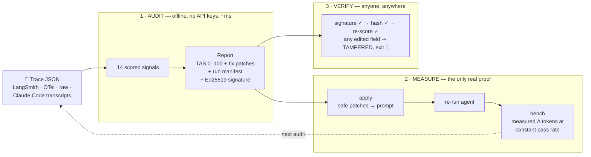
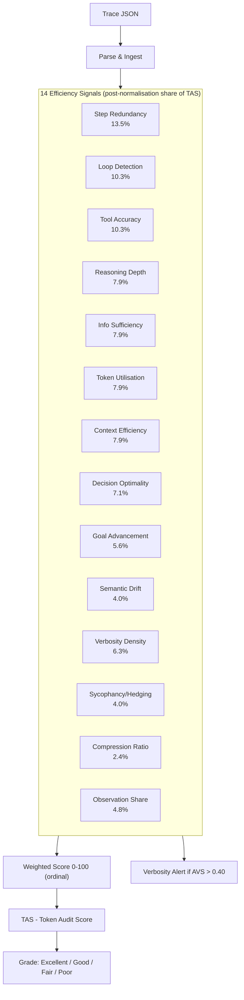
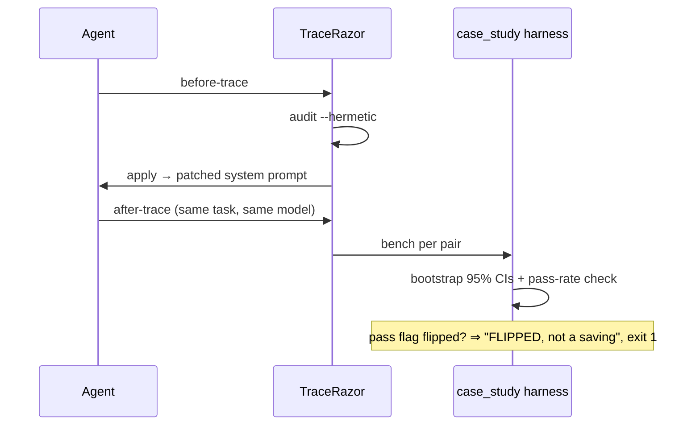
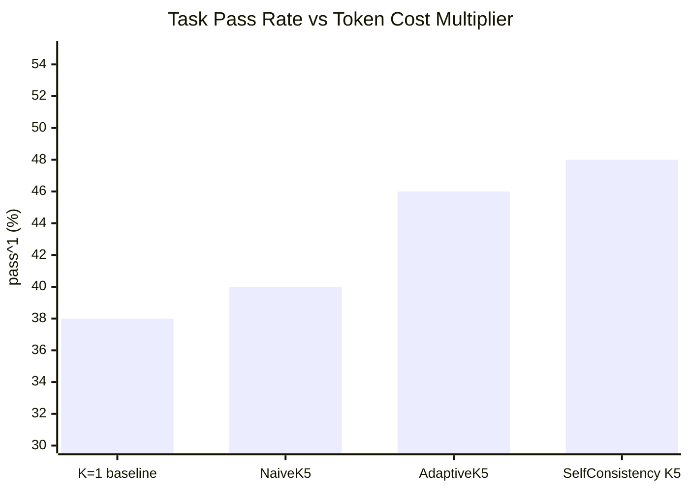
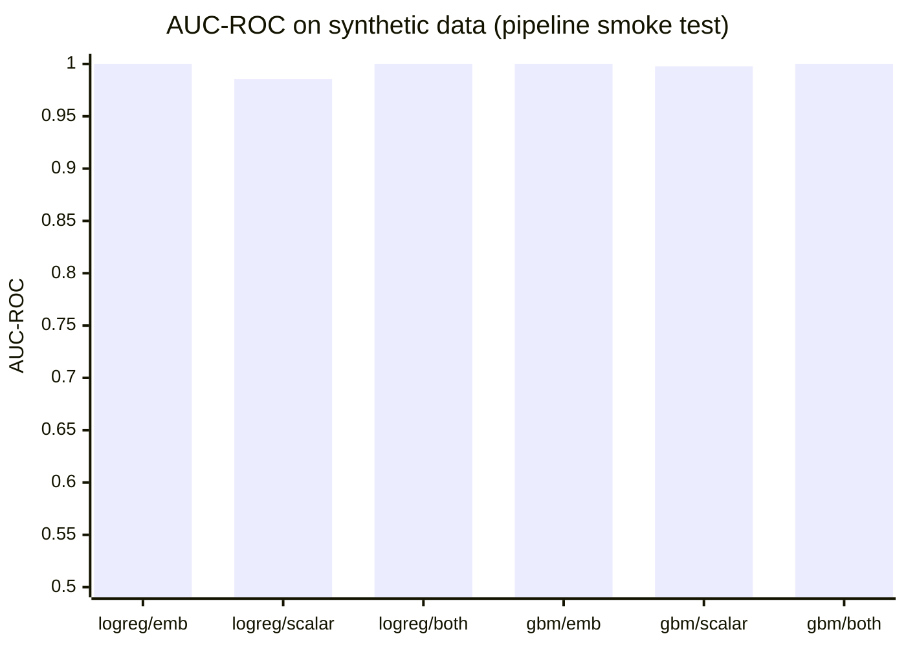
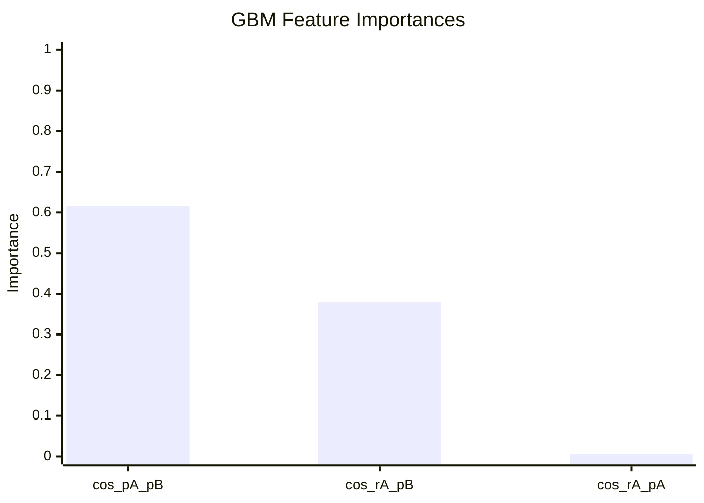
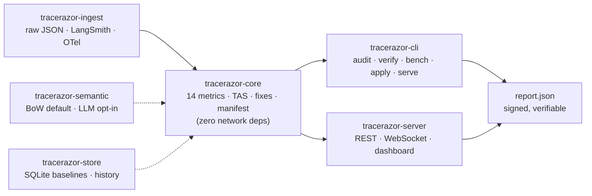

# TraceRazor

**An offline auditor that decomposes AI-agent token waste into 14 scored signals, emits risk-tagged fix patches, and produces cryptographically verifiable (Ed25519-signed) reports.**

[](https://github.com/ZulfaqarHafez/tracerazor/actions)
[](https://pypi.org/project/tracerazor/)
&nbsp;·&nbsp; MIT &nbsp;·&nbsp; Rust + Python &nbsp;·&nbsp; Author: Zulfaqar Hafez

```bash
pip install tracerazor
```

---

## What TraceRazor Does

TraceRazor v0.4.1 closes a full loop: **audit** a trace offline, **apply** the
emitted fixes, **measure** the real before/after delta at constant task
outcome, and let anyone **verify** the report cryptographically.


```mermaid
flowchart LR
    T["📄 Trace JSON<br/>LangSmith · OTel · raw ·<br/>Claude Code transcripts"]

    subgraph AUDIT["1 · AUDIT — offline, no API keys, ~ms"]
        A["14 scored signals"] --> R["Report<br/>TAS 0–100 + fix patches<br/>+ run manifest<br/>+ Ed25519 signature"]
    end

    subgraph MEASURE["2 · MEASURE — the only real proof"]
        F["apply<br/>safe patches → prompt"] --> RR["re-run agent"]
        RR --> B["bench<br/>measured Δ tokens at<br/>constant pass rate"]
    end

    subgraph VERIFY["3 · VERIFY — anyone, anywhere"]
        V["signature ✓ → hash ✓ → re-score ✓<br/>any edited field ⇒ TAMPERED, exit 1"]
    end

    T --> A
    R --> F
    R --> V
    B -.->|next audit| T
```

Audit runs offline (no API keys; low single-digit milliseconds on typical
traces). Measure turns the audit's heuristic savings *estimates* into
*measured* deltas — see the [live case study](docs/case_study.md), which
caught one of our own fixes costing tokens and verified the repair. Verify
lets a third party check that a score is authentic and reproducible.
Experimental sampling and substitutability work is demoted to
[Labs](#labs-experimental) status.

---

## The Problem

A substantial fraction of agent tokens is structurally redundant: repeated steps, sycophantic preamble, reformulated context, and unnecessary reasoning loops. The exact share is workload-dependent and we do not claim a universal figure. The most concrete number we can stand behind is our own measurement: across 24 public τ-bench / SWE-agent traces, **mean step redundancy is 13% — ~20% on the messy airline subset, 5% on retail, 17% on SWE-agent** (after the responsiveness rules: a step answering a new user turn, a successful retry of a failure, or a verification re-run after an edit is never counted as redundant) (see [`docs/external_agent_audits.md`](docs/external_agent_audits.md)). Treat any broader "30–60%" rule of thumb as an unvalidated heuristic, not a measured constant.

A typical production support agent handling 8 tool calls across 3 loops consumes **15,000-40,000 tokens per resolution**:

| Pattern | Observed Frequency | Token Impact |
|---|---|---|
| Redundant reasoning steps | 18-35% of traces | ~20% of tokens |
| Sycophantic / hedging preamble | >60% of outputs | 5-15% per step |
| Input context reformulation | 1-3 steps per trace | 300-800 tokens each |
| Unnecessary reasoning depth | ~25% of traces | 10-30% of tokens |
| Repeated tool-call loops | ~15% of traces | Full loop cost |

Mainstream observability tools (LangSmith, Langfuse, Arize, Phoenix) record runs and surface token usage. They do not decompose that usage into structural-waste categories or emit machine-applicable prompt patches. TraceRazor is complementary, not a replacement; it consumes LangSmith / OTEL trace JSON and emits a TAS score plus a fix bundle.

## How it compares

Most tools in this space are observability and cost dashboards: LangSmith, Langfuse, Helicone, Arize Phoenix, MLflow, Traceloop, AgentOps, W&B Weave, Braintrust. They tell you how much a run cost and where. TraceRazor instead decomposes that cost into named waste categories, scores it, and emits fix patches, so the two work together: keep your dashboard for capture and monitoring, run TraceRazor on its trace JSON to find and remove waste. Full feature-by-feature breakdown with sources in [COMPARISON.md](COMPARISON.md).

---

## Audit

> Identify wasted tokens, get fix patches, and estimate monthly savings. No API keys needed. Fast on typical traces — low single-digit milliseconds up to ~50 steps; cost grows with trace length (see the [Performance](#performance) note). Reproduce locally with `cargo bench -p tracerazor-core`.

### How It Works


```mermaid
flowchart TD
    T[Trace JSON] --> P[Parse & Ingest]
    P --> M

    subgraph M["14 Efficiency Signals (post-normalisation share of TAS)"]
        direction LR
        S1["Step Redundancy\n13.5%"]
        S2["Loop Detection\n10.3%"]
        S3["Tool Accuracy\n10.3%"]
        S4["Reasoning Depth\n7.9%"]
        S5["Info Sufficiency\n7.9%"]
        S6["Token Utilisation\n7.9%"]
        S7["Context Efficiency\n7.9%"]
        S8["Decision Optimality\n7.1%"]
        S9["Goal Advancement\n5.6%"]
        S10["Semantic Drift\n4.0%"]
        V1["Verbosity Density\n6.3%"]
        V2["Sycophancy/Hedging\n4.0%"]
        V3["Compression Ratio\n2.4%"]
        O1["Observation Share\n4.8%"]
    end

    M --> W["Weighted Score 0-100 (ordinal)"]
    W --> TAS["TAS - Token Audit Score"]
    TAS --> G["Grade: Excellent / Good / Fair / Poor"]
    M --> AVS["Verbosity Alert if AVS > 0.40"]
```

> **TAS is ordinal, not cardinal.** Most weights are heuristics, not calibrated.
> The exception is OBS, added after it was the one feature that predicted real
> recoverable waste and replicated across two datasets (see
> [Better features](#better-features-observation-accumulation)). Use TAS to track
> *one project over time*, not as an absolute percentage. Override via
> `ScoringConfig.weights`.

### The 14 Metrics

All shares are *post-normalisation* (the raw weights below sum to 1.26; `compute()` divides by the sum).

**Structural Efficiency**

| Metric | Share | What It Detects |
|---|---|---|
| Step Redundancy Rate (SRR) | 13.5% | Near-duplicate steps wasting tokens |
| Loop Detection Index (LDI) | 10.3% | Repeated tool calls re-attempting the same action |
| Tool Call Accuracy (TCA) | 10.3% | Failed tool calls and retries |
| Reasoning Depth (RDA) |  7.9% | Over-deep reasoning for simple tasks |
| Information Sufficiency (ISR) |  7.9% | Steps adding no novel information |
| Token Utilisation (TUR) |  7.9% | Off-task token spending |
| Context Efficiency (CCE) |  7.9% | Duplicate context across steps |
| Decision Optimality (DBO) |  7.1% | Sub-optimal tool call sequences |
| Goal Advancement (GAR) |  5.6% | Steps that fail to move toward the stated goal |
| Semantic Drift (CSD) |  4.0% | Reasoning drift mid-trace |

**Verbosity and Presentation**

| Metric | Share | What It Detects |
|---|---|---|
| Verbosity Density (VDI) | 6.3% | Filler words and low-substance content |
| Sycophancy/Hedging (SHL) | 4.0% | Excessive politeness and caution |
| Compression Ratio (CCR) | 2.4% | Highly compressible text |

**Observation accumulation** (data-validated, see [Better features](#better-features-observation-accumulation))

| Metric | Share | What It Detects |
|---|---|---|
| Observation Token Share (OBS) | 4.8% | Share of tokens spent on tool I/O vs recoverable reasoning |

**TAS Grade Scale**

| Grade | Range | Meaning |
|---|---|---|
| Excellent | 90-100 | Minimal recoverable waste |
| Good | 70-89 | Addressable inefficiency |
| Fair | 50-69 | Significant structural waste |
| Poor | 0-49 | Fundamental reasoning issues |

### Better features (observation accumulation)

When the original 13 metrics were calibrated against real recoverable token waste
(tau-bench before/after pairs), no weighting predicted it (negative cross-validated
R²). The literature points to context accumulation, verbose/redundant/stale tool
observations, as the real cost driver, so we added candidate features measuring it
and tested them on two independent real datasets:

| Dataset (pairs) | metrics only | metrics + features |
|---|---|---|
| tau-bench (233) | -0.11 | **+0.08** |
| tau2-bench (1,055) | +0.01 | **+0.12** |

Adding the features flips real-data cross-validated R² positive on both, with
`obs_token_share` the consistent driver (r = +0.28, +0.33). It is promoted into
the composite as the OBS metric. The absolute R² is still modest (~0.1), so this
improves the score's grounding without making TAS a strong predictor yet; the
remaining candidate features (stale-observation retention, context growth) stay
diagnostic in `report.features`. Reproduce via `calibration/` (see
[DATA_TEMPLATE.md](calibration/DATA_TEMPLATE.md)); details in the
[paper](paper/tracerazor.tex).

### Sample Output

```bash
tracerazor audit traces/support-agent-run-2847.json
```

```
TRACERAZOR REPORT
------------------------------------------------------
Trace:     support-agent-run-2847
Agent:     customer-support-v3
Framework: langgraph
Steps:     11   Tokens: 14280
Analysed:  13ms
------------------------------------------------------
TRACERAZOR SCORE:  79 / 100  [GOOD]  (raw structural: 82, task value: 0.90)
VAE SCORE:         0.73
MVTG:              33.8%  (trace is 33.8% above minimum viable token count)
Note: TAS is an *ordinal* heuristic score - compare runs within one
project over time, not as an absolute efficiency percentage.
------------------------------------------------------
METRIC BREAKDOWN
Code   Metric                         Score    Target   Status
SRR    Step Redundancy Rate           0.0%     <15%     PASS
LDI    Loop Detection Index           0.000    <0.10    PASS
TCA    Tool Call Accuracy             83.3%    >85%     FAIL
RDA    Reasoning Depth Approp.        0.917    >0.75    PASS
ISR    Info Sufficiency Rate          100.0%   >80%     PASS
TUR    Token Utilisation Ratio        0.959    >0.35    PASS
CCE    Context Carry-over Eff.        0.613    >0.60    PASS
DBO    Decision Branch Optimality     0.833    >0.70    PASS [cold]
-- Verbosity Metrics ----------------------------------
VDI    Verbosity Density Index        0.775    >0.60    PASS
SHL    Sycophancy/Hedging Level       0.219    <0.20    FAIL
CCR    Caveman Compression Ratio      0.384    <0.30    FAIL
-- Goal Advancement -----------------------------------
GAR    Goal Advancement Ratio         0.403    ≥0.40    PASS  (goal proxy: step 10)
-- Semantic Path --------------------------------------
CSD    Cross-Step Semantic Drift      0.438    ≥0.60    FAIL  [drifting pairs: 3→6]
OBS    Observation Token Share        0.377    ≥0.30    PASS
------------------------------------------------------
SAVINGS ESTIMATE  (heuristic projection from flagged waste, not a measured re-run)
Tokens saved:      4827  (33.8% reduction)
Cost saved:        $0.0145 per run
Projected/month:   $724.05  (at the configured run count & token price)
```

> Savings figures are **estimates** derived from per-fix heuristics, not a
> measured before/after re-run. Use `tracerazor bench` to validate a specific
> patch set against an actual re-run. Numbers above are reproducible from the
> shipped trace with the command shown.
>
> We measured this gap ourselves with live agent runs: the heuristic estimate
> can have the wrong *sign* (round 1 measured the old `goal_anchor` patch at
> −5.6% — a cost, not a saving — at constant pass rate, which is why that
> patch was rewritten). Full data: [`docs/case_study.md`](docs/case_study.md).

### Automated Fix Patches

Every audit produces machine-applicable patches tied to the metrics that failed:

```json
"fixes": [
  {
    "fix_type": "termination_guard",
    "target": "system_prompt",
    "patch": "Once search_products returns results, do not call it again for the same query.",
    "estimated_token_savings": 420
  },
  {
    "fix_type": "hedge_reduction",
    "target": "system_prompt",
    "patch": "Do not begin responses with preamble phrases (let me, I'd be happy to, certainly).",
    "estimated_token_savings": 740
  },
  {
    "fix_type": "context_compression",
    "target": "system_prompt",
    "patch": "Summarise conversation to last 3 facts before each tool call.",
    "estimated_token_savings": 183
  }
]
```

| Fix Type | Trigger | Target |
|---|---|---|
| `tool_schema` | TCA misfire | Tool's required parameter schema |
| `termination_guard` | LDI loop | Loop-breaking condition |
| `context_compression` | CCE bloat | Context summarisation directive |
| `verbosity_reduction` | VDI fail | Filler-word elimination |
| `hedge_reduction` | SHL fail | Sycophancy/hedging directive |
| `reformulation_guard` | Reformulation flag | Skip re-stating input context |
| `goal_anchor` | GAR/TPE drift | Re-anchor the agent on its task objective |

### Path Entropy — a real "staying on the path" signal

Most "drift" metrics (including TraceRazor's own GAR and CSD) reduce to a *mean cosine similarity*. **Trajectory Path Entropy (TPE)** is different: it is a genuine information-theoretic measure of how *directed* an agent's run is toward its goal. Each step is scored for goal-progress, the step-to-step increments are classified as **advance / stall / regress**, and TraceRazor computes the normalised Shannon entropy of that distribution:

```text
H = − Σ p(s)·log2 p(s)      path_entropy = H / log2(3)  ∈ [0, 1]
focus_score = clamp( (directedness + 1)/2 − 0.25·path_entropy , 0, 1 )
```

| Trajectory | path_entropy | focus_score | Reading |
|---|---:|---:|---|
| Monotonic climb to goal | 0.0 | 1.00 | focused |
| Steady drift away | 0.0 | 0.00 | regressing |
| No movement | 0.0 | 0.50 | wandering |
| Erratic lurching | ~1.0 | 0.25 | scattered |

TPE is anchored on the **real task goal** when the trace carries one in `metadata` (`task` / `goal` / `objective` / …) — otherwise it falls back to the agent's final step and says so via `goal_origin`. It is reported as a **diagnostic alongside TAS, not folded into the composite score**, so the published per-metric shares are unchanged. When TPE (or GAR) detects drift, the audit now emits a `goal_anchor` fix instead of only flagging it.

> Honesty note: TPE measures whether a trajectory is *directed*; it does not by itself prove a fix keeps an agent on task. Use `tracerazor bench` on a captured before/after trace pair to validate that.

### Performance

`analyse()` is fast on typical traces and scales close to linearly in trace length. Indicative `cargo bench -p tracerazor-core` numbers (single trace, BoW backend stand-in):

| Trace length | Time (measured) |
|---:|---:|
| 10 steps | ~0.13 ms |
| 50 steps | ~1.2 ms |
| 200 steps | ~8.6 ms |
| 1000 steps | ~140 ms |

The earlier "sub-5 ms per trace" headline only held below ~70 steps; novelty scanning (ISR) was quadratic. ISR is now bounded to a recent-context window, which roughly halved the 200-step cost and cut the 1000-step cost ~3×. Long traces still grow super-linearly (similarity-based redundancy detection dominates), so we no longer print a single universal figure — run the bench on your own hardware for exact numbers.

### Quickstart: Audit

> TraceRazor needs **at least 5 steps** to compute its metrics; shorter traces
> are skipped with a notice.

```python
from tracerazor import Tracer

with Tracer(agent_name="support-agent", framework="openai") as t:
    t.reasoning("Parse the refund request for order ORD-123.", tokens=180)

    order = lookup_order(order_id="ORD-123")
    t.tool("lookup_order", params={"order_id": "ORD-123"},
           output=str(order), success=True, tokens=90)

    t.reasoning("Order is within the 30-day window; it is eligible.", tokens=160)

    eligible = check_eligibility(order_id="ORD-123")
    t.tool("check_eligibility", params={"order_id": "ORD-123"},
           output=str(eligible), success=True, tokens=110)

    refund = process_refund(order_id="ORD-123")
    t.tool("process_refund", params={"order_id": "ORD-123"},
           output=str(refund), success=True, tokens=140)

    t.reasoning("Refund processed; confirm to the customer.", tokens=120)

report = t.analyse()
print(report.summary())
# TAS 80.4/100 [Good] | 6 steps, 800 tokens | Saved 250 tokens (31%)

report.assert_passes()   # raises AssertionError in CI if TAS < 70
```

Or via CLI:

```bash
# Build the binary
cargo build --release

# Audit a shipped sample trace (gate CI by adding --threshold 75)
tracerazor audit traces/support-agent-run-2847.json

# Hermetic + verifiable: pure function of (trace, config, version)
tracerazor audit traces/support-agent-run-2847.json --hermetic --format json > report.json
tracerazor verify report.json traces/support-agent-run-2847.json

# Compare two traces per-metric
tracerazor compare traces/external/tau_bench/gpt-4o_airline_task0.json traces/external/tau_bench/gpt-4o_retail_task0.json
```

### Audits on Real Public Agent Trajectories

We ran TraceRazor's audit over **24 real public agent runs** sourced from
two well-known benchmarks, τ-bench (Sierra Research) and SWE-agent
(Princeton NLP), to calibrate expectations against artefacts you have
likely already seen.

| Model | Domain | n | Avg TAS | Avg step redundancy |
|---|---|---|---|---|
| GPT-4o | τ-bench airline | 5 | **53** (Fair/Poor) | **36%** |
| GPT-4o | τ-bench retail | 5 | 85 (Good) | 14% |
| Claude Sonnet 3.5 (new) | τ-bench airline | 5 | 67 (Fair) | **41%** |
| Claude Sonnet 3.5 (new) | τ-bench retail | 5 | 81 (Good) | 17% |
| SWE-agent (4 prompt variants) | marshmallow#1867 | 4 | 70 (Good/Fair) | 22% |

Highlights: GPT-4o's worst airline trace scores 47/100 with **57% step
redundancy**; SWE-agent's XML prompt variant uses ~52% fewer tokens than
the cursors variant for the same successful patch. Full table, methodology,
and the 24 converted trace JSONs live at
[`docs/external_agent_audits.md`](docs/external_agent_audits.md) and
[`traces/external/`](traces/external/). Converters in
[`tools/`](tools/).

#### Real ReAct trajectories from Hugging Face (AgentInstruct)

To exercise a *different* real agent style — tool-using **ReAct** agents that
interleave a thought with a shell/SQL action, rather than function-calling
assistants — we also audit trajectories sourced from the Hugging Face dataset
[`zai-org/AgentInstruct`](https://huggingface.co/datasets/zai-org/AgentInstruct)
(formerly `THUDM/AgentInstruct`). The corpus is audited end-to-end by a
`cargo test` statistics gate
([`crates/tracerazor-cli/tests/huggingface_real_data.rs`](crates/tracerazor-cli/tests/huggingface_real_data.rs))
and summarised in
[`docs/huggingface_agentinstruct_audit.md`](docs/huggingface_agentinstruct_audit.md)
(reproduce with `python -m benchmark.hf_audit_stats`; every audit runs in a
fresh state directory so measurements are order-independent). On the
de-contaminated corpus mean TAS is **78.0** at the default floor (4 analysable
traces) and **82.9** over the full 13-trace corpus with `--min-steps 2`. The
exercise mattered because it surfaced — and fixed — a data-fidelity hazard plus
four product blind spots that the τ-bench traces did not:

| Finding on real ReAct data | Fix |
|---|---|
| **Few-shot scaffolding audited as agent behaviour** (every row embeds the dataset's one-shot demo, `loss=false`; it pseudo-replicated one canned trajectory into every trace) | Converter audits only real-task turns via the **`loss` flag** (text-marker fallback). Mean TAS 82.8→78.0 — the demo was *padding* every score |
| **Loop detection never fired** (`os_6` runs `grep -o "Linux" <FILE> \| wc -l` 4×, but LDI keyed on exact tool+params) | LDI now detects **parametric loops** — same command template, different argument (LDIₙₒᵣₘ 1.00→0.33 on the clean `os_6`) |
| **GAR/CSD collapsed** (ReAct fuses the reasoning into the tool-call turn, which both metrics ignored) | GAR/CSD score tool-call steps carrying substantive **reasoning prose**, not just `reasoning`-typed steps |
| **Code syntax diluted similarity** (wholesale fence-stripping made it *worse*: CSDₙₒᵣₘ 0.415→0.353 — the argument literals are the goal anchors) | Fenced code is reduced to its **argument literals** (paths, quoted strings, numbers); syntax dropped (GARₙₒᵣₘ 0.202→0.348 overall) |
| **DBO structurally capped single-tool agents** (a bash operator's n calls = n−1 "retries" when keyed on tool name) | Cold-start retry/thrash signals key on the **invocation** (tool+params): DBOₙₒᵣₘ 0.59→0.88, with the one genuine-failure trace the only one below the ceiling |

**Coverage finding:** with scaffolding excluded, ~69% of real trajectories
(9/13) finish in 3–4 steps — below the default 5-step analysis floor. The
`audit` command now takes **`--min-steps N`** (default unchanged, clamped ≥2)
so short real-world task runs are auditable by explicit opt-in; the gate
verifies 13/13 full-corpus coverage.

**Auditable runs (provenance):** every audit now embeds a **run manifest**
(SHA-256 of the input trace bytes, tool version, timestamp, the similarity
backend that *actually* ran, the exact weights + their hash, step floor, and
any store-derived baselines). `--hermetic` makes the score a pure function of
(trace, config, version), and **`tracerazor verify <report> <trace>`**
re-checks the hash and exactly re-scores hermetic BoW runs — one flipped byte
fails verification. Reports also carry **AGF (Action/Claim Grounding
Fidelity)**: a deterministic diagnostic measuring how much of what the agent
did and concluded is traceable to prior context/observations, with every
ungrounded literal itemised (mean 0.854 on the AgentInstruct corpus).

Provenance and a live dataset-viewer fetch path are in
[`traces/external/huggingface/agentinstruct/SOURCE.md`](traces/external/huggingface/agentinstruct/SOURCE.md);
the converter is [`tools/convert_agentinstruct.py`](tools/convert_agentinstruct.py).

### Calibrating TAS to your workload

The fourteen sub-metrics are combined with weights that are heuristic by
default. If you want TAS to be a *calibrated* indicator for your use case rather
than an ordinal one, fit the weights to ground truth with the calibration tool
in [`calibration/`](calibration/). The supported objective is **recoverable
token waste**: the weights are fit so that efficiency (`raw TAS / 100`) predicts
`1 - recoverable_fraction`, where the fraction comes from measured before/after
re-runs at constant task quality (e.g. your products vs. industry multi-agent
baselines).

```bash
pip install -e ".[calibrate]"
cargo build --release -p tracerazor

# Your data: a manifest of traces with measured recoverable waste
python -m calibration.calibrate --dataset path/to/manifest.json \
  --out config/tas_weights.json --report config/calibration_report.md

# Use the fitted weights
tracerazor audit run.json --weights config/tas_weights.json
# or globally:  export TRACERAZOR_WEIGHTS=config/tas_weights.json
```

The tool reports **train R², cross-validated R², and the default-weights
baseline**, so recalibration is only adopted when it demonstrably helps. On a
reproducible controlled benchmark of 200 traces with six categories of injected
waste, calibrated weights reach **cross-validated R² = 0.64** against recoverable
waste versus **R² = 0.09** for the heuristic defaults (see
[`config/calibration_report.md`](config/calibration_report.md)). That validates
the procedure; it is not a claim about any specific production system, which
needs your own measured data.

The built-in defaults are left unchanged until you calibrate on your own data,
because the injected-waste distribution is a model rather than a sample of real
agents, so shipping those weights as the default would swap one unvalidated
choice for another. The worked example lives in `calibration/`; see
[`calibration/README.md`](calibration/README.md).

---

## Measure: from estimated to measured savings

The audit's "tokens saved" figure is a heuristic projection. The `apply` →
re-run → `bench` loop replaces it with a **measured** delta, and the
measurement harness refuses to call a delta a "saving" on any task whose
pass flag flipped:


```mermaid
sequenceDiagram
    participant Agent
    participant TraceRazor
    participant Harness as case_study harness

    Agent->>TraceRazor: before-trace
    TraceRazor->>TraceRazor: audit --hermetic
    TraceRazor->>Agent: apply → patched system prompt
    Agent->>TraceRazor: after-trace (same task, same model)
    TraceRazor->>Harness: bench per pair
    Harness->>Harness: bootstrap 95% CIs + pass-rate check
    Note over Harness: pass flag flipped? ⇒ "FLIPPED, not a saving", exit 1
```

We ran this loop live — 24 real Claude Code runs over 6 pytest-verified
tasks × 2 replicates, ≈$1.30 total — and published both rounds, including
the one that went against us:

| Round | Patch under test | Mean token Δ (95% CI) | Pass rate |
|---|---|---|---|
| 1 | `goal_anchor` as shipped | **−5.6%** [−11.4, +0.2] — a cost | 12/12 → 12/12 |
| 2 | `goal_anchor` rewritten from round-1 evidence | **+0.7%** [−8.9, +9.9] — cost-neutral | 12/12 → 12/12 |

Round 1's estimate accuracy was **−102%**: the projection had the wrong
sign. That measurement is why the shipped patch no longer tells the agent to
restate its objective every step. Full protocol, data, and limitations:
[`docs/case_study.md`](docs/case_study.md) — every trace, fix, and run log is
committed, so the measurement re-runs without API spend. The transcript
converter (`benchmark/convert_claude_code.py`) makes any Claude Code session
auditable the same way.

---

## Verify: signed, tamper-evident reports

A score is only evidence if a third party can check it. Every audit embeds a
**run manifest** (trace SHA-256, tool version, similarity backend, exact
weights + hash, thresholds, store-derived baselines), and `verify` re-checks
it; hermetic bag-of-words runs are re-scored exactly, field by field.

For adversarial settings (compliance hand-offs, vendor claims), sign the
report:

```bash
# One-time: generate an Ed25519 keypair
tracerazor keygen
# TRACERAZOR_SIGNING_KEY=...   (private — keep secret, e.g. a CI secret)
# TRACERAZOR_VERIFY_KEY=...    (public — distribute freely)

# Audits signed with the key embed a signature over the canonical report
export TRACERAZOR_SIGNING_KEY=<key>
tracerazor audit traces/support-agent-run-2847.json --hermetic --format json > report.json

# Verification checks the signature FIRST: any edited field — TAS, AGF,
# savings, fixes, summary, even the similarity-backend claim — exits 1 TAMPERED
tracerazor verify report.json traces/support-agent-run-2847.json
# signature       : OK (Ed25519)
# trace hash      : OK (...)
# re-score        : OK (all metrics match)
# verified        : full (Ed25519-authenticated + reproduced from trace, manifest, version)
```

Unsigned reports never get a "full" verdict — they verify as
`rescore-only (unsigned)` at best. For WORM hand-offs, `tracerazor export
<trace> --bundle evidence.zip` packs trace + signed report + weights +
SHA256SUMS into one archive that `tracerazor verify evidence.zip` checks
end-to-end (no separate trace argument needed).

---

## Labs (experimental)

The two sections below are research tracks, not part of the supported
product surface. Their results are preliminary (single-seed sampling
benchmark; substitutability validated only on synthetic data) — treat them
as directional until the caveats inside each section are resolved.

## Labs: Adaptive Sampling (experimental)

> Two drop-in LangGraph strategies, `AdaptiveKNode` (per-step parallel
> sampling) and `SelfConsistencyBaseline` (re-sample the final answer only).
> SelfConsistency is the **default** and the **Pareto winner** on tau-bench
> airline; AdaptiveK is a targeted tool for mid-trajectory branching
> failures, not a free uplift.

### How It Works

```
  Agent Step
       │
       ▼
  ┌─────────────────────────────────────────────┐
  │         AdaptiveKNode (K candidates)         │
  │                                             │
  │  LLM call 1 ──►  branch_1                   │
  │  LLM call 2 ──►  branch_2  ──►  consensus   │──► best response
  │  LLM call 3 ──►  branch_3        winner     │
  │      ...                                    │
  │                                             │
  │  K shrinks when all agree  (saves tokens)   │
  │  K resets after mutating tool calls         │
  └─────────────────────────────────────────────┘
```

K adapts automatically:
- **Shrinks toward `k_min`** when all candidates produce the same tool call (full consensus = lower uncertainty)
- **Resets to `k_max`** after a divergent vote or a state-mutating tool call (e.g. booking a flight, cancelling an order)

### Benchmark Results (tau-bench airline, 50 tasks, gpt-4o)


```mermaid
xychart-beta
    title "Task Pass Rate vs Token Cost Multiplier"
    x-axis ["K=1 baseline", "NaiveK5", "AdaptiveK5", "SelfConsistency K5"]
    y-axis "pass^1 (%)" 30 --> 55
    bar [38, 40, 46, 48]
```

| Strategy | pass^1 | Mean tokens | vs baseline | Notes |
|---|---|---|---|---|
| K=1 baseline | 38% | 63k | 1.0x | Single deterministic pass |
| NaiveKEnsemble (K=5) | 40% | 282k | 4.5x | 5 full independent agents, majority vote |
| AdaptiveKNode (K=5) | 46% | 246k | 3.9x | Per-step adaptive sampling |
| SelfConsistency (K=5) | 48% | 137k | **2.2x** | Deterministic tools, re-sample final answer |

**Pareto winner: SelfConsistency at K=5**: highest pass rate (48%) at the lowest cost multiplier (2.2x); ~285k tokens per successful task vs ~535k for AdaptiveK.

### When to use which

- **`SelfConsistencyBaseline` (default).** Most failures are wrong final-answer formatting. Resampling the terminal answer at K=5 fixes them for ~1/N the cost of full-step ensembling. Pick this unless you have evidence that mid-trajectory branching is your failure mode.
- **`AdaptiveKNode`.** Use when failures look like *mid-trajectory* problems rather than final-answer problems. Symptoms include K=1 runs that loop until the step cap, agents that pick a wrong tool early and never recover, or domains where wrong mutating actions are expensive enough that catching pre-commit disagreement justifies the Kx cost. On tau-bench airline AdaptiveK uniquely solved 6/50 tasks (notably one that K=1 and SelfConsistency both abandoned at the step cap), but lost 4 tasks that K=1 had passed cleanly. Expect gains on the hard tail and regressions on easy tasks.
- **`NaiveKEnsemble`.** Not recommended. Failures correlate across independent runs, so a majority vote does not recover them.

The K-shrink on consensus does work: AdaptiveK uses ~42% fewer fresh (non-cached) tokens than NaiveK5, but the saving is not enough to overcome SelfConsistency's structural advantage of skipping intermediate ensembling entirely.

### Quickstart: Sampling

```python
from tracerazor import AdaptiveKNode, openai_llm
from openai import AsyncOpenAI
from langgraph.graph import StateGraph

llm = openai_llm(AsyncOpenAI(), model="gpt-4.1")
node = AdaptiveKNode(llm=llm, tools=my_tools, k_max=5, k_min=2)

graph = StateGraph(AgentState)
graph.add_node("agent", node)
# ... add edges and compile as usual ...

result = await graph.ainvoke({"messages": [HumanMessage(content="...")]})
print(result["consensus_report"].summary())
```

Or use the baselines directly:

```python
from tracerazor import SelfConsistencyBaseline, NaiveKEnsemble

# Deterministic tools + K re-sampled final answers
sc = SelfConsistencyBaseline(llm=llm, tools=my_tools, k=5)
result = await sc.run(task)

# K fully independent agent runs
naive = NaiveKEnsemble(llm=llm, tools=my_tools, k=5)
result = await naive.run(task)
```

---

## Labs: Substitutability Classifier (experimental)

> Predict whether a cached LLM response can safely replace a fresh response to a new prompt. Every correct positive saves one full LLM round-trip.

### How It Works

```
           ┌─────────────────────────────────────────────────────┐
           │               Substitutability Decision              │
           │                                                     │
  prompt_B │                                                     │  substitutable?
  ─────────►   cos(embed(pA), embed(pB))                        ├──────────────►
           │   cos(embed(rA), embed(pB))  ──►  Classifier  ──►  │  YES → reuse
 response_A    jaccard overlap                                   │   NO → new call
  ─────────►   length ratios                                     │
           │                                                     │
           └─────────────────────────────────────────────────────┘
```

**Pass criteria:** precision ≥ 80% AND recall ≥ 30% simultaneously at the same operating threshold. A wrong substitution silently corrupts the agent trajectory; that is costlier than a missed cache hit.

### Feature Tiers

```
  ┌──────────┬────────────────────────────────────────────────────────────┐
  │  Tier    │  Features                                                  │
  ├──────────┼────────────────────────────────────────────────────────────┤
  │  emb     │  cos(embed(pA), embed(pB))  - prompt semantic similarity   │
  │          │  cos(embed(rA), embed(pB))  - response-to-new-prompt match │
  │          │  cos(embed(rA), embed(pA))  - response quality anchor      │
  ├──────────┼────────────────────────────────────────────────────────────┤
  │  scalar  │  jaccard(pA, pB)            - word overlap                 │
  │          │  len(pB) / len(pA)          - relative prompt length       │
  │          │  len(rA) / len(pB)          - response size vs new prompt  │
  │          │  jaccard(rA, pB)            - response word overlap        │
  │          │  common_prefix_frac         - positional prompt similarity  │
  ├──────────┼────────────────────────────────────────────────────────────┤
  │  both    │  All 8 features above                                      │
  └──────────┴────────────────────────────────────────────────────────────┘
```

Embeddings: `all-MiniLM-L6-v2`, 22M parameters, 384-dim, fully offline.

### Synthetic Sanity Check: NOT a generalisation estimate

> The results below are on **186 synthetic Claude-generated records** drawn from
> 20 airline scenario templates. Every config trivially separates this
> distribution because the generator was instructed with the target label (a
> form of label leakage), and templates leak across the train/test split.
> **Treat these numbers as a pipeline-wiring smoke test, not a classifier-skill
> estimate.** Projected real-data AUC: **0.70-0.90** (consistent with the
> `scalar`-tier CV AUC of 0.90 +/- 0.05, the only number here not corrupted by
> template leakage). The eval pipeline (`tracerazor/redundancy/evaluate_full.py`)
> has been hardened to use `StratifiedGroupKFold` keyed by `template_id`, re-
> run against real tau-bench transcripts before quoting any number in production.


```mermaid
xychart-beta
    title "AUC-ROC on synthetic data (pipeline smoke test)"
    x-axis ["logreg/emb", "logreg/scalar", "logreg/both", "gbm/emb", "gbm/scalar", "gbm/both"]
    y-axis "AUC-ROC" 0.5 --> 1.0
    bar [1.0000, 0.9856, 1.0000, 1.0000, 0.9978, 1.0000]
```

| Configuration | CV ROC mean+/-std | Test ROC | Test PR | Precision | Recall | On-synthetic |
|---|---|---|---|---|---|---|
| logreg/emb | 1.000 +/- 0.000 | 1.000 | 1.000 | 81.1% | 100.0% | pass |
| logreg/scalar | 0.900 +/- 0.051 | 0.986 | 0.987 | 81.1% | 100.0% | pass |
| logreg/both | 1.000 +/- 0.000 | 1.000 | 1.000 | 81.1% | 100.0% | pass |
| gbm/emb | 1.000 +/- 0.000 | 1.000 | 1.000 | 81.1% | 100.0% | pass |
| gbm/scalar | 0.923 +/- 0.046 | 0.998 | 0.998 | 81.1% | 100.0% | pass |
| gbm/both | 1.000 +/- 0.000 | 1.000 | 1.000 | 81.1% | 100.0% | pass |

All six configs pass on synthetic data; **none of these is a deployable
threshold**. Re-validate on your own transcripts before production use.

**GBM Feature Importance (emb tier):**


```mermaid
xychart-beta
    title "GBM Feature Importances"
    x-axis ["cos_pA_pB", "cos_rA_pB", "cos_rA_pA"]
    y-axis "Importance" 0 --> 1.0
    bar [0.6153, 0.3789, 0.0058]
```

`cos_pA_pB` (prompt semantic similarity) dominates at 61.5%, but on the
synthetic data this likely means the classifier is recovering the template
identity, not learning substitutability. Re-evaluate feature importances
once real-data labels are in place.

### Quickstart: Substitutability Classifier

```bash
# Generate synthetic training data (requires ANTHROPIC_API_KEY in .env)
python -m tracerazor.redundancy.generate_data --n 300 --run-id run_synthetic
python -m tracerazor.redundancy.generate_data --n 100 --run-id run_v3 --out results/run_v3/judge_transcripts.jsonl

# Full evaluation: 5-fold CV, bootstrap CI, PR curves, confusion matrices, feature importance
python -m tracerazor.redundancy.evaluate_full --results-dir results --test-run run_v3
# Writes docs/findings_v5.md
```

```python
import pandas as pd
from tracerazor.redundancy.substitutability import build_features, train, evaluate, load_labels, split_by_run

df = load_labels("results")
df_train, df_test = split_by_run(df, test_run_pattern="run_v3")

logreg, gbm = train(df_train, tier="emb")
result = evaluate(logreg, df_test)
print(result)   # EvalResult(auc_roc=1.0, passes=True, ...)

# Single pair inference
df_pair = pd.DataFrame([{
    "prompt_A": "Book AA100 JFK to LAX June 15",
    "response_A": "Found AA100 departing 08:00, $450.",
    "prompt_B": "Book AA100 JFK to LAX June 16",
}])
X = build_features(df_pair, tier="emb")
prob = logreg.pipeline.predict_proba(X)[0, 1]
substitutable = prob >= 0.015
```

Full findings and methodology: [`docs/findings_v5.md`](docs/findings_v5.md)

---

## Install

```bash
pip install tracerazor                    # core: audit + adaptive sampling
pip install "tracerazor[openai]"          # OpenAI adapter for AdaptiveKNode
pip install "tracerazor[anthropic]"       # Anthropic adapter
pip install "tracerazor[langgraph]"       # LangGraph integration
pip install "tracerazor[all]"             # everything
```

For the substitutability classifier:

```bash
pip install sentence-transformers scikit-learn pandas numpy anthropic
```

---

## End-to-End Example

```python
# Step 1: Instrument and audit
from tracerazor import Tracer

with Tracer(agent_name="support-agent", framework="openai") as t:
    response = llm.invoke(prompt)
    t.reasoning(response.text, tokens=response.usage.total_tokens)
    result = lookup_order(order_id="ORD-123")
    t.tool("lookup_order", params={"order_id": "ORD-123"},
           output=str(result), success=True, tokens=80)

report = t.analyse()
print(report.summary())
report.assert_passes()   # CI gate

# Step 2: Improve sampling reliability
from tracerazor import AdaptiveKNode, openai_llm, SelfConsistencyBaseline

llm_node = openai_llm(AsyncOpenAI(), model="gpt-4.1")
node = AdaptiveKNode(llm=llm_node, tools=my_tools, k_max=5)
# ... wire into LangGraph graph ...

# Step 3: Predict substitutability before each LLM call
from tracerazor.redundancy.substitutability import build_features
import pandas as pd

df = pd.DataFrame([{
    "prompt_A": cached_context,
    "response_A": cached_response,
    "prompt_B": current_context,
}])
X = build_features(df, tier="emb")
if trained_classifier.predict_proba(X)[0, 1] >= 0.015:
    response = cached_response   # reuse: save one LLM call
else:
    response = await llm(current_context)
```

---

## Integrations

Framework adapters live under `tracerazor.integrations.*` and ship with the
main package. Each is opt-in: install the matching extra to pull the framework
deps in.

```bash
pip install tracerazor                    # core: audit + sampling
pip install "tracerazor[langgraph]"       # adds TraceRazorCallback
pip install "tracerazor[crewai]"
pip install "tracerazor[agents]"          # OpenAI Agents SDK
pip install "tracerazor[redundancy]"      # substitutability classifier
pip install "tracerazor[all]"
```

### LangGraph

```python
from tracerazor.integrations.langgraph import TraceRazorCallback

callback = TraceRazorCallback(agent_name="support-graph", threshold=70)
result = graph.invoke({"messages": [...]}, config={"callbacks": [callback]})
callback.analyse().markdown()
```

### CrewAI

```python
from tracerazor.integrations.crewai import TraceRazorCallback

callback = TraceRazorCallback(agent_name="support-crew", threshold=70)
crew = Crew(agents=[...], tasks=[...], callbacks=[callback])
crew.kickoff()
callback.assert_passes()
```

### OpenAI Agents SDK

```python
from tracerazor.integrations.openai_agents import TraceRazorHooks

hooks = TraceRazorHooks(agent_name="support-agent", threshold=70)
await Runner.run(agent, "I need a refund for order ORD-9182", hooks=hooks)
hooks.assert_passes()
```

### GitHub Actions CI Gate

Works from **any repo** — the action downloads a prebuilt release binary
(no Rust toolchain), parses the report JSON (a malformed report fails the
step instead of silently scoring 0), posts a sticky PR comment, and uploads
the JSON report as an artifact.

```yaml
permissions:
  pull-requests: write # for the sticky PR comment

- uses: ZulfaqarHafez/TraceRazor/.github/actions/tracerazor@v0.4.1
  with:
    trace-file: traces/latest-run.json
    threshold: '75'
    # Optional regression gate vs a known-good baseline:
    baseline-trace: traces/support-agent-run-2847.json
    regression-threshold: '10' # fail on any metric dropping >10%
```

Outputs: `tas-score`, `grade`, `passes`, `regression-detected`,
`tokens-saved`, `report`, `report-json-path`. Exits 1 if TAS < threshold or
a per-metric regression exceeds the threshold; exits 2 (without inventing a
score) on broken input.

| Framework | Adapter |
|---|---|
| LangGraph / LangChain | Native callback + LangSmith / OTEL ingest |
| OpenAI Agents SDK | Native `RunHooks` |
| CrewAI | Native `CrewCallbackHandler` |
| OTEL-instrumented agents | OTEL JSON ingest |
| Raw / custom | Python SDK or JSON file |

---

## CLI Reference

```
tracerazor <COMMAND>

Commands:
  audit      Score a trace file; gate CI on --threshold <N>
  verify     Verify a report (or evidence bundle .zip) — signature, hash, re-score
  keygen     Generate an Ed25519 keypair for report signing
  optimize   Rewrite the system prompt with an LLM to eliminate detected waste
  apply      Patch a system prompt file with safe, non-functional fixes
  bench      Compare before/after traces and verify actual savings
  compare    Per-metric delta table between two trace files
  simulate   Project TAS impact of removing or merging steps
  cost       Monthly savings estimate across a set of traces
  export     Forward a report to OTEL/webhook, or pack an evidence bundle
  serve      Start the HTTP server (REST API + dashboard)
  list       List traces stored in the current session
```

```bash
# Fleet/batch mode: a directory (or several files) produces one aggregate
# report — mean/median TAS, worst-5 list — hermetic per file. Gate on mean:
tracerazor audit traces/external/ --min-steps 2 --threshold 70

tracerazor compare before.json after.json
tracerazor simulate trace.json --remove 3,8 --merge 6,7
tracerazor cost trace*.json --provider anthropic-claude-3-5-sonnet --runs 50000
tracerazor optimize trace.json --system-prompt agent.txt --output agent_v2.txt --target-tas 85

# Signed evidence bundle (trace + signed report + weights + SHA256SUMS),
# verifiable as a single file:
tracerazor export traces/support-agent-run-2847.json --bundle evidence.zip
tracerazor verify evidence.zip
```

LLM backend (for `optimize` and `--enhanced`):

```bash
export OPENAI_API_KEY=sk-...
# or
export ANTHROPIC_API_KEY=sk-ant-...
# or OpenAI-compatible (Ollama, vLLM, Groq, Together, LM Studio)
export TRACERAZOR_LLM_PROVIDER=openai-compatible
export TRACERAZOR_LLM_BASE_URL=http://localhost:11434/v1
export TRACERAZOR_LLM_MODEL=llama3.1
```

---

## REST API

Start: `tracerazor serve` (alias for `./target/release/tracerazor-server`).

The audit endpoint takes a `{"trace": ...}` envelope — the raw trace JSON
(same schema as the CLI) wrapped in a `trace` key:

```bash
tracerazor serve --port 8080 &

curl -s -X POST http://127.0.0.1:8080/api/audit \
  -H "Content-Type: application/json" \
  -d '{"trace": {"trace_id": "t1", "agent_name": "support", "framework": "raw",
        "steps": [{"id": 1, "step_type": "reasoning", "content": "...", "tokens": 100}]}}'
```

**Auth:** set `TRACERAZOR_API_TOKEN` to require
`Authorization: Bearer <token>` on every `/api` route and `/ws`; requests
without it get `401`. The server binds loopback by default — set a token
*before* exposing it (`--bind 0.0.0.0`), and the server warns if you don't.
Health probes (`/healthz`, `/readyz`) stay open for orchestrators.

```bash
TRACERAZOR_API_TOKEN=s3cret tracerazor serve --bind 0.0.0.0 --port 8080 &
curl -s -H "Authorization: Bearer s3cret" http://127.0.0.1:8080/api/traces
```

| Method | Path | Description |
|---|---|---|
| `POST` | `/api/audit` | Score a trace (`{"trace": ...}` envelope); auto-captures to KB if TAS >= 85 |
| `GET` | `/api/traces` | List stored traces |
| `GET/DELETE` | `/api/traces/:id` | Full trace + report / delete |
| `GET` | `/api/dashboard` | Aggregate stats |
| `GET` | `/api/agents` | Per-agent stats, worst-first |
| `GET` | `/api/compare?a=:id&b=:id` | Metric diff between two traces |
| `WS` | `/ws` | Live audit event stream |
| `GET` | `/api/metrics` | Prometheus exposition |

---

## Architecture

How a trace flows through the crates:


```mermaid
flowchart LR
    IN["tracerazor-ingest<br/>raw JSON · LangSmith · OTel"] --> CORE["tracerazor-core<br/>14 metrics · TAS · fixes · manifest<br/>(zero network deps)"]
    SEM["tracerazor-semantic<br/>BoW default · LLM opt-in"] -.-> CORE
    STORE["tracerazor-store<br/>SQLite baselines · history"] -.-> CORE
    CORE --> CLI["tracerazor-cli<br/>audit · verify · bench · apply · serve"]
    CORE --> SRV["tracerazor-server<br/>REST · WebSocket · dashboard"]
    CLI --> OUT["report.json<br/>signed, verifiable"]
    SRV --> OUT
```

Repository layout:

```
tracerazor/
├── crates/
│   ├── tracerazor-core/       # 14 metrics, TAS scoring, fix generation, IAR
│   ├── tracerazor-ingest/     # Parsers: raw JSON, LangSmith, OpenTelemetry
│   ├── tracerazor-semantic/   # BoW similarity + LLM backend (OpenAI / Anthropic / compatible)
│   ├── tracerazor-store/      # SQLite: traces, KB, baselines, anomaly detection
│   ├── tracerazor-server/     # Axum REST + WebSocket + embedded dashboard
│   └── tracerazor-cli/        # CLI entry point; persistent store at ~/.tracerazor/
│
├── tracerazor/                # Single Python package (pip install tracerazor)
│   ├── _audit_tracer.py       # Tracer context manager
│   ├── _audit_client.py       # TraceRazorClient + TraceRazorReport
│   ├── _adaptive_k.py         # AdaptiveKNode (LangGraph node)
│   ├── _self_consistency.py   # SelfConsistencyBaseline
│   ├── _naive_ensemble.py     # NaiveKEnsemble
│   ├── _consensus.py          # ExactMatchConsensus, BranchProposal, Outcome
│   ├── _adapters.py           # openai_llm, anthropic_llm, mock_llm
│   ├── integrations/          # opt-in framework adapters
│   │   ├── langgraph/         # pip install "tracerazor[langgraph]"
│   │   ├── crewai/            # pip install "tracerazor[crewai]"
│   │   └── openai_agents/     # pip install "tracerazor[agents]"
│   └── redundancy/            # pip install "tracerazor[redundancy]"
│       ├── substitutability.py
│       ├── generate_data.py   # synthetic transcript generator (Anthropic)
│       └── evaluate_full.py   # 5-fold CV, group-aware split, control baseline
│
├── examples/                  # framework-specific end-to-end snippets
│   ├── langgraph/
│   ├── crewai/
│   └── openai_agents/
│
├── benchmark/
│   ├── case_study.py          # measured-savings harness: bench per pair + bootstrap CIs
│   ├── convert_claude_code.py # Claude Code transcript → auditable trace
│   └── live/                  # live-study kit: task suite, runner, both rounds' data
│
├── docs/
│   ├── case_study.md          # MEASURED live case study: 24 real agent runs, CIs, both rounds
│   ├── findings_v5.md         # Substitutability study: full results + Mermaid charts
│   └── tau_bench_benchmark_report.md  # Pareto analysis of sampling strategies
│
└── .github/                   # CI workflow + composite GitHub Action
```

`tracerazor-core` has zero network dependencies; offline analysis never pulls in `reqwest`. The semantic, server and substitutability components are opt-in and call out to LLM / embedding services; `--enhanced` activates at runtime without recompiling.

---

## Test Coverage

Reproduce with `cargo test --workspace` and `pytest`.

| Crate / Module | Tests |
|---|---|
| tracerazor-core | 164 |
| tracerazor-ingest (incl. golden files) | 7 |
| tracerazor-semantic | 22 |
| tracerazor-store | 10 |
| tracerazor-server (incl. auth) | 24 |
| tracerazor-cli (2 unit + 22 integration) | 24 |
| Doc-tests | 9 |
| **Total Rust** | **260, all pass** |
| **Python** (pytest) | **254 pass, 4 skipped** |

---

## Research Foundation

| # | Paper | Informs |
|---|---|---|
| [1] | Han et al. (2024). **Token-Budget-Aware LLM Reasoning (TALE)**. ACL 2025. | TUR, CCE |
| [2] | Zhao et al. (2025). **SelfBudgeter: Adaptive Token Allocation**. | Adaptive sampling |
| [3] | Lee et al. (2025). **Evaluating Step-by-step Reasoning Traces: A Survey**. | Framework basis |
| [4] | Su et al. (2024). **Dualformer: Controllable Fast and Slow Thinking**. | RDA |
| [5] | Wu et al. (2025). **Step Pruner: Efficient Reasoning in LLMs**. | Optimal path diff |
| [6] | Feng et al. (2025). **Efficient Reasoning Models: A Survey**. | Metric validation |
| [7] | Pan et al. (2024). **ToolChain*: A* Search for Tool Sequences**. NeurIPS 2024. | DBO, KB design |
| [8] | Hassid et al. (2025). **Reasoning on a Budget**. | VAE score |
| [9] | (2025). **Balanced Thinking (SCALe-SFT)**. | Efficiency without accuracy loss |
| [10] | Mohammadi et al. (2025). **Evaluation and Benchmarking of LLM Agents**. KDD 2025. | Composite scoring |
| [11] | Shi et al. (2024). **Verbosity Bias in LLM Responses**. | VDI, SHL, CCR design |
| [12] | Zeng et al. (2023). **AgentTuning: Enabling Generalized Agent Abilities for LLMs** (AgentInstruct dataset). | Real ReAct-trace evaluation; LDI/GAR/CSD validation |

---

## Limitations & Honest Caveats

TraceRazor is a useful, fast heuristic tool. It is **not** a validated scientific
instrument, and we want to be precise about what it does and does not establish:

- **TAS is an ordinal heuristic by default.** The built-in composite weights are
  author-chosen and not fit against a labelled corpus, so out of the box TAS is
  best used to compare runs of the *same* agent over time, not as an absolute
  cross-agent percentage. Some sub-metrics intentionally pull in opposite
  directions (e.g. redundancy vs. continuity), so there is no single optimal
  point. **You can replace the heuristic weights with data-calibrated ones**,
  see [Calibrating TAS](#calibrating-tas-to-your-workload).
- **Savings and dollar figures are estimates, not measurements.** They are the
  sum of per-fix heuristic projections, *not* a measured before/after re-run at
  constant task quality. To validate a concrete patch set, capture a real
  "after" trace and use `tracerazor bench`.
- **The sampling benchmark is preliminary.** The published numbers are
  single-seed over 50 tasks with no confidence intervals; small differences
  between strategies are within noise. Treat the "Pareto" framing as
  directional, and re-run with multiple seeds (`--seeds`) before drawing firm
  conclusions. The in-package `SelfConsistencyBaseline` selects answers by
  honest majority vote (no oracle).
- **The substitutability classifier result is a pipeline smoke test, not a
  generalisation estimate.** It is trained and evaluated on synthetic templated
  pairs where the label is essentially topic identity; the headline AUC reflects
  label leakage by construction. See the dedicated section above.
- **IAR (adherence) is closed-loop self-validation**: it checks whether the
  tool's own fixes improved the tool's own metrics, with no external ground
  truth such as task success or human judgement.
- **Performance** is a few milliseconds for typical traces (tens of steps) and
  scales roughly linearly with step count; multi-thousand-step traces take
  proportionally longer.

For a fuller, paper-style treatment of the methodology and its limitations, see
[`paper/tracerazor.tex`](paper/tracerazor.tex).

---

## License

MIT. Copyright (c) 2025-2026 Zulfaqar Hafez. See [LICENSE](LICENSE).
