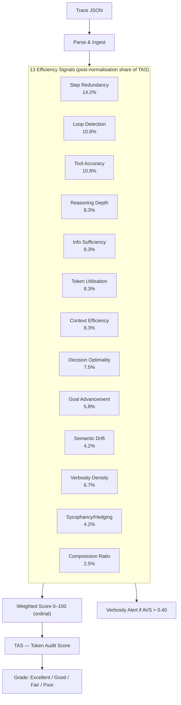
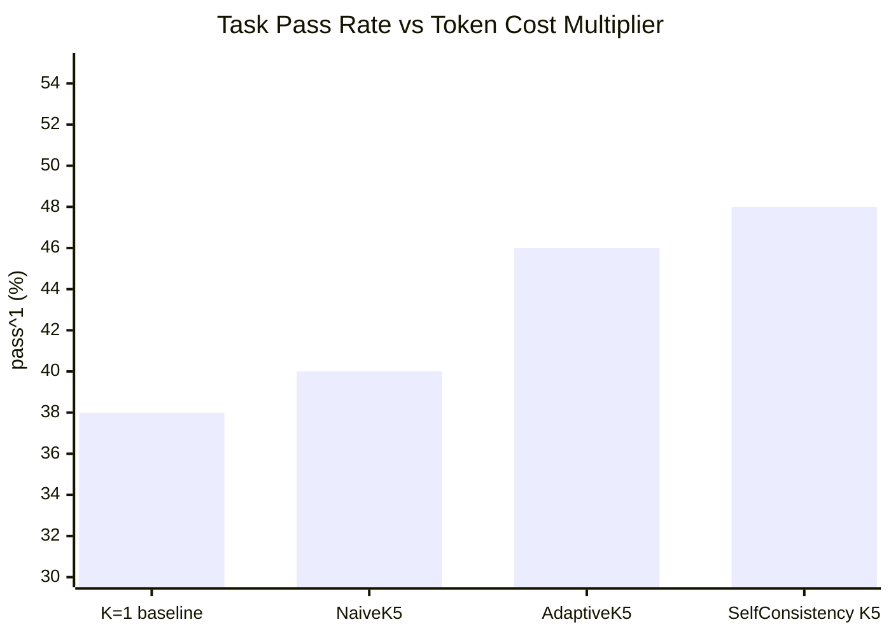
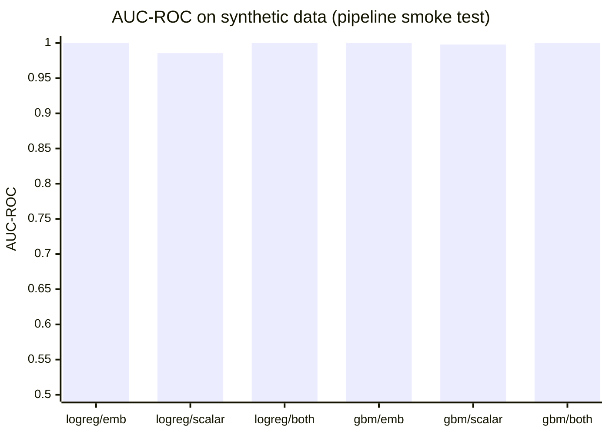
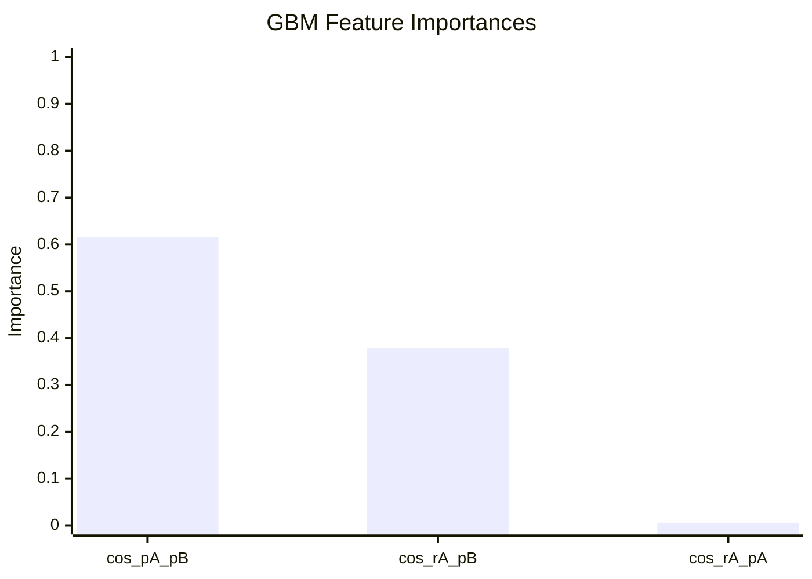

# TraceRazor

**Token efficiency auditing, adaptive sampling, and substitutability analysis for production AI agents.**

[](https://github.com/ZulfaqarHafez/tracerazor/actions)
[](https://pypi.org/project/tracerazor/)
&nbsp;·&nbsp; MIT &nbsp;·&nbsp; Rust + Python &nbsp;·&nbsp; Author: Zulfaqar Hafez

```bash
pip install tracerazor
```

---

## What TraceRazor Does

```
  ┌───────────────────────────────────────────────────────────────────────────┐
  │                           TraceRazor v1.0.0                               │
  │                                                                           │
  │   ┌──────────────┐    ┌──────────────────┐    ┌────────────────────────┐ │
  │   │   1. AUDIT   │    │   2. SAMPLING    │    │  3. SUBSTITUTABILITY   │ │
  │   │              │    │                  │    │                        │ │
  │   │ Score your   │    │ Run K parallel   │    │ Predict when a cached  │ │
  │   │ agent traces │    │ LLM calls per    │    │ response can replace a │ │
  │   │ across 13    │    │ step. Pick the   │    │ fresh LLM call, saving │ │
  │   │ efficiency   │    │ consensus        │    │ one round-trip per     │ │
  │   │ metrics.     │    │ winner.          │    │ correct prediction.    │ │
  │   │              │    │                  │    │                        │ │
  │   │ Offline.     │    │ Drop-in for      │    │ MiniLM embeddings +    │ │
  │   │ Sub-5 ms    │    │ LangGraph.       │    │ sklearn classifier.    │ │
  │   │ on the bench.│    │                  │    │                        │ │
  │   └──────────────┘    └──────────────────┘    └────────────────────────┘ │
  └───────────────────────────────────────────────────────────────────────────┘
```

Each pillar is independent. Use one, two, or all three.

---

## The Problem

Independent surveys and our own audits suggest a substantial fraction — commonly **30–60%** — of agent tokens is structurally redundant: repeated steps, sycophantic preamble, reformulated context, and unnecessary reasoning loops. Exact share is workload-dependent.

A typical production support agent handling 8 tool calls across 3 loops consumes **15,000–40,000 tokens per resolution**:

| Pattern | Observed Frequency | Token Impact |
|---|---|---|
| Redundant reasoning steps | 18–35% of traces | ~20% of tokens |
| Sycophantic / hedging preamble | >60% of outputs | 5–15% per step |
| Input context reformulation | 1–3 steps per trace | 300–800 tokens each |
| Unnecessary reasoning depth | ~25% of traces | 10–30% of tokens |
| Repeated tool-call loops | ~15% of traces | Full loop cost |

Mainstream observability tools (LangSmith, Langfuse, Arize, Phoenix) record runs and surface token usage. They do not decompose that usage into structural-waste categories or emit machine-applicable prompt patches. TraceRazor is complementary, not a replacement — it consumes LangSmith / OTEL trace JSON and emits a TAS score plus a fix bundle.

---

## Pillar 1 — Audit

> Identify wasted tokens, get fix patches, and estimate monthly savings. No API keys needed. Sub-5 ms target per trace — reproduce locally with `cargo bench -p tracerazor-core`.

### How It Works


```mermaid
flowchart TD
    T[Trace JSON] --> P[Parse & Ingest]
    P --> M

    subgraph M["13 Efficiency Signals (post-normalisation share of TAS)"]
        direction LR
        S1["Step Redundancy\n14.2%"]
        S2["Loop Detection\n10.8%"]
        S3["Tool Accuracy\n10.8%"]
        S4["Reasoning Depth\n8.3%"]
        S5["Info Sufficiency\n8.3%"]
        S6["Token Utilisation\n8.3%"]
        S7["Context Efficiency\n8.3%"]
        S8["Decision Optimality\n7.5%"]
        S9["Goal Advancement\n5.8%"]
        S10["Semantic Drift\n4.2%"]
        V1["Verbosity Density\n6.7%"]
        V2["Sycophancy/Hedging\n4.2%"]
        V3["Compression Ratio\n2.5%"]
    end

    M --> W["Weighted Score 0–100 (ordinal)"]
    W --> TAS["TAS — Token Audit Score"]
    TAS --> G["Grade: Excellent / Good / Fair / Poor"]
    M --> AVS["Verbosity Alert if AVS > 0.40"]
```

> **TAS is ordinal, not cardinal.** Weights are preliminary heuristics, not
> calibrated against a labelled corpus. Use TAS to track *one project over
> time*, not as an absolute efficiency percentage. Override via
> `ScoringConfig.weights` if your workload values differ.

### The 13 Metrics

All shares are *post-normalisation* (the raw weights below sum to 1.20; `compute()` divides by the sum).

**Structural Efficiency**

| Metric | Share | What It Detects |
|---|---|---|
| Step Redundancy Rate (SRR) | 14.2% | Near-duplicate steps wasting tokens |
| Loop Detection Index (LDI) | 10.8% | Repeated tool calls re-attempting the same action |
| Tool Call Accuracy (TCA) | 10.8% | Failed tool calls and retries |
| Reasoning Depth (RDA) |  8.3% | Over-deep reasoning for simple tasks |
| Information Sufficiency (ISR) |  8.3% | Steps adding no novel information |
| Token Utilisation (TUR) |  8.3% | Off-task token spending |
| Context Efficiency (CCE) |  8.3% | Duplicate context across steps |
| Decision Optimality (DBO) |  7.5% | Sub-optimal tool call sequences |
| Goal Advancement (GAR) |  5.8% | Steps that fail to move toward the stated goal |
| Semantic Drift (CSD) |  4.2% | Reasoning drift mid-trace |

**Verbosity and Presentation**

| Metric | Share | What It Detects |
|---|---|---|
| Verbosity Density (VDI) | 6.7% | Filler words and low-substance content |
| Sycophancy/Hedging (SHL) | 4.2% | Excessive politeness and caution |
| Compression Ratio (CCR) | 2.5% | Highly compressible text |

**TAS Grade Scale**

| Grade | Range | Meaning |
|---|---|---|
| Excellent | 90–100 | Minimal recoverable waste |
| Good | 70–89 | Addressable inefficiency |
| Fair | 50–69 | Significant structural waste |
| Poor | 0–49 | Fundamental reasoning issues |

### Sample Output

```bash
tracerazor audit traces/support-agent-run-2847.json
```

```
TRACERAZOR REPORT
------------------------------------------------------
Trace:     support-agent-run-2847    Agent: support-agent
Steps:     9                         Tokens: 18420
------------------------------------------------------
TRACERAZOR SCORE:  64 / 100  [FAIR]
------------------------------------------------------
!! VERBOSITY ALERT  AVS: 0.52  Primary driver: SHL (sycophancy/hedging)
   Est. verbose tokens: 9578
------------------------------------------------------
METRIC BREAKDOWN
Code   Metric                         Score    Target   Status
SRR    Step Redundancy Rate           18.2%    <15%     FAIL
LDI    Loop Detection Index           0.182    <0.10    FAIL
TCA    Tool Call Accuracy             83.3%    >85%     FAIL
RDA    Reasoning Depth Approp.        0.820    >0.75    PASS
ISR    Info Sufficiency Rate          88.0%    >80%     PASS
TUR    Token Utilisation Ratio        0.714    >0.35    PASS
CCE    Context Carry-over Eff.        0.880    >0.60    PASS
VDI    Verbosity Density Index        0.512    >0.60    FAIL
SHL    Sycophancy/Hedging Level       0.380    <0.20    FAIL
CCR    Caveman Compression Ratio      0.412    <0.30    FAIL
------------------------------------------------------
SAVINGS ESTIMATE
Tokens saved:      9,840  (53.4% reduction)
Cost saved:        $0.0295 per run
At 50K runs/month: $1,477.20/month saved
```

### Automated Fix Patches

Every audit produces machine-applicable patches tied to the metrics that failed:

```json
"fixes": [
  {
    "fix_type": "termination_guard",
    "target": "system_prompt",
    "patch": "Once search_products returns results, do not call it again for the same query.",
    "estimated_token_savings": 420
  },
  {
    "fix_type": "hedge_reduction",
    "target": "system_prompt",
    "patch": "Do not begin responses with preamble phrases (let me, I'd be happy to, certainly).",
    "estimated_token_savings": 740
  },
  {
    "fix_type": "context_compression",
    "target": "system_prompt",
    "patch": "Summarise conversation to last 3 facts before each tool call.",
    "estimated_token_savings": 183
  }
]
```

| Fix Type | Trigger | Target |
|---|---|---|
| `tool_schema` | TCA misfire | Tool's required parameter schema |
| `termination_guard` | LDI loop | Loop-breaking condition |
| `context_compression` | CCE bloat | Context summarisation directive |
| `verbosity_reduction` | VDI fail | Filler-word elimination |
| `hedge_reduction` | SHL fail | Sycophancy/hedging directive |
| `reformulation_guard` | Reformulation flag | Skip re-stating input context |

### Quickstart — Audit

```python
from tracerazor import Tracer

with Tracer(agent_name="support-agent", framework="openai") as t:
    response = llm.invoke(prompt)
    t.reasoning(response.text, tokens=response.usage.total_tokens)

    result = lookup_order(order_id="ORD-123")
    t.tool("lookup_order", params={"order_id": "ORD-123"},
           output=str(result), success=True, tokens=80)

report = t.analyse()
print(report.summary())
# TAS 81.4/100 [Good] | 2 steps, 900 tokens | Saved 140 tokens (16%)

report.assert_passes()   # raises AssertionError in CI if TAS < 70
```

Or via CLI:

```bash
# Build the binary
cargo build --release

# Audit a trace file
tracerazor audit traces/agent-run.json --threshold 75

# Optimize the system prompt to hit TAS 82
tracerazor optimize trace.json --output system_prompt_v2.txt --target-tas 82

# Compare before and after
tracerazor bench --before trace.json --after trace_v2.json
```

---

## Pillar 2 — Adaptive Sampling

> Two drop-in LangGraph strategies — `AdaptiveKNode` (per-step parallel
> sampling) and `SelfConsistencyBaseline` (re-sample the final answer only).
> SelfConsistency is the **default** and the **Pareto winner** on tau-bench
> airline; AdaptiveK is a targeted tool for mid-trajectory branching
> failures, not a free uplift.

### How It Works

```
  Agent Step
       │
       ▼
  ┌─────────────────────────────────────────────┐
  │         AdaptiveKNode (K candidates)         │
  │                                             │
  │  LLM call 1 ──►  branch_1                   │
  │  LLM call 2 ──►  branch_2  ──►  consensus   │──► best response
  │  LLM call 3 ──►  branch_3        winner     │
  │      ...                                    │
  │                                             │
  │  K shrinks when all agree  (saves tokens)   │
  │  K resets after mutating tool calls         │
  └─────────────────────────────────────────────┘
```

K adapts automatically:
- **Shrinks toward `k_min`** when all candidates produce the same tool call (full consensus = lower uncertainty)
- **Resets to `k_max`** after a divergent vote or a state-mutating tool call (e.g. booking a flight, cancelling an order)

### Benchmark Results (tau-bench airline, 50 tasks, gpt-4o)


```mermaid
xychart-beta
    title "Task Pass Rate vs Token Cost Multiplier"
    x-axis ["K=1 baseline", "NaiveK5", "AdaptiveK5", "SelfConsistency K5"]
    y-axis "pass^1 (%)" 30 --> 55
    bar [38, 40, 46, 48]
```

| Strategy | pass^1 | Mean tokens | vs baseline | Notes |
|---|---|---|---|---|
| K=1 baseline | 38% | 63k | 1.0x | Single deterministic pass |
| NaiveKEnsemble (K=5) | 40% | 282k | 4.5x | 5 full independent agents, majority vote |
| AdaptiveKNode (K=5) | 46% | 246k | 3.9x | Per-step adaptive sampling |
| SelfConsistency (K=5) | 48% | 137k | **2.2x** | Deterministic tools, re-sample final answer |

**Pareto winner: SelfConsistency at K=5** — highest pass rate (48%) at the lowest cost multiplier (2.2x); ~285k tokens per successful task vs ~535k for AdaptiveK.

### When to use which

- **`SelfConsistencyBaseline` (default).** Most failures are wrong final-answer formatting. Resampling the terminal answer at K=5 fixes them for ~1/N the cost of full-step ensembling. Pick this unless you have evidence that mid-trajectory branching is your failure mode.
- **`AdaptiveKNode`.** Use when failures look like *mid-trajectory* problems rather than final-answer problems — symptoms include K=1 runs that loop until the step cap, agents that pick a wrong tool early and never recover, or domains where wrong mutating actions are expensive enough that catching pre-commit disagreement justifies the K× cost. On tau-bench airline AdaptiveK uniquely solved 6/50 tasks (notably one that K=1 and SelfConsistency both abandoned at the step cap), but lost 4 tasks that K=1 had passed cleanly — expect gains on the hard tail and regressions on easy tasks.
- **`NaiveKEnsemble`.** Not recommended. Failures correlate across independent runs, so a majority vote does not recover them.

The K-shrink on consensus does work — AdaptiveK uses ~42% fewer fresh (non-cached) tokens than NaiveK5 — but the saving is not enough to overcome SelfConsistency's structural advantage of skipping intermediate ensembling entirely.

### Quickstart — Sampling

```python
from tracerazor import AdaptiveKNode, openai_llm
from openai import AsyncOpenAI
from langgraph.graph import StateGraph

llm = openai_llm(AsyncOpenAI(), model="gpt-4.1")
node = AdaptiveKNode(llm=llm, tools=my_tools, k_max=5, k_min=2)

graph = StateGraph(AgentState)
graph.add_node("agent", node)
# ... add edges and compile as usual ...

result = await graph.ainvoke({"messages": [HumanMessage(content="...")]})
print(result["consensus_report"].summary())
```

Or use the baselines directly:

```python
from tracerazor import SelfConsistencyBaseline, NaiveKEnsemble

# Deterministic tools + K re-sampled final answers
sc = SelfConsistencyBaseline(llm=llm, tools=my_tools, k=5)
result = await sc.run(task)

# K fully independent agent runs
naive = NaiveKEnsemble(llm=llm, tools=my_tools, k=5)
result = await naive.run(task)
```

---

## Pillar 3 — Substitutability Classifier

> Predict whether a cached LLM response can safely replace a fresh response to a new prompt. Every correct positive saves one full LLM round-trip.

### How It Works

```
           ┌─────────────────────────────────────────────────────┐
           │               Substitutability Decision              │
           │                                                     │
  prompt_B │                                                     │  substitutable?
  ─────────►   cos(embed(pA), embed(pB))                        ├──────────────►
           │   cos(embed(rA), embed(pB))  ──►  Classifier  ──►  │  YES → reuse
 response_A    jaccard overlap                                   │   NO → new call
  ─────────►   length ratios                                     │
           │                                                     │
           └─────────────────────────────────────────────────────┘
```

**Pass criteria:** precision ≥ 80% AND recall ≥ 30% simultaneously at the same operating threshold. A wrong substitution silently corrupts the agent trajectory — that is costlier than a missed cache hit.

### Feature Tiers

```
  ┌──────────┬────────────────────────────────────────────────────────────┐
  │  Tier    │  Features                                                  │
  ├──────────┼────────────────────────────────────────────────────────────┤
  │  emb     │  cos(embed(pA), embed(pB))  — prompt semantic similarity   │
  │          │  cos(embed(rA), embed(pB))  — response-to-new-prompt match │
  │          │  cos(embed(rA), embed(pA))  — response quality anchor      │
  ├──────────┼────────────────────────────────────────────────────────────┤
  │  scalar  │  jaccard(pA, pB)            — word overlap                 │
  │          │  len(pB) / len(pA)          — relative prompt length       │
  │          │  len(rA) / len(pB)          — response size vs new prompt  │
  │          │  jaccard(rA, pB)            — response word overlap        │
  │          │  common_prefix_frac         — positional prompt similarity  │
  ├──────────┼────────────────────────────────────────────────────────────┤
  │  both    │  All 8 features above                                      │
  └──────────┴────────────────────────────────────────────────────────────┘
```

Embeddings: `all-MiniLM-L6-v2` — 22M parameters, 384-dim, fully offline.

### Synthetic Sanity Check — NOT a generalisation estimate

> The results below are on **186 synthetic Claude-generated records** drawn from
> 20 airline scenario templates. Every config trivially separates this
> distribution because the generator was instructed with the target label (a
> form of label leakage), and templates leak across the train/test split.
> **Treat these numbers as a pipeline-wiring smoke test, not a classifier-skill
> estimate.** Projected real-data AUC: **0.70–0.90** (consistent with the
> `scalar`-tier CV AUC of 0.90 ± 0.05, the only number here not corrupted by
> template leakage). The eval pipeline (`tracerazor/redundancy/evaluate_full.py`)
> has been hardened to use `StratifiedGroupKFold` keyed by `template_id` — re-
> run against real tau-bench transcripts before quoting any number in production.


```mermaid
xychart-beta
    title "AUC-ROC on synthetic data (pipeline smoke test)"
    x-axis ["logreg/emb", "logreg/scalar", "logreg/both", "gbm/emb", "gbm/scalar", "gbm/both"]
    y-axis "AUC-ROC" 0.5 --> 1.0
    bar [1.0000, 0.9856, 1.0000, 1.0000, 0.9978, 1.0000]
```

| Configuration | CV ROC mean±std | Test ROC | Test PR | Precision | Recall | On-synthetic |
|---|---|---|---|---|---|---|
| logreg/emb | 1.000 ± 0.000 | 1.000 | 1.000 | 81.1% | 100.0% | pass |
| logreg/scalar | 0.900 ± 0.051 | 0.986 | 0.987 | 81.1% | 100.0% | pass |
| logreg/both | 1.000 ± 0.000 | 1.000 | 1.000 | 81.1% | 100.0% | pass |
| gbm/emb | 1.000 ± 0.000 | 1.000 | 1.000 | 81.1% | 100.0% | pass |
| gbm/scalar | 0.923 ± 0.046 | 0.998 | 0.998 | 81.1% | 100.0% | pass |
| gbm/both | 1.000 ± 0.000 | 1.000 | 1.000 | 81.1% | 100.0% | pass |

All six configs pass on synthetic data; **none of these is a deployable
threshold**. Re-validate on your own transcripts before production use.

**GBM Feature Importance (emb tier):**


```mermaid
xychart-beta
    title "GBM Feature Importances"
    x-axis ["cos_pA_pB", "cos_rA_pB", "cos_rA_pA"]
    y-axis "Importance" 0 --> 1.0
    bar [0.6153, 0.3789, 0.0058]
```

`cos_pA_pB` (prompt semantic similarity) dominates at 61.5%, but on the
synthetic data this likely means the classifier is recovering the template
identity, not learning substitutability. Re-evaluate feature importances
once real-data labels are in place.

### Quickstart — Substitutability Classifier

```bash
# Generate synthetic training data (requires ANTHROPIC_API_KEY in .env)
python -m redundancy.generate_data --n 300 --run-id run_synthetic
python -m redundancy.generate_data --n 100 --run-id run_v3 --out results/run_v3/judge_transcripts.jsonl

# Full evaluation: 5-fold CV, bootstrap CI, PR curves, confusion matrices, feature importance
python -m tracerazor.redundancy.evaluate_full --results-dir results --test-run run_v3
# Writes docs/findings_v5.md
```

```python
import pandas as pd
from tracerazor.redundancy.substitutability import build_features, train, evaluate, load_labels, split_by_run

df = load_labels("results")
df_train, df_test = split_by_run(df, test_run_pattern="run_v3")

logreg, gbm = train(df_train, tier="emb")
result = evaluate(logreg, df_test)
print(result)   # EvalResult(auc_roc=1.0, passes=True, ...)

# Single pair inference
df_pair = pd.DataFrame([{
    "prompt_A": "Book AA100 JFK to LAX June 15",
    "response_A": "Found AA100 departing 08:00, $450.",
    "prompt_B": "Book AA100 JFK to LAX June 16",
}])
X = build_features(df_pair, tier="emb")
prob = logreg.pipeline.predict_proba(X)[0, 1]
substitutable = prob >= 0.015
```

Full findings and methodology: [`docs/findings_v5.md`](docs/findings_v5.md)

---

## Install

```bash
pip install tracerazor                    # core: audit + adaptive sampling
pip install "tracerazor[openai]"          # OpenAI adapter for AdaptiveKNode
pip install "tracerazor[anthropic]"       # Anthropic adapter
pip install "tracerazor[langgraph]"       # LangGraph integration
pip install "tracerazor[all]"             # everything
```

For the substitutability classifier:

```bash
pip install sentence-transformers scikit-learn pandas numpy anthropic
```

---

## End-to-End Example

```python
# Step 1: Instrument and audit
from tracerazor import Tracer

with Tracer(agent_name="support-agent", framework="openai") as t:
    response = llm.invoke(prompt)
    t.reasoning(response.text, tokens=response.usage.total_tokens)
    result = lookup_order(order_id="ORD-123")
    t.tool("lookup_order", params={"order_id": "ORD-123"},
           output=str(result), success=True, tokens=80)

report = t.analyse()
print(report.summary())
report.assert_passes()   # CI gate

# Step 2: Improve sampling reliability
from tracerazor import AdaptiveKNode, openai_llm, SelfConsistencyBaseline

llm_node = openai_llm(AsyncOpenAI(), model="gpt-4.1")
node = AdaptiveKNode(llm=llm_node, tools=my_tools, k_max=5)
# ... wire into LangGraph graph ...

# Step 3: Predict substitutability before each LLM call
from tracerazor.redundancy.substitutability import build_features
import pandas as pd

df = pd.DataFrame([{
    "prompt_A": cached_context,
    "response_A": cached_response,
    "prompt_B": current_context,
}])
X = build_features(df, tier="emb")
if trained_classifier.predict_proba(X)[0, 1] >= 0.015:
    response = cached_response   # reuse: save one LLM call
else:
    response = await llm(current_context)
```

---

## Integrations

Framework adapters live under `tracerazor.integrations.*` and ship with the
main package. Each is opt-in: install the matching extra to pull the framework
deps in.

```bash
pip install tracerazor                    # core: audit + sampling
pip install "tracerazor[langgraph]"       # adds TraceRazorCallback
pip install "tracerazor[crewai]"
pip install "tracerazor[agents]"          # OpenAI Agents SDK
pip install "tracerazor[redundancy]"      # substitutability classifier
pip install "tracerazor[all]"
```

### LangGraph

```python
from tracerazor.integrations.langgraph import TraceRazorCallback

callback = TraceRazorCallback(agent_name="support-graph", threshold=70)
result = graph.invoke({"messages": [...]}, config={"callbacks": [callback]})
callback.analyse().markdown()
```

### CrewAI

```python
from tracerazor.integrations.crewai import TraceRazorCallback

callback = TraceRazorCallback(agent_name="support-crew", threshold=70)
crew = Crew(agents=[...], tasks=[...], callbacks=[callback])
crew.kickoff()
callback.assert_passes()
```

### OpenAI Agents SDK

```python
from tracerazor.integrations.openai_agents import TraceRazorHooks

hooks = TraceRazorHooks(agent_name="support-agent", threshold=70)
await Runner.run(agent, "I need a refund for order ORD-9182", hooks=hooks)
hooks.assert_passes()
```

### GitHub Actions CI Gate

```yaml
- uses: ./.github/actions/tracerazor
  with:
    trace-file: traces/latest.json
    threshold: '75'
```

Outputs: `tas-score`, `grade`, `passes`, `report`. Exits 1 if TAS < threshold.

| Framework | Adapter |
|---|---|
| LangGraph / LangChain | Native callback + LangSmith / OTEL ingest |
| OpenAI Agents SDK | Native `RunHooks` |
| CrewAI | Native `CrewCallbackHandler` |
| OTEL-instrumented agents | OTEL JSON ingest |
| Raw / custom | Python SDK or JSON file |

---

## CLI Reference

```
tracerazor <COMMAND>

Commands:
  audit      Score a trace file; gate CI on --threshold <N>
  optimize   Rewrite the system prompt with an LLM to eliminate detected waste
  apply      Patch a system prompt file with safe, non-functional fixes
  bench      Compare before/after traces and verify actual savings
  compare    Per-metric delta table between two trace files
  simulate   Project TAS impact of removing or merging steps
  cost       Monthly savings estimate across a set of traces
  export     Forward a stored trace to OTEL or a webhook
```

```bash
tracerazor compare before.json after.json
tracerazor simulate trace.json --remove 3,8 --merge 6,7
tracerazor cost trace*.json --provider anthropic-claude-3-5-sonnet --runs-per-month 50000
tracerazor optimize trace.json --system-prompt agent.txt --output agent_v2.txt --target-tas 85
```

LLM backend (for `optimize` and `--enhanced`):

```bash
export OPENAI_API_KEY=sk-...
# or
export ANTHROPIC_API_KEY=sk-ant-...
# or OpenAI-compatible (Ollama, vLLM, Groq, Together, LM Studio)
export TRACERAZOR_LLM_PROVIDER=openai-compatible
export TRACERAZOR_LLM_BASE_URL=http://localhost:11434/v1
export TRACERAZOR_LLM_MODEL=llama3.1
```

---

## REST API

Start: `./target/release/tracerazor-server`

| Method | Path | Description |
|---|---|---|
| `POST` | `/api/audit` | Score a trace; auto-captures to KB if TAS >= 85 |
| `GET` | `/api/traces` | List stored traces |
| `GET/DELETE` | `/api/traces/:id` | Full trace + report / delete |
| `GET` | `/api/dashboard` | Aggregate stats |
| `GET` | `/api/agents` | Per-agent stats, worst-first |
| `GET` | `/api/compare?a=:id&b=:id` | Metric diff between two traces |
| `WS` | `/ws` | Live audit event stream |
| `GET` | `/api/metrics` | Prometheus exposition |

---

## Architecture

```
tracerazor/
├── crates/
│   ├── tracerazor-core/       # 13 metrics, TAS scoring, fix generation, IAR
│   ├── tracerazor-ingest/     # Parsers: raw JSON, LangSmith, OpenTelemetry
│   ├── tracerazor-semantic/   # BoW similarity + LLM backend (OpenAI / Anthropic / compatible)
│   ├── tracerazor-store/      # SQLite: traces, KB, baselines, anomaly detection
│   ├── tracerazor-server/     # Axum REST + WebSocket + embedded dashboard
│   ├── tracerazor-proxy/      # Four-layer guardrail proxy
│   └── tracerazor-cli/        # CLI entry point; persistent store at ~/.tracerazor/
│
├── tracerazor/                # Single Python package (pip install tracerazor)
│   ├── _audit_tracer.py       # Tracer context manager
│   ├── _audit_client.py       # TraceRazorClient + TraceRazorReport
│   ├── _adaptive_k.py         # AdaptiveKNode (LangGraph node)
│   ├── _self_consistency.py   # SelfConsistencyBaseline
│   ├── _naive_ensemble.py     # NaiveKEnsemble
│   ├── _consensus.py          # ExactMatchConsensus, BranchProposal, Outcome
│   ├── _adapters.py           # openai_llm, anthropic_llm, mock_llm
│   ├── integrations/          # opt-in framework adapters
│   │   ├── langgraph/         # pip install "tracerazor[langgraph]"
│   │   ├── crewai/            # pip install "tracerazor[crewai]"
│   │   └── openai_agents/     # pip install "tracerazor[agents]"
│   └── redundancy/            # pip install "tracerazor[redundancy]"
│       ├── substitutability.py
│       ├── generate_data.py   # synthetic transcript generator (Anthropic)
│       └── evaluate_full.py   # 5-fold CV, group-aware split, control baseline
│
├── examples/                  # framework-specific end-to-end snippets
│   ├── langgraph/
│   ├── crewai/
│   └── openai_agents/
│
├── docs/
│   ├── findings_v5.md         # Substitutability study: full results + Mermaid charts
│   └── tau_bench_benchmark_report.md  # Pareto analysis of sampling strategies
│
└── .github/                   # CI workflow + composite GitHub Action
```

`tracerazor-core` has zero network dependencies — offline analysis never pulls in `reqwest`. The semantic, server, proxy and substitutability components are opt-in and call out to LLM / embedding services; `--enhanced` activates at runtime without recompiling.

---

## Test Coverage

| Crate / Module | Tests |
|---|---|
| tracerazor-core | 126 |
| tracerazor-ingest | 3 |
| tracerazor-semantic | 21 |
| tracerazor-store | 10 |
| tracerazor-server | 13 |
| tracerazor-proxy | 12 |
| tracerazor-cli (integration) | 9 |
| Python v2 (pytest) | 9 suites |
| **Total Rust** | **194, all pass** |

---

## Research Foundation

| # | Paper | Informs |
|---|---|---|
| [1] | Han et al. (2024). **Token-Budget-Aware LLM Reasoning (TALE)**. ACL 2025. | TUR, CCE |
| [2] | Zhao et al. (2025). **SelfBudgeter: Adaptive Token Allocation**. | Proxy Layer 3 |
| [3] | Lee et al. (2025). **Evaluating Step-by-step Reasoning Traces: A Survey**. | Framework basis |
| [4] | Su et al. (2024). **Dualformer: Controllable Fast and Slow Thinking**. | RDA |
| [5] | Wu et al. (2025). **Step Pruner: Efficient Reasoning in LLMs**. | Optimal path diff |
| [6] | Feng et al. (2025). **Efficient Reasoning Models: A Survey**. | Metric validation |
| [7] | Pan et al. (2024). **ToolChain*: A* Search for Tool Sequences**. NeurIPS 2024. | DBO, KB design |
| [8] | Hassid et al. (2025). **Reasoning on a Budget**. | VAE score, proxy |
| [9] | (2025). **Balanced Thinking (SCALe-SFT)**. | Efficiency without accuracy loss |
| [10] | Mohammadi et al. (2025). **Evaluation and Benchmarking of LLM Agents**. KDD 2025. | Composite scoring |
| [11] | Shi et al. (2024). **Verbosity Bias in LLM Responses**. | VDI, SHL, CCR design |

---

## License

MIT. Copyright 2025 Zulfaqar Hafez. See [LICENSE](LICENSE).
