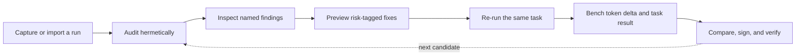
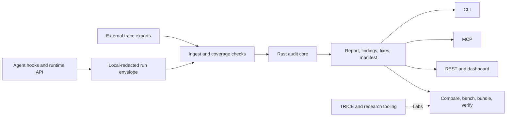

<h1 align="center">TraceRazor</h1>

<p align="center">
  <strong>Local-first efficiency QA for AI agents.</strong><br>
  Audit traces offline. Diagnose structural waste. Prove improvements with same-workload reruns.
</p>

<p align="center">
  <a href="https://github.com/ZulfaqarHafez/TraceRazor/actions/workflows/tracerazor.yml"></a>
  <a href="https://pypi.org/project/tracerazor/"></a>
  <a href="https://pypi.org/project/tracerazor/"></a>
  <a href="https://github.com/ZulfaqarHafez/TraceRazor/releases/latest"></a>
  <a href="https://github.com/ZulfaqarHafez/TraceRazor/blob/main/LICENSE"></a>
</p>

<p align="center">
  <a href="#60-second-start">Install</a> |
  <a href="https://github.com/ZulfaqarHafez/TraceRazor/blob/main/docs/AGENT_GUIDE.md">Agent guide</a> |
  <a href="https://github.com/ZulfaqarHafez/TraceRazor/blob/main/docs/public_trust_matrix.md">Trust matrix</a> |
  <a href="https://github.com/ZulfaqarHafez/TraceRazor/blob/main/docs/case_study.md">Evidence</a> |
  <a href="https://github.com/ZulfaqarHafez/TraceRazor/blob/main/SECURITY.md">Security</a>
</p>

<p align="center">
  
</p>

TraceRazor v1.1.0 is the efficiency layer between agent tracing and deployment.
It turns reasoning traces into named waste findings, risk-tagged fixes,
same-workload regression checks, and evidence that can be re-scored or signed.
The stable audit path runs locally, needs no model API key, and sends no trace
content to a hosted service.

Observability tells you what happened. TraceRazor asks which work was avoidable,
what to change, and whether the changed agent still completes the same task.

| Diagnose | Improve | Prove |
|---|---|---|
| Decompose token use into 8 weighted signals and 6 diagnostics | Review risk-tagged prompt and tool-schema fixes | Compare the same workload, benchmark a rerun, and verify the evidence |
| Check ingest quality before trusting token-derived metrics | Preview safe patches before changing a prompt | Reproduce hermetic reports or add Ed25519 authenticity |
| Import common trace formats or capture runs from agent hosts | Keep coach mode advisory and local-redacted | Export portable bundles with hashes and exact scoring configuration |

## 60-second start

TraceRazor 1.1 ships five platform wheels. Each wheel bundles the native Rust
auditor, so a normal install does not require a Rust toolchain.

```bash
python -m pip install "tracerazor[mcp]>=1.1,<2"

tracerazor --version
tracerazor agent doctor --format json
tracerazor audit traces/support-agent-run-2847.json --hermetic --format json
```

The final command uses the sample in this checkout. For your own export:

```bash
tracerazor import export.json --from auto --out trace.json --audit
```

`--from auto` recognizes native/raw TraceRazor JSON, LangSmith, Langfuse,
Phoenix, OpenTelemetry, and Claude Code exports.

### What the sample reports

The bundled support-agent trace currently produces this shape under 1.1.0:

```text
trace       customer-support-v3 / langgraph
steps       11
tokens      14,280
TAS         83.1 / 100, display band: Good
finding     1 failed tool call retried with the missing order_id
fixes       tool schema, context compression, goal anchor
projection  estimated 4,827 tokens per run, 33.8%
proof       hermetic manifest with trace, weights, config, and version hashes
```

The projection is not a measured saving. Re-run the same task and use
`tracerazor bench` before calling the delta real.

## The product loop


```mermaid
flowchart LR
    A["Capture or import a run"] --> B["Audit hermetically"]
    B --> C["Inspect named findings"]
    C --> D["Preview risk-tagged fixes"]
    D --> E["Re-run the same task"]
    E --> F["Bench token delta and task result"]
    F --> G["Compare, sign, and verify"]
    G -. next candidate .-> B
```

The loop separates three kinds of claim:

1. **Diagnosis:** the audit found a structural pattern in this trace.
2. **Projection:** a fix is estimated to remove some tokens.
3. **Measurement:** a same-task rerun used fewer provider-reported tokens while
   the task-success oracle remained passing.

Only the third is a measured saving.

## Why TraceRazor

TraceRazor complements tracing and observability platforms. Keep the system you
already use for capture, retention, dashboards, and alerts. Export a run to
TraceRazor when you need efficiency diagnosis and a before/after gate.

| Question | Typical observability workflow | TraceRazor |
|---|---|---|
| How many tokens and dollars did this run use? | Primary strength | Included as trace context and projections |
| Why was work structurally wasteful? | Usually custom evaluation | Named redundancy, loop, tool, context, and verbosity signals |
| What should I change? | Manual analysis | Risk-tagged fix candidates and optimal-path diff |
| Did the change preserve the task? | External evaluation | Same-workload compare and bench inputs, with your task oracle |
| Can another reviewer reproduce the score? | Platform-dependent | Hermetic manifest, hashes, optional Ed25519 signature, and metric re-scoring for bag-of-words runs |
| Must trace content leave the machine? | Often | No for the stable audit path |

See [COMPARISON.md](COMPARISON.md) for the longer market and product boundary.

## What ships in 1.1

### Offline auditor

`tracerazor audit` parses a trace, checks ingest coverage, calculates an ordinal
Token Alignment Score (TAS), annotates the path, and can emit fix candidates.
Use `--hermetic --format json` for machine runs. Hermetic mode makes scoring a
function of the trace, configuration, and version instead of local store
history.

### Same-workload regression gate

`tracerazor compare` reports the TAS and per-signal delta between a declared
baseline and candidate. It exits 1 only when the configured regression gate
fails. A low score by itself still exits 0 unless an explicit gate was set.

### Before/after measurement

`tracerazor bench` reports measured token and TAS deltas and can compare those
results with the audit's estimates. It does not replace a task-success oracle.
Do not label a token decrease as a saving when task success regressed.

### Reviewable fixes

Fixes are tagged `safe`, `needs_review`, or `dangerous`. `tracerazor apply`
defaults to the safe subset, supports `--dry-run`, and never silently applies
dangerous fixes. Clean traces can legitimately produce no fixes.

### Reproducible and authentic evidence

Every JSON audit carries a run manifest with the trace hash, tool version,
similarity backend, weights, thresholds, and ingest quality. Hermetic
bag-of-words runs can be re-scored metric by metric. Set
`TRACERAZOR_SIGNING_KEY` when cryptographic authenticity is required; unsigned
reports verify at `rescore-only (unsigned)` at best and do not authenticate
non-scored fields.

### Agent-native lifecycle

The `tracerazor agent` surface provides doctor, dry-run install, status,
ownership-safe uninstall, child-process context propagation, lifecycle hooks,
and offline receipt verification for Codex, Claude Code, Gemini CLI, and a
generic wrapper.

### Local MCP, API, and dashboard

`tracerazor-mcp` exposes audit, current-run discovery, findings, comparison,
signal explanation, fix preview, policy checks, and verification over stdio.
`tracerazor serve` starts the loopback-first REST/WebSocket server, local
OTLP/HTTP receiver, and embedded dashboard.

## Signals

TAS is composed from eight weighted signals. Six additional signals remain
detection-only by default because they were too constant, correlated, or
logically circular to improve the composite in the current evaluation.

| Weighted signal | Detects |
|---|---|
| Step Redundancy Rate (SRR) | Near-duplicate steps |
| Loop Detection Index (LDI) | Repeated action cycles |
| Tool Call Accuracy (TCA) | Failed calls and same-tool retries |
| Reasoning Depth (RDA) | Depth beyond the task's observed complexity |
| Information Sufficiency (ISR) | Steps that add little novel information |
| Context Efficiency (CCE) | Duplicated context across steps |
| Observation Token Share (OBS) | Token share consumed by tool observations |
| Compression Ratio (CCR) | Highly compressible text |

| Diagnostic | Detection role |
|---|---|
| Token Utilisation (TUR) | Per-step useful and flagged token breakdown |
| Decision Optimality (DBO) | Suboptimal tool-sequence choices |
| Goal Advancement (GAR) | Steps that do not advance the objective |
| Semantic Drift (CSD) | Drifting step pairs |
| Verbosity Density (VDI) | Low-density language patterns |
| Sycophancy and Hedging (SHL) | Hedging and agreement filler |

Trajectory Path Entropy (TPE), Action/Claim Grounding Fidelity (AGF), path
annotations, and observation-accumulation features are reported separately.
See [metric effectiveness](docs/metric_effectiveness.md) for the evaluation and
calibration boundary.

> TAS is ordinal, not cardinal. Compare the same project, workload, and agent
> over time. Do not rank unrelated agents or interpret an 80 as "80% efficient."

## Import, capture, and integrations

| Surface | Supported path |
|---|---|
| Trace files | Native/raw JSON, LangSmith, Langfuse, Phoenix, OpenTelemetry, Claude Code |
| Agent hosts | Codex, Claude Code, Gemini CLI, generic wrapper |
| Framework runtime | LangGraph, CrewAI, OpenAI Agents SDK |
| Telemetry | Authenticated loopback-first OTLP/HTTP JSON and protobuf, not OTLP/gRPC |
| Python | Tracer API, runtime processor, framework handles |
| Automation | CLI JSON, stdio MCP, REST, GitHub Action |

Provider-reported token counts retain their provenance. Missing usage is marked
degraded instead of being silently replaced with character-count estimates.
Always inspect `manifest.ingest_quality` before relying on token-derived output.

## Install TraceRazor into an agent host

Previewing an installation is a read-only trust step:

```bash
tracerazor agent install \
  --host auto \
  --scope project \
  --mode coach \
  --dry-run
```

Apply only after reviewing the detected host and paths:

```bash
tracerazor agent install --host auto --scope project --mode coach
tracerazor agent status --format json
```

The reviewed install command writes only TraceRazor-owned host integration
files. Once installed, coach mode captures and advises; the runtime coach does
not edit prompts, tools, or working files. Runs use the common
`.tracerazor/runs/<run-id>/` envelope and a local-redacted policy by default.

```bash
tracerazor agent verify-receipt .tracerazor/runs/<run-id>/run-receipt.json \
  --verify-key "$TRACERAZOR_VERIFY_KEY" \
  --format json
```

The canonical agent workflow is in
[`.agents/skills/tracerazor/SKILL.md`](.agents/skills/tracerazor/SKILL.md).
Packaged surfaces are available for
[Codex](plugins/tracerazor),
[Claude Code](extensions/claude-code/tracerazor), and
[Gemini CLI](extensions/gemini-cli/tracerazor).

## Gate efficiency in GitHub Actions

Prefer same-workload regression checks over a universal TAS floor:

```yaml
permissions:
  contents: read
  pull-requests: write

steps:
  - uses: actions/checkout@v4
  # An upstream eval job must upload these two runs from the same workload.
  - uses: actions/download-artifact@v4
    with:
      name: agent-eval-traces
      path: artifacts
  - uses: ZulfaqarHafez/TraceRazor/.github/actions/tracerazor@v1.1.0
    with:
      trace-file: artifacts/candidate.json
      baseline-trace: artifacts/baseline.json
      regression-threshold: "10"
```

The action downloads the pinned release binary, validates the report shape,
posts a sticky pull-request comment, and uploads the JSON report. Broken input
exits 2 without inventing a score.

## Measure and verify

### Preview a fix

```bash
tracerazor audit before.json --hermetic --format json > report.json
tracerazor apply report.json --to system_prompt.txt --dry-run
```

### Measure a rerun

Re-run the same task with the same model and a real task-success check, then:

```bash
tracerazor bench \
  --before before.json \
  --after after.json \
  --fixes report.json \
  --format json

tracerazor compare before.json after.json \
  --regression-threshold 10 \
  --format json
```

### Create portable evidence

```bash
tracerazor keygen
export TRACERAZOR_SIGNING_KEY="<private-key>"

tracerazor export trace.json --bundle evidence.zip
tracerazor verify evidence.zip --format json
```

Keep the signing key private. Distribute only the verification key. Without a
signing key, the bundle can still be hash-checked and re-scored, but it is not
an authenticated author claim.

## Architecture


```mermaid
flowchart LR
    H["Agent hooks and runtime API"] --> R["Local-redacted run envelope"]
    X["External trace exports"] --> I["Ingest and coverage checks"]
    R --> I
    I --> C["Rust audit core"]
    C --> J["Report, findings, fixes, manifest"]
    J --> CLI["CLI"]
    J --> MCP["MCP"]
    J --> API["REST and dashboard"]
    J --> E["Compare, bench, bundle, verify"]
    L["TRICE and research tooling"] -. Labs .-> E
```

The Rust core handles ingest, graph analysis, scoring, storage, CLI, and the
local server. The Python package supplies the launcher, runtime capture,
framework integrations, MCP server, and research tooling. See
[docs/agent-native.md](docs/agent-native.md) and
[docs/python_api.md](docs/python_api.md) for the implementation surfaces.

## Evidence before adjectives

TraceRazor publishes the material needed to challenge its claims:

- The [live case study](docs/case_study.md) includes a fix that moved token use
  in the wrong direction. That failure changed the shipped recommendation and
  is why projections are never presented as measurements.
- [Metric effectiveness](docs/metric_effectiveness.md) records which signals
  remained weighted and which were demoted to diagnostics.
- The [public trust matrix](docs/public_trust_matrix.md) separates local proof,
  public release proof, and unmet project targets.
- The [v1.1.0 release](https://github.com/ZulfaqarHafez/TraceRazor/releases/tag/v1.1.0)
  publishes five wheels, five standalone archives, checksums, SBOMs,
  provenance-shaped evidence, and proof cards.
- Hermetic audit output records the exact weights and configuration required
  for reproduction.

Passing release automation does not establish that TAS is scientifically
validated, that every fix saves tokens, or that Labs results generalize.

## Labs

TraceRazor includes active research surfaces, kept separate from the stable
product contract:

- **TRICE:** deterministic live context-control experiments with verifier-bound
  receipts, manifests, bundles, and explicit claim cards.
- **Adaptive sampling:** experimental branching and consensus helpers.
- **Substitutability classifier:** experimental cached-response reuse research.

The checked-in TRICE smoke evidence is not a held-out efficacy claim. Its claim
cards deliberately keep broad claim permission false. Start with
[docs/trice_library.md](docs/trice_library.md),
[docs/trice_claim_card.md](docs/trice_claim_card.md), and the
[research paper](paper/trice_v3_research_paper.pdf).

## Distribution

| Distribution | Supported in 1.1 |
|---|---|
| PyPI wheel | Windows x64, macOS x64/ARM64, Linux x64/ARM64 |
| Standalone archive | Same five native targets on GitHub Releases |
| Agent image | `linux/amd64` and `linux/arm64` |
| Source build | Rust toolchain, `cargo build --release -p tracerazor` |

Linux wheel floors are glibc 2.35 on x64 and glibc 2.39 on ARM64.
Alpine/musl is not supported in 1.1. Source distributions are intentionally not
published because they cannot guarantee a bundled auditor. There is no stable
crates.io installation contract yet. Build the CLI from source instead of
installing it from the Cargo registry.

For an unsupported platform or checkout development:

```bash
cargo build --release -p tracerazor
export TRACERAZOR_BIN=/absolute/path/to/target/release/tracerazor
```

For the TLS-protected local container topology, follow
[docs/container.md](docs/container.md). Non-loopback use requires a bearer
token, a TLS-terminating proxy, `TRACERAZOR_TLS_TERMINATED=true`, and blocked
direct access to the backend. A token alone is not the exposure boundary.

## Optional Python extras

```bash
python -m pip install "tracerazor[mcp]"         # stdio MCP server
python -m pip install "tracerazor[langgraph]"   # LangGraph runtime handle
python -m pip install "tracerazor[crewai]"      # CrewAI runtime handle
python -m pip install "tracerazor[agents]"      # OpenAI Agents processor
python -m pip install "tracerazor[http]"        # HTTP audit client
python -m pip install "tracerazor[all]"         # all optional surfaces
```

## Documentation

| Need | Start here |
|---|---|
| Machine-oriented end-to-end recipe | [Agent guide](docs/AGENT_GUIDE.md) |
| Trusted host install and runtime capture | [Agent-native guide](docs/agent-native.md) |
| Native trace schema | [Trace format](docs/trace-format.md) |
| MCP tools and host configuration | [MCP guide](docs/MCP.md) |
| Python API | [Python API](docs/python_api.md) |
| Containers, TLS, and secrets | [Container guide](docs/container.md) |
| Product boundary | [Comparison](COMPARISON.md) |
| Release trust | [Public trust matrix](docs/public_trust_matrix.md) |
| Changes | [Changelog](CHANGELOG.md) |
| Security reporting | [Security policy](SECURITY.md) |
| Agent discovery index | [llms.txt](llms.txt) |

## Develop and verify

On Windows PowerShell, add Cargo to `PATH` first if needed:

```powershell
$env:PATH = "$env:USERPROFILE\.cargo\bin;$env:PATH"
```

Run the repository gates:

```bash
cargo fmt --all -- --check
cargo test --workspace
cargo clippy --workspace --all-targets -- -D warnings
cargo deny check licenses
python -m pytest -q
tracerazor audit traces/support-agent-run-2847.json --hermetic --threshold 70
```

See [CONTRIBUTING.md](CONTRIBUTING.md) for contribution conventions.

## Honesty contract

- **TAS is ordinal.** Use it for the same workload over time, not as an
  absolute percentage or cross-agent leaderboard.
- **Savings are estimates until rerun.** Every audit token and dollar figure is
  a heuristic projection. `monthly_runs_assumed: true` means the cost figure
  used a default run volume.
- **Task success comes first.** A lower token count is not a saving when the
  task result regressed.
- **Short traces can skip.** Below the minimum step count, text mode has no
  report body and JSON mode returns a structured `status: skipped` object.
- **Ingest coverage matters.** Degraded token or content coverage weakens
  token-derived metrics. Read `manifest.ingest_quality`.
- **Default audits have local state.** Use `--hermetic` for reproducible reports
  and comparisons.
- **Labs are experiments.** TRICE, adaptive sampling, and substitutability do
  not carry broad efficacy claims.

## License and provenance

TraceRazor's original source and project artwork are licensed under the
[MIT License](LICENSE), copyright 2025-2026 Zulfaqar Hafez.

Third-party dependencies remain subject to their upstream terms. The 1.1
wheels, standalone archives, and runtime images exclude the external research
corpora, but the source tree and legacy 1.0.3 source distribution still contain
AgentInstruct-derived fixtures whose redistribution permission is unconfirmed.
Those fixtures are not covered by TraceRazor's MIT license.

[THIRD_PARTY_NOTICES.md](THIRD_PARTY_NOTICES.md) records the current
distribution boundary; a dependency-specific attribution bundle is still
required before the next release. Artwork provenance is in
[docs/assets/README.md](docs/assets/README.md).

If you use TraceRazor in research, cite [CITATION.cff](CITATION.cff).
