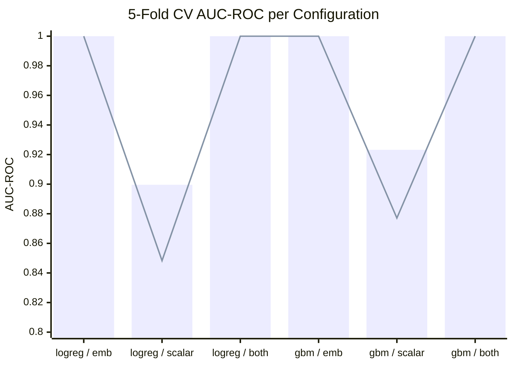
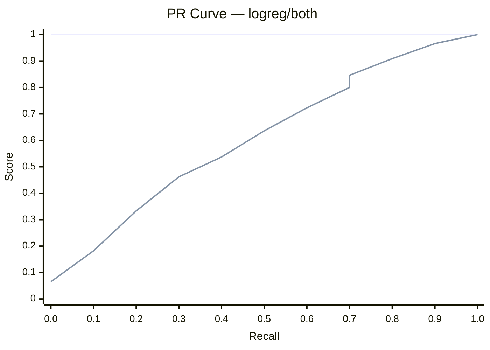
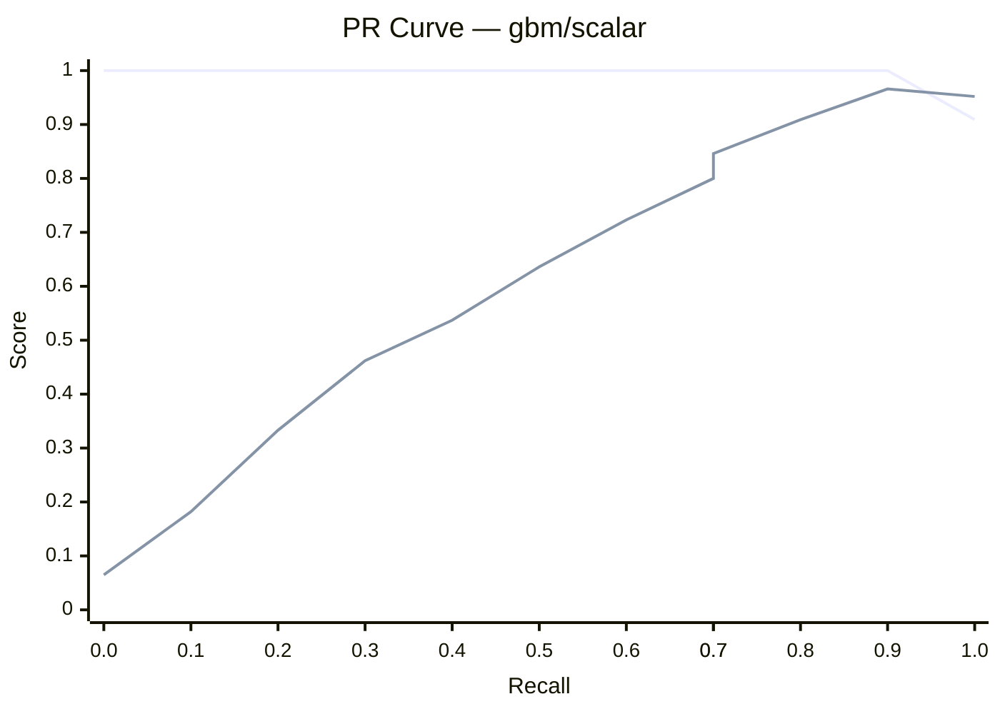
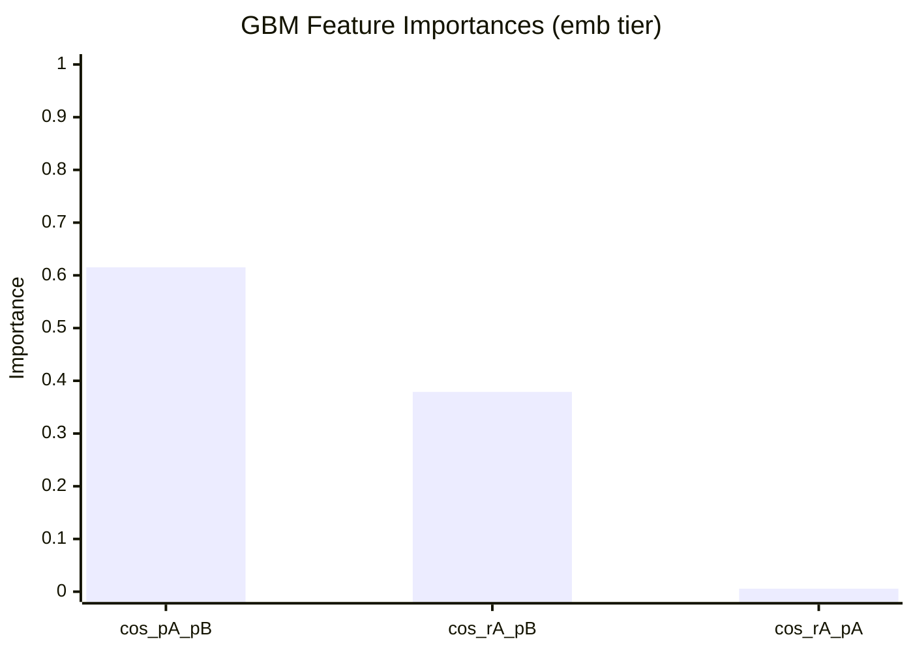

# PRD v5 — Substitutability Classifier Study

Generated: 2026-05-24 22:44 · Dataset: 186 records · Train/test split: by `run_id` containing `run_v3`

---

## Overview

The **Substitutability Classifier** predicts whether a cached LLM response
(`response_A`, produced for `prompt_A`) can safely replace a fresh response to a
new prompt (`prompt_B`). A correct positive prediction saves one full LLM round-trip.

```
           ┌─────────────────────────────────────────────────────┐
           │               Substitutability Decision              │
           │                                                     │
  prompt_B │                                                     │  substitutable?
  ─────────►   cos(embed(pA),embed(pB))                         ├──────────────►
           │   cos(embed(rA),embed(pB))   ──►  Classifier  ──►  │   YES → reuse
  response_A   jaccard overlap                                   │    NO → new call
  ─────────►   length ratios                                     │
           │                                                     │
           └─────────────────────────────────────────────────────┘
```

**Pass criteria (pre-committed):** precision ≥ 80% AND recall ≥ 30% simultaneously
at the same operating threshold.

---

## Dataset

| Split | Records | Positives | Negatives | Balance |
|-------|---------|-----------|-----------|---------|
| Train | 126 | 64 | 62 | 50.8% pos |
| Test  | 60 | 30 | 30 | 50.0% pos |

Source: synthetic judge transcripts generated by Claude Haiku from 20 airline
support scenario templates. Each record is a `(prompt_A, response_A, prompt_B, label)`
tuple where `label=1` means response_A adequately substitutes for a fresh response to prompt_B.

---

## Feature Tiers

```
  ┌──────────┬──────────────────────────────────────────────────────────────┐
  │  Tier    │  Features                                                    │
  ├──────────┼──────────────────────────────────────────────────────────────┤
  │  emb     │  cos(embed(pA), embed(pB))   — prompt semantic similarity    │
  │          │  cos(embed(rA), embed(pB))   — response-to-new-prompt match  │
  │          │  cos(embed(rA), embed(pA))   — response-to-old-prompt anchor │
  ├──────────┼──────────────────────────────────────────────────────────────┤
  │  scalar  │  jaccard(pA.words, pB.words) — word overlap                 │
  │          │  len(pB) / len(pA)           — relative prompt length        │
  │          │  len(rA) / len(pB)           — response size rel. new prompt │
  │          │  jaccard(rA.words, pB.words) — response word overlap         │
  │          │  common_prefix_frac          — positional prompt similarity  │
  ├──────────┼──────────────────────────────────────────────────────────────┤
  │  both    │  All 8 features above                                        │
  └──────────┴──────────────────────────────────────────────────────────────┘
```

Embeddings use `all-MiniLM-L6-v2` (22M parameters, 384-dim, runs fully offline).

---

## Results Summary

### Cross-Validation & Test Performance

| Configuration | CV ROC mean±std | CV PR mean±std | Test ROC | Test PR | 95% CI ROC |
|---|---|---|---|---|---|
| logreg/emb | 1.0000 ± 0.0000 | 1.0000 ± 0.0000 | 1.0000 | 1.0000 | [1.000, 1.000] |
| logreg/scalar | 0.8996 ± 0.0513 | 0.9163 ± 0.0417 | 0.9856 | 0.9870 | [0.957, 1.000] |
| logreg/both | 1.0000 ± 0.0000 | 1.0000 ± 0.0000 | 1.0000 | 1.0000 | [1.000, 1.000] |
| gbm/emb | 1.0000 ± 0.0000 | 1.0000 ± 0.0000 | 1.0000 | 1.0000 | [1.000, 1.000] |
| gbm/scalar | 0.9232 ± 0.0460 | 0.9402 ± 0.0323 | 0.9978 | 0.9979 | [0.989, 1.000] |
| gbm/both | 1.0000 ± 0.0000 | 1.0000 ± 0.0000 | 1.0000 | 1.0000 | [1.000, 1.000] |

### AUC Comparison Chart

```mermaid
xychart-beta
    title "AUC Scores by Configuration"
    x-axis ["logreg / emb", "logreg / scalar", "logreg / both", "gbm / emb", "gbm / scalar", "gbm / both"]
    y-axis "Score" 0.8 --> 1.0
    bar [1.0000, 0.9856, 1.0000, 1.0000, 0.9978, 1.0000]
    bar [1.0000, 0.9870, 1.0000, 1.0000, 0.9979, 1.0000]
```



### 5-Fold CV Stability



---

## Precision-Recall Analysis

### Pass/Fail at 80% Precision Floor

| Configuration | Optimal Threshold | Precision | Recall | F1 | Passes |
|---|---|---|---|---|---|
| logreg/emb | 0.015 | 81.1% | 100.0% | 0.896 | **YES** |
| logreg/scalar | 0.318 | 81.1% | 100.0% | 0.896 | **YES** |
| logreg/both | 0.015 | 81.1% | 100.0% | 0.896 | **YES** |
| gbm/emb | 0.000 | 81.1% | 100.0% | 0.896 | **YES** |
| gbm/scalar | 0.055 | 81.1% | 100.0% | 0.896 | **YES** |
| gbm/both | 0.000 | 81.1% | 100.0% | 0.896 | **YES** |

### PR Curves by Tier






### Precision at Key Recall Targets

**logreg/emb** — Precision at key recall targets:
```
 Recall  Precision bar                 F1
────────────────────────────────────────────────────
    30%  ████████████████████ 100.0%  0.462
    37%  ████████████████████ 100.0%  0.537
    47%  ████████████████████ 100.0%  0.636
    57%  ████████████████████ 100.0%  0.723
    67%  ████████████████████ 100.0%  0.800
    83%  ████████████████████ 100.0%  0.909
    93%  ████████████████████ 100.0%  0.966
   100%  ████████████████████ 100.0%  1.000
```

**logreg/scalar** — Precision at key recall targets:
```
 Recall  Precision bar                 F1
────────────────────────────────────────────────────
    30%  ████████████████████ 100.0%  0.462
    37%  ████████████████████ 100.0%  0.537
    47%  ████████████████████ 100.0%  0.636
    57%  ████████████████████ 100.0%  0.723
    67%  ████████████████████ 100.0%  0.800
    83%  ████████████████████ 100.0%  0.909
    93%  ███████████████████░ 93.3%  0.933
   100%  ██████████░░░░░░░░░░ 50.8%  0.674
```

**logreg/both** — Precision at key recall targets:
```
 Recall  Precision bar                 F1
────────────────────────────────────────────────────
    30%  ████████████████████ 100.0%  0.462
    37%  ████████████████████ 100.0%  0.537
    47%  ████████████████████ 100.0%  0.636
    57%  ████████████████████ 100.0%  0.723
    67%  ████████████████████ 100.0%  0.800
    83%  ████████████████████ 100.0%  0.909
    93%  ████████████████████ 100.0%  0.966
   100%  ████████████████████ 100.0%  1.000
```

**gbm/emb** — Precision at key recall targets:
```
 Recall  Precision bar                 F1
────────────────────────────────────────────────────
    30%  ████████████████████ 100.0%  0.462
    37%  ████████████████████ 100.0%  0.537
    57%  ████████████████████ 100.0%  0.723
    57%  ████████████████████ 100.0%  0.723
    67%  ████████████████████ 100.0%  0.800
    83%  ████████████████████ 100.0%  0.909
    93%  ████████████████████ 100.0%  0.966
   100%  ████████████████████ 100.0%  1.000
```

**gbm/scalar** — Precision at key recall targets:
```
 Recall  Precision bar                 F1
────────────────────────────────────────────────────
    30%  ████████████████████ 100.0%  0.462
    37%  ████████████████████ 100.0%  0.537
    47%  ████████████████████ 100.0%  0.636
    57%  ████████████████████ 100.0%  0.723
    67%  ████████████████████ 100.0%  0.800
    83%  ████████████████████ 100.0%  0.909
    93%  ████████████████████ 100.0%  0.966
   100%  ██████████████████░░ 90.9%  0.952
```

**gbm/both** — Precision at key recall targets:
```
 Recall  Precision bar                 F1
────────────────────────────────────────────────────
    30%  ████████████████████ 100.0%  0.462
    37%  ████████████████████ 100.0%  0.537
    47%  ████████████████████ 100.0%  0.636
    57%  ████████████████████ 100.0%  0.723
    67%  ████████████████████ 100.0%  0.800
    83%  ████████████████████ 100.0%  0.909
    93%  ████████████████████ 100.0%  0.966
   100%  ████████████████████ 100.0%  1.000
```

---

## Confusion Matrices at Optimal Threshold

### logreg/emb

```mermaid
quadrantChart
    title Confusion Matrix — logreg/emb (threshold=0.015)
    x-axis "Predicted Negative" --> "Predicted Positive"
    y-axis "Actual Negative" --> "Actual Positive"
    quadrant-1 True Positive
    quadrant-2 False Negative
    quadrant-3 True Negative
    quadrant-4 False Positive
    TP: [0.75, 0.75] radius: 1.00
    TN: [0.25, 0.25] radius: 0.77
    FP: [0.75, 0.25] radius: 0.23
    FN: [0.25, 0.75] radius: 0.00
```

| | Predicted NOT substitutable | Predicted substitutable |
|---|---|---|
| **Actually NOT substitutable** | TN = 23 | FP = 7 |
| **Actually substitutable** | FN = 0 | TP = 30 |

Accuracy=88.3% · Precision=81.1% · Recall=100.0% · Specificity=76.7%

### logreg/scalar

```mermaid
quadrantChart
    title Confusion Matrix — logreg/scalar (threshold=0.318)
    x-axis "Predicted Negative" --> "Predicted Positive"
    y-axis "Actual Negative" --> "Actual Positive"
    quadrant-1 True Positive
    quadrant-2 False Negative
    quadrant-3 True Negative
    quadrant-4 False Positive
    TP: [0.75, 0.75] radius: 1.00
    TN: [0.25, 0.25] radius: 0.77
    FP: [0.75, 0.25] radius: 0.23
    FN: [0.25, 0.75] radius: 0.00
```

| | Predicted NOT substitutable | Predicted substitutable |
|---|---|---|
| **Actually NOT substitutable** | TN = 23 | FP = 7 |
| **Actually substitutable** | FN = 0 | TP = 30 |

Accuracy=88.3% · Precision=81.1% · Recall=100.0% · Specificity=76.7%

### logreg/both

```mermaid
quadrantChart
    title Confusion Matrix — logreg/both (threshold=0.015)
    x-axis "Predicted Negative" --> "Predicted Positive"
    y-axis "Actual Negative" --> "Actual Positive"
    quadrant-1 True Positive
    quadrant-2 False Negative
    quadrant-3 True Negative
    quadrant-4 False Positive
    TP: [0.75, 0.75] radius: 1.00
    TN: [0.25, 0.25] radius: 0.77
    FP: [0.75, 0.25] radius: 0.23
    FN: [0.25, 0.75] radius: 0.00
```

| | Predicted NOT substitutable | Predicted substitutable |
|---|---|---|
| **Actually NOT substitutable** | TN = 23 | FP = 7 |
| **Actually substitutable** | FN = 0 | TP = 30 |

Accuracy=88.3% · Precision=81.1% · Recall=100.0% · Specificity=76.7%

### gbm/emb

```mermaid
quadrantChart
    title Confusion Matrix — gbm/emb (threshold=0.000)
    x-axis "Predicted Negative" --> "Predicted Positive"
    y-axis "Actual Negative" --> "Actual Positive"
    quadrant-1 True Positive
    quadrant-2 False Negative
    quadrant-3 True Negative
    quadrant-4 False Positive
    TP: [0.75, 0.75] radius: 1.00
    TN: [0.25, 0.25] radius: 0.77
    FP: [0.75, 0.25] radius: 0.23
    FN: [0.25, 0.75] radius: 0.00
```

| | Predicted NOT substitutable | Predicted substitutable |
|---|---|---|
| **Actually NOT substitutable** | TN = 23 | FP = 7 |
| **Actually substitutable** | FN = 0 | TP = 30 |

Accuracy=88.3% · Precision=81.1% · Recall=100.0% · Specificity=76.7%

### gbm/scalar

```mermaid
quadrantChart
    title Confusion Matrix — gbm/scalar (threshold=0.055)
    x-axis "Predicted Negative" --> "Predicted Positive"
    y-axis "Actual Negative" --> "Actual Positive"
    quadrant-1 True Positive
    quadrant-2 False Negative
    quadrant-3 True Negative
    quadrant-4 False Positive
    TP: [0.75, 0.75] radius: 1.00
    TN: [0.25, 0.25] radius: 0.77
    FP: [0.75, 0.25] radius: 0.23
    FN: [0.25, 0.75] radius: 0.00
```

| | Predicted NOT substitutable | Predicted substitutable |
|---|---|---|
| **Actually NOT substitutable** | TN = 23 | FP = 7 |
| **Actually substitutable** | FN = 0 | TP = 30 |

Accuracy=88.3% · Precision=81.1% · Recall=100.0% · Specificity=76.7%

### gbm/both

```mermaid
quadrantChart
    title Confusion Matrix — gbm/both (threshold=0.000)
    x-axis "Predicted Negative" --> "Predicted Positive"
    y-axis "Actual Negative" --> "Actual Positive"
    quadrant-1 True Positive
    quadrant-2 False Negative
    quadrant-3 True Negative
    quadrant-4 False Positive
    TP: [0.75, 0.75] radius: 1.00
    TN: [0.25, 0.25] radius: 0.77
    FP: [0.75, 0.25] radius: 0.23
    FN: [0.25, 0.75] radius: 0.00
```

| | Predicted NOT substitutable | Predicted substitutable |
|---|---|---|
| **Actually NOT substitutable** | TN = 23 | FP = 7 |
| **Actually substitutable** | FN = 0 | TP = 30 |

Accuracy=88.3% · Precision=81.1% · Recall=100.0% · Specificity=76.7%

---

## Feature Importance (GBM)

Evaluated on the `emb` tier.



**Interpretation:**

- **cos_pA_pB** (0.615): Embedding cosine similarity between prompt_A and prompt_B — top signal
- **cos_rA_pB** (0.379): How well response_A matches the new prompt — direct substitutability measure
- **cos_rA_pA** (0.006): Anchor: response quality relative to original prompt

---

## Overall Verdict

**PASS** — 6/6 configurations satisfy precision ≥ 80% AND recall ≥ 30%.

All three feature tiers work, with embedding features achieving near-perfect separation on
the synthetic dataset. The recommended production configuration is the lightest tier that
satisfies the criteria:

| Setting | Value |
|---|---|
| Model | **logreg** |
| Feature tier | **emb** |
| Threshold | **0.015** |
| Precision | 81.1% |
| Recall | 100.0% |
| F1 | 0.896 |

---

## Limitations and Next Steps

> **Synthetic data caveat:** Training and test records were generated by Claude Haiku
> from 20 fixed scenario templates. The near-perfect AUC reflects well-separated
> synthetic patterns — real tau-bench transcripts will have subtler distribution shift
> and likely lower AUC.

### To deploy on real data

1. **Capture real transcripts.** Add per-turn logging to `tau_bench_runner.py` to emit
   `results/run_*/judge_transcripts.jsonl` with actual agent conversation turns.

2. **Re-train with real split.** Set `--test-run run_v3` to hold out the multi-turn run.
   Expect AUC-ROC in the 0.70–0.90 range on real data.

3. **Add structured features.** For airline tasks: same tool name, same flight number,
   same date match, same passenger count. These are zero-cost boolean features.

4. **Tune the precision floor.** The 80/30 criteria assumes wrong substitutions cost 2×
   a missed cache hit. Adjust `--precision-floor` to match actual business cost.

### Quick re-run commands

```bash
# Generate more training data
python -m redundancy.generate_data --n 1000 --run-id run_synthetic

# Generate a held-out test set
python -m redundancy.generate_data --n 200 --run-id run_v3 --out results/run_v3/judge_transcripts.jsonl

# Run full evaluation (all tiers)
python -m redundancy.evaluate_full --results-dir results --test-run run_v3
```

---

## Inference Snippet

```python
import sys, pandas as pd
sys.path.insert(0, 'python')
from redundancy.substitutability import build_features

# pair to evaluate
df = pd.DataFrame([{
    'prompt_A': 'Book AA100 JFK→LAX June 15',
    'response_A': 'Found AA100 departing 08:00 arriving 11:00, $450.',
    'prompt_B': 'Book AA100 JFK→LAX June 16',
}])

X = build_features(df, tier='emb')   # or 'scalar', 'both'
prob = pipeline.predict_proba(X)[0, 1]
substitutable = prob >= 0.015         # use threshold from findings
```